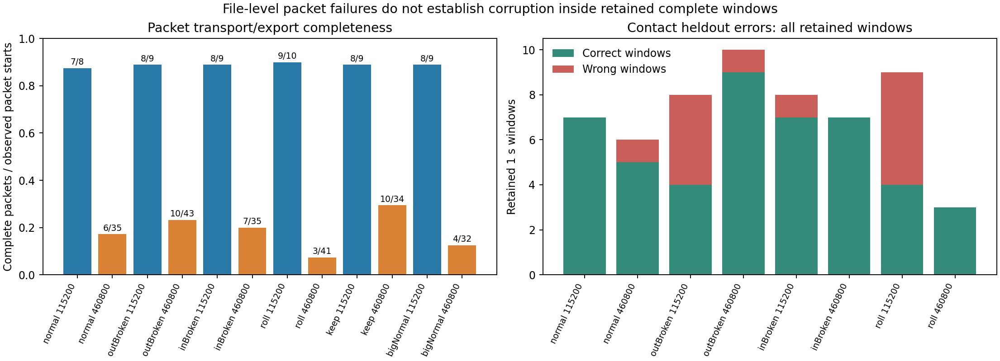
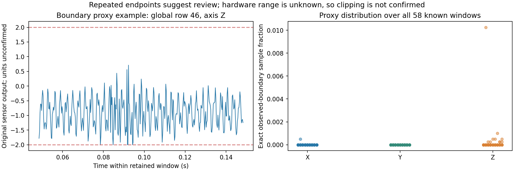
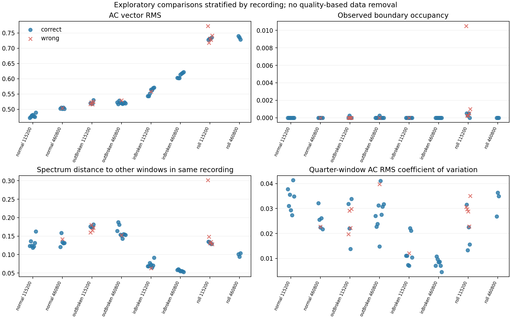

# 接触式质量诊断与逐窗口误判核查

日期：2026-09-22。环境：`conda m2vllm`。本次只读分析原 `raw_xyz`、包解析 JSON 与已有预测；不重训、不删窗口、不按准确率挑阈值，也不把 teacher 置信度当作标签质量。

## 1. 先给出结论

**现有证据不支持“清除少量坏数据就能把接触式窗口准确率提高到 98%”。** 88 个可用窗口全部为有限的 `4000×3` 数组，没有整窗精确重复或全 XYZ 平直；上游仅保留完整包。从 58 个已知类别留出窗口中复核到 46 对、12 错，和验收结果一致。

本轮仅作复查提示的端点/平直启发式，在 58 窗中标记了两个滚动体窗口，两个均误判；**其余 10 个误判没有触发这些旗标**。即便假设这两窗必须重采，也不能把删去后的分数当作原来 58 窗的准确率，更不能根据误判结果继续扩大筛除范围。

另一个重要发现是 **bigNormal 的明显固定端点堆积**：12/12 窗都需复查，任一轴恰好取到观测端点的采样时刻占比中位数为 **19.075%**、最大 **23.35%**。这提示采集量程或数据链存在失真可能，但目前没有设备量程/单位证据，不能确定为真正 ADC 削顶。外部失败同时伴随结构、主周期和这种测量现象变化，不能归因于“结构变化”这一个因素。

本报告的数值、代码和图均已保存；当前没有产生任何“清洗后准确率”或新模型性能。

## 2. 范围、匹配与证据来源

- 原始波形：四类预处理目录中 12 个接触式 NPZ，88 个一秒 XYZ 窗口；正常 13、内圈 15、外圈 18、滚动体 12、keep 18、bigNormal 12。
- 主误判比较：`acceptance_contact98_radar95/window_predictions.csv` 中 **v0、retained_head_v1、heldout_recordings** 的接触式结果，58 个窗口。以 `row↔global_row` 匹配，再检查 bag_id 和真值逐行相同；每窗仅计一次。
- keep 与 bigNormal 仅作测量质量描述，不进入四类错误比较、阈值选择或训练。
- 质量记录：上游每个接触文件 JSON 的 `quality.issues`、完整包数、包序号和 `windows` 元数据。当前可检索目录未找到相应原始 DAT，因此没有宣称重新从 DAT 验证丢字节或恢复缺失数据。
- 实现与校验：[analyze_quality.py](analyze_quality.py)、[protocol.json](protocol.json)、[verification.json](verification.json)。所有 NPZ 哈希在分析前后保持一致。

## 3. 一秒窗口是否有缺口或损坏

4,000 Hz 由用户确认；完整 4,096 点包为 1.024 秒，上游取 `[48:4048]`，两端各舍弃 12 ms，得到真正 4,000 点的一秒窗口。没有把 4,096 点压成一秒，也没有跨包拼接。

上游解析要求计数严格 `1…4096`，遇到无效记录或计数不连续即放弃未完成包。因此**按已保存的解析记录**，保留窗口没有已知的包内计数缺口。这里仍有两个边界：原 DAT 缺失，不能本轮独立重放所有原始字节；点计数连续也不能证明设备物理时钟绝对均匀，或者传感器没有重复输出旧样本。

88 窗均无绝对窗口时间戳，只有文件起始时间和包序号；全部 `absolute_window_start` 为空。不能由这些资料推出真实包间隔或精确 radar/contact 时间映射。`packet_ordinal_observed` 是解析器看到的包起点顺序，不是设备的全局硬件包号。

| 主台架录制 | 完整包 / 已观察包起点 | 已记录解析问题 | 保留窗正确 / 总数 |
|---|---:|---:|---:|
| normal 115200 | 7 / 8 | 2 | 7 / 7 |
| normal 460800 | 6 / 35 | 102 | 5 / 6 |
| inner 115200 | 8 / 9 | 2 | 7 / 8 |
| inner 460800 | 7 / 35 | 92 | 7 / 7 |
| outer 115200 | 8 / 9 | 2 | 4 / 8 |
| outer 460800 | 10 / 43 | 90 | 9 / 10 |
| ball 115200 | 9 / 10 | 2 | 4 / 9 |
| ball 460800 | 3 / 41 | 179 | 3 / 3 |

115200 文件的两个问题通常是开头截到半条记录与结尾未终止记录，不能全部算作中途传输错误。460800 文件有大量中间无效字段及计数跳跃。例如 roll 460800 的已保存日志中，字节位置 473060 处期望计数 406、读到 2441；509442 处记录字段数量异常。这足以说明该文件的可解析连续包非常有限，但尚不能区分发送端、接收缓冲、日志保存或格式解析等根因。

`完整包/已观察起点` 是**本文件可解析完整率**，不是设备真实丢包率：文件头尾可能被截断，未被记录的包起点更无法计数。完整率更低的 460800 保留窗口反而有更高分类率；两者还混杂录制、设备状态与不同训练折，不能建立“包完整率决定保留窗误判”的因果结论。



详细记录：[recording_packet_quality.csv](recording_packet_quality.csv)、[parser_issue_locations.csv](parser_issue_locations.csv)。后者仅摘录原 JSON 位置和原因，不填补或修复原始数据。

## 4. 计算了哪些客观指标

所有信号指标先于正确/错误结果匹配计算。它们描述可测现象，并不自动等于质量好坏；故障冲击本来就可能引起高峰度、crest factor 或能量变化。

| 指标 | 实际定义 | 可解释范围 |
|---|---|---|
| 有限性/长度 | 每窗恰为 4000×3，检查 NaN/Inf | 发现基础格式错误 |
| 重复/平直 | 原始 float32 窗哈希；连续相同采样值；XYZ 同时不变 | 查复制窗口或冻结输出迹象，不能保证未发生更复杂重传 |
| DC | 各轴原始均值 | 可能含重力、偏置与安装方向；单位/姿态待确认 |
| AC RMS | 每轴减均值后均方根；向量 RMS 为三轴 RMS 平方和开方 | 原始单位下振动强度，不能直接当故障或质量阈值 |
| 峰峰值 | 原始最大值减最小值 | 幅值范围与异常跳变的描述 |
| 峰度 | Pearson kurtosis，Gaussian 参考值为 3 | 冲击性描述；高值可能是有效故障冲击 |
| Crest factor | AC 绝对峰值 / AC RMS | 冲击与峰值相对能量；不能单独识别削顶 |
| 端点占用 | 样本恰等于本批原始数据最大绝对端点 | 可疑固定数值堆积代理，不是已知 ADC 满量程 |
| 端点连续长度 | 同轴连续取到上述端点的样本数 | 观察平台，需设备规格进一步确认 |
| 频带能量比例 | Hann periodogram，0–5、5–100、100–800、800–1800、1800–2000 Hz，占全谱能量 | 频谱分布/带宽情况；高频能量不等于混叠已发生 |
| 谱峰 | 每轴及三轴功率和在 10–100 Hz 的最大谱峰 | 仅称主谱峰，不自动认定轴转频 |
| 窗内稳定性 | 四个 0.25 秒子窗 AC RMS 的 CV、主峰跨度 | 同窗变化；子窗频率网格 4 Hz，不能声称亚 Hz 转速变化 |
| 谱形稳定性 | 当前窗与同录制其他窗平均归一化谱的 Jensen–Shannon 距离 | 描述录制内变化，使用了同录制其他数据，仅为回顾分析 |

整窗 periodogram 使用 `nfft=4000`、1 Hz 网格，没有靠零填充制造频率精度。全部 `raw_xyz` 仍保留原单位，本次不擅自将其解释为 g 或 m/s²。

结果：88/88 窗有限且形状正确，整窗精确重复为 0；XYZ 同时相等的连续相邻采样比例最大为 0，各轴最长相同值连续段为 5 个点；最小各轴 AC RMS 约 0.1593 原始单位，没有平直轴。全部 264 轴指标见 [axis_quality.csv](axis_quality.csv)，窗口级汇总见 [window_quality.csv](window_quality.csv)。

## 5. 固定端点：可疑测量现象与误判的关系

本批数据最大绝对数值是 float32 下的 **1.998604059…**，对应导出时约 **±1.998604**。这个数值由所有 88 个波形的**无标签统计**识别，包含外部数据，因此不是预先冻结的部署满量程。没有设备手册、寄存器配置或原 ADC 格式时，不能因为数值接近 2 就宣布“设备量程是 ±2 g”。

本轮计算前固定的复查启发式是：任一轴命中该端点的时刻比例≥0.1%，或某轴连续 4 点命中端点，或 XYZ 连续 20 点保持不变。这只是本轮审计定位样本的规则，**非厂家确认标准、非生产筛除规则、非独立开发集标定阈值**；所有窗口依然保留。后续若要部署，端点必须由已确认设备量程决定，阈值必须在独立开发采集上确定。

| 状态 | 窗口数 | 提示复查窗数 | 任一轴端点占用中位数 | 最大值 |
|---|---:|---:|---:|---:|
| normal | 13 | 0 | 0% | 0% |
| inner | 15 | 0 | 0% | 0% |
| outer | 18 | 0 | 0% | 0.025% |
| ball | 12 | 2 | 0.025% | 1.05% |
| keep | 18 | 14 | 0.175% | 0.725% |
| bigNormal | 12 | 12 | 19.075% | 23.35% |

主四类触发的两窗均来自 ball 115200：全局 row 46（该录制第 1 包）端点占用 1.05%、最长端点连续 4 点；row 51（第 6 包）占用 0.1%、最长连续 1 点。两窗都误判，但其余 10 错窗未触发；不能因此推导所有错误来自削顶。

下图示例按已知类别窗口中**端点占用最大**选取，没有依据正确/错误选择。这段信号存在接近同一负端点的截平现象，足以建议核实量程或重新采集；量程未知时仍只能写“饱和嫌疑”。



bigNormal 在不同结构、可能不同速度之外还出现大比例端点堆积。因此原先 0/2 正常识别的外部失败，应写成“在该外部测量条件下未通过”，不能通过一个共同变化的案例单独证明模型只在结构泛化上失败。将 bigNormal 改成更大已确认量程重采，并保持相同转速与测点，是当前很有价值的干预。

## 6. 正确/错误比较：录制混杂非常明显

12 个错窗分布在五份录制：normal 460800 为 1，inner 115200 为 1，outer 115200 为 4、outer 460800 为 1，ball 115200 为 5。其他三份录制没有错窗，不能硬做自身的错/对差异。

如果把所有错误和正确窗直接汇总，错误窗的谱距离、短窗 RMS 变动似乎更大；但大部分错误集中在外圈和滚动体，幅值/谱分布本来就不同。为控制录制和类别，另在每份同时有对/错的录制内部比较中位数。它仍是小样本探索，无法控制未知的时间、负载或真实故障冲击强弱，也不作显著性或因果声称。

| 指标 | 对窗总体中位数 | 错窗总体中位数 | 五份录制内部“错−对”差值的中位数 | 各录制方向 |
|---|---:|---:|---:|---|
| AC 向量 RMS | 0.5254 | 0.5437 | +0.000875 | 4 上升 / 1 下降 |
| 最大轴 crest | 3.4079 | 3.5597 | −0.0353 | 2 上升 / 3 下降 |
| 短窗 RMS CV | 0.02326 | 0.02897 | +0.000982 | 3 上升 / 2 下降 |
| 谱形 JS 距离 | 0.12947 | 0.15059 | −0.002032 | 2 上升 / 3 下降 |
| 100–800 Hz 能量占比 | 0.8783 | 0.8844 | −0.000558 | 2 上升 / 3 下降 |

这说明不少“错误窗看起来质量差”的总体差异并不在录制内部一致。比如 outer 115200，错误与正确 AC RMS 中位数约 0.52024/0.51937，几乎相同；错误窗谱形距离中位数反而略低。没有找到一个足以解释全部错误、且可以直接成为合法筛选规则的单一质量量。



这组接触主峰也不提供“误判都是转速波动”的直接证据：normal/inner/outer 的三轴功率和主峰多为 33 Hz，ball 多为 66 Hz，后者可能是更强的谐波，不能未经轴速证据将其解释为转速翻倍。在同一录制里，正确/错误主峰中位数未见差异。

完整比较：[heldout_window_quality_and_error.csv](heldout_window_quality_and_error.csv)、[within_recording_error_comparison.csv](within_recording_error_comparison.csv)、[exploratory_error_summary.csv](exploratory_error_summary.csv)。本报告没有读取、排序或使用 teacher 置信度来决定“好/坏标签”。

## 7. 下一轮预先固定的质量层级

建议先冻结以下证据层级，再开始新采集。层级描述能支持的分析，不强迫把所有未完全标定样本丢弃；预处理之外另保留 `review_flags`，不能拿复查旗标自动更改故障标签。

| 层级 | 预先固定的进入条件 | 允许的用途 |
|---|---|---|
| D0：确定不可用 | 非有限、长度错误、已知计数中断却跨段拼接、结合设备状态已确认输出冻结等问题（单轴低振动不自动视为坏数据） | 保留原始文件与拒收原因；不送入要求连续一秒的模型；报告总覆盖率 |
| D1：基本数值可用 | 有限、长度正确、源自完整计数包，没有已知包内缺口 | 当前 88 窗处于这一基础层，可做袋级诊断探索；不声称精确同步 |
| D2：测量标定通过 | 已记录量程/单位、采样配置、静态偏置及独立噪声基线；满足事先标定的饱和/掉码标准 | 可以比较跨设备/速度的幅值与共同带宽质量 |
| D3：时序证据完整 | D2 加硬件采样时间或可靠块计数、包间缺口掩码、时钟映射与误差界 | 可进入精细时序对齐评价；不能以文件名时间替代 |

当前设备量程未知、包间时间未知，不能宣称已有 D2/D3 证据。端点占用较高的 bigNormal 即使基本数值合法，也必须在跨结构评价前重新核实测量。质量筛选若未来启用，应同时报告**覆盖率、各类别拒收率、保留样本性能及全输入有效诊断率**，避免靠多拒收获得表面高准确率。

## 8. 不增加设备的优先补采方案

| 实验 | 固定操作 | 观测与预定判据 |
|---|---|---|
| 量程/单位核实 | 保存传感器完整型号、寄存器/软件配置、输出单位；设备允许时比较当前量程与下一更大量程 | 检查 ±1.998604 是否确为转换边界；同工况下较大量程消除端点堆积且归一后主谱保留，才支持原数据饱和解释 |
| 静止与偏置 | 电机停止，保持同安装采 3 段；如安全且设备允许，另作离线姿态校准，不混入故障测试 | 区分重力/固定偏置与动态振动，估计各轴噪声底；不用模型置信度定义静止质量 |
| 串口/日志完整性 | 同一工况交替采两波特率，各 3 次；原始字节不改写，记录接收块长度、单调时钟、丢帧计数和设备提供的序号 | 对比完整包比例与中途格式错误；首尾截断单列；不能由接收时刻推断每个采样的时间 |
| 四类可重复性 | 每类至少 3 次独立启动/安装或日期录制；先固定一个转速、负载、测点和量程 | 两份录制用于开发、全新一份固定测试；按录制/实体划分，完整报告一秒窗口和整段汇总 |
| bigNormal 因素隔离 | 先按已确认足够量程重采，再与主台架匹配转速、测点和稳态区间 | 先消除采集失真混杂，再评估结构；已经看过的两份旧 bigNormal 只作开发/失败分析 |
| 对齐时序日志 | 若设备提供样本计数/内部时间则原样记录；否则保存可获得的接收块日志并承认其误差 | 明确哪些块之间有缺口；缺少真实时基时维持袋级监督，不构造逐窗口一一配对 |

每次建议保留至少 60–120 秒真实采集会话，明确其中真正采到的连续采样秒数与通信等待时间；“会话 120 秒”不自动等于 120 个连续一秒窗口。可用设备现有配置与主机记录完成这些核查，不要求新增硬件。

新的物理量程阈值、质量规则和验收口径必须在独立开发录制上固定。需要重采的样本按质量证据处理，不能因为原模型判断错误就把真实故障窗口定义成脏数据。

## 9. 复现与交付

```bash
conda run --no-capture-output -n m2vllm python quality/analyze_quality.py
```

脚本拒绝覆盖已经完成的审计；重新分析须另建输出目录或复制脚本到新目录。输出包括 88 行窗口质量、264 行各轴质量、12 行包级概要、所有已归档解析异常位置、58 行留出误判关联和录制内比较。三幅科学图仅呈现实际观测，没有用生成图片代替数据。
