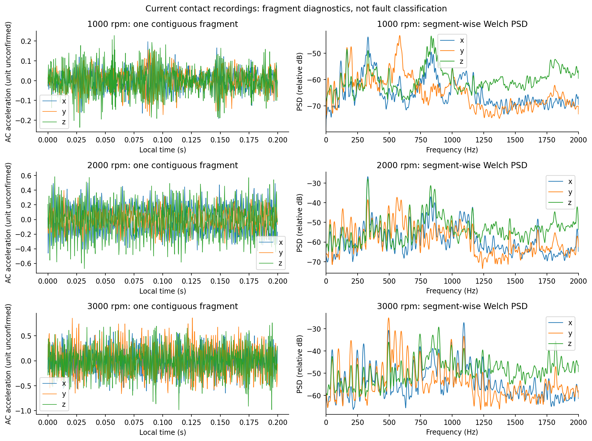
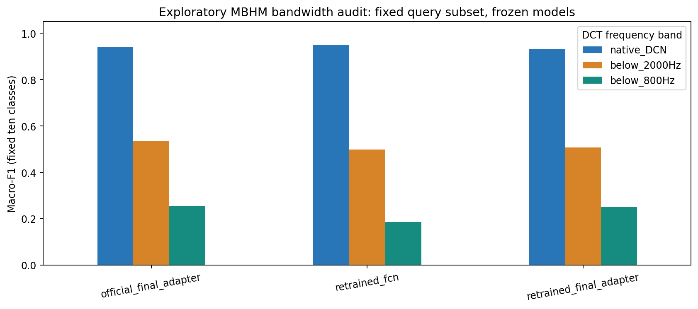

# 接触式预处理与 embedding：当前数据、实际验证与下一步

更新：2026-09-19。环境：conda `m2vllm`。输入为 `/home/huangyating/anomaly_detection/接触式`；模型代码为 `/home/huangyating/BearLLM`。本轮已定位给定会话的本地记录，并以仓库中的复现报告、完成检查、评测结果及实际权重交叉核验复现状态。

**判断：可以保留 BearLLM 的模型接口接入 4 kHz 三轴加速度，但需要修正采集完整性、1 秒频率坐标、静态偏置和参考配对，并验证低带宽适配。当前三份导出不足以形成合格的教师输入，不能据此宣布 embedding 已具有可靠故障语义。**

本轮没有修改原始数据、已有 BearLLM 源码或权重；没有重训模型。实际执行了接触式解析和统计、合成信号接口验证、426 条 MBHM 查询上的 9 项冻结权重带宽消融。

## 1. BearLLM 复现已经做到哪一步

已核对 [完整复现说明](../../BearLLM/FULL_REPRODUCTION_zh.md)、[实测结果](../../BearLLM/outputs/full/RESULTS_zh.md)、`outputs/full/completion_check.log` 和训练权重。当前开源配置的训练与全量评估已经完成：FCN 最多 50 轮、按原调度规则在第 19 轮早停，主检查点为第 11 轮；LoRA 完成 50 轮、7500 次更新。

| 已有复现指标 | 数值 | 解释 |
|---|---:|---|
| 重训 FCN 原协议测试配对准确率 | 98.67% | 查询留出，但正常参考池仍可能跨划分重用 |
| 官方测试查询生成分类准确率 | 97.70% | 12,279 条测试查询；官方原训练成员未知 |
| 重训最终模型测试生成准确率 | 93.78% | 保留微调末期 BatchNorm 状态 |
| 同次重训、原仓库保存方式的对照 | 95.76% | 只改变导出时 BN 状态，不能据此把测试最高者替换为主结果 |

这些是 MBHM/当前公开源码协议的结果，不能直接外推到新传感器、4 kHz、电机壳体传播测点。600 条训练语料回放也不是泛化测试。后续接触式教师默认从独立 FCN 开始做可解释对照，同时保留官方/重训最终适配器；不按本批三个正常文件“正常预测最多”来选教师。

## 2. 当前导出首先存在采集完整性问题

### 2.1 六个文件实际对应三份信号

DAT 是分号分隔的 ASCII 数值记录，不是二进制加速度。记录主要形如 `序号,x,y,z;`，`!1` 对应可见的包首标记。TXT 为带 GB18030 中文接收标记的同一数值流，标记形如 `[21:05:33.876]收←◆`。逐字节核对显示：正确移除这类标记后，TXT 的有效载荷与 DAT 完全相同，因此两者不能当两次重复采集。

三个文件均从包中间开始，在下一包中间结束，均未保存一个完整的 `1…4096` 包。不能因为某个文件累计数值行数超过 4096，就跨采样包间隙拼成一段连续信号。

| 转速 | 保守保留的完整 XYZ 行 | 最长可信连续片段 | 名义片段时长 | 完整 4096 点包 | 合格 4000 点窗口 |
|---|---:|---:|---:|---:|---:|
| 1000 rpm | 4539 | 1641 点 | 0.41025 s | 0 | 0 |
| 2000 rpm | 3189 | 2119 点 | 0.52975 s | 0 | 0 |
| 3000 rpm | 4112 | 2018 点 | 0.50450 s | 0 | 0 |

保守解析规则是：去掉文件首尾残缺记录；不跨 `4096→!1` 拼接；序号异常处分段；本批接收标记穿过的记录均暂时排除，不猜测缺失字符。这并不表示每个接收边界都一定损坏，而是对已经观察到的导出异常作统一保守处理。

### 2.2 字符异常集中在一个值得排查的保存边界

三个文件首个接收标记均出现在有效载荷第 **100000 字节**。其中 1000 rpm 数据出现明确的 `1641 → 164 → 1643`，很像序号 1642 丢失末位字符。3000 rpm 同一边界出现 `2019,...,-.008269`；这在语法上可以解析成合法浮点数，但不能据此判断其原始值，也没有擅自补成 `-1.008269`。2000 rpm 的该边界也正好切入数值记录。

应优先核查串口工具的显示缓存上限、保存选项或导出处理，而不是直接判断传感器硬件丢包。现有文件只能证明保存下来的内容有问题，不能定位问题最早发生在哪一层。

每份 TXT 只有两个可见的接收时间标记，且切在包内数值字符串中。它们是主机接收批次时间，不能当作每个样本或每个采样包的采样时刻；也不能用这两个时间点精确拟合 4 kHz 采样时钟。

### 2.3 三轴有明显静态偏置，不能直接照用 demo 的 DCN

保留数据的三轴均值大约为 x=-0.074、y=-0.055、z=-0.906，数值单位和量程尚未确认。z 轴静态分量可能含重力，但不能未经确认就换算单位或强行校准成 1 g。

| 转速 | x 交流 RMS | y 交流 RMS | z 交流 RMS |
|---|---:|---:|---:|
| 1000 rpm | 0.0471 | 0.0504 | 0.0637 |
| 2000 rpm | 0.1907 | 0.1181 | 0.2261 |
| 3000 rpm | 0.2357 | 0.2929 | 0.2676 |

单位沿用原文件。它们仅是本批片段的描述统计，不是故障判据，也不是三次独立重复的统计区间。

仓库 `functions/dcn.py` 直接 DCT，没有去均值；实际 MBHM 数据集的 `src/dcn.py` 则先去均值/除标准差。使用统计量按未归一化 DCT-II 的 Parseval 关系计算，若不去均值，本批 z 轴 DC 项能量占比约为 **99.75%、96.99%、95.80%**。这说明静态偏置足以主导输入归一化。本轮实现选择匹配数据集处理的**逐轴去均值**，并已与本地数据集 DCN 函数逐值核对。

图中频谱在各连续片段内单独估计，不把包间隙拼接成连续时间。Welch 使用 512 点片段；补零只用于绘图，真实分辨能力约为 7.8 Hz，不能由此精确估计转频或弱故障特征。

## 3. 4 kHz／4096 点应如何送入 BearLLM

### 3.1 固定时长，保持物理频率位置

BearLLM 的论文取段方式是按采样率取一秒，再 DCT 并补齐/截断到 24000 个系数；正常参考来自相同工况。[论文方法 4.1](https://arxiv.org/html/2408.11281v2#S4.SS1)

对 DCT-II，频率坐标可写为 $f_k=kf_s/(2N)$。因此：

- 4 kHz 的 1 秒是 **4000 点**，DCT 网格间隔 0.5 Hz。
- 4096 点是 **1.024 秒**，网格间隔约 0.48828 Hz。如果直接把其系数按教师的 1 秒网格解释，物理频率位置会偏高 2.4%。
- 完整包建议固定取中间 `packet[48:4048]`，得到 4000 点；窗口开始时间是采样包开始后 12 ms。余下 96 点仍保留在原始数据中。
- **只在 DCT 系数末尾补零到 24000。** 不把 4000 点时域拉伸成 24000 点，不把缺失记录填零后当连续观测，也不通过插值制造高频测量。

当前 4 kHz 的可测频带最多到 Nyquist 2 kHz，实际还受传感器内部抗混叠滤波影响。24000 维输入中前 4000 个 DCT 系数有测量依据，后 20000 个是未知高频的占位零；这不是已经观测到高频能量为零。原始采样率、滤波配置、可测频带 mask 和轴向应随样本保存。

**暂不建议为追求带宽直接改为 5 kHz。** 固定 4096 点在 5 kHz 时只有 0.8192 秒，无法在单包内得到原教师需要的 1 秒。若以后使用 5 kHz，需要每包至少 5000 个连续点、或证实跨包无采样间隙，或另行训练变长/频率网格适配器。

### 3.2 具体 DCN

对每个轴的一秒序列 $a$：

$$
\tilde a=a-\operatorname{mean}(a),\quad c=\mathrm{DCT}_{\mathrm{II}}(\tilde a),\quad
v=\operatorname{pad}_{24000}(c),\quad
F=0.01\sqrt{24000}\,v/\|v\|_2.
$$

拒绝非有限值、样本不足和近零交流能量。输出维度是 24000，RMS 为 0.01。数据集脚本在 DCT 前除标准差的统一标量，会被后面的能量归一化抵消，因此该实现与数据集版本数值一致。

教师兼容分支不额外加 Hann 窗、不取 DCT 绝对值、不转 log 谱，也不先做逐包 PCA。Hann/PSD/包络谱可用于并行的物理诊断分支，但不应悄悄替换已训练教师的输入分布。滤波、PCA、PHI-S 等变更需要单列实验；不能因为维度能对上就认定语义已对齐。

## 4. XYZ 和 embedding 的正确接口

### 4.1 两个输入通道是 query 与 reference

当前 `FeatureEncoder` 接受 `[B,2,24000]`，内部计算 query-reference 残差。**不能把 XYZ 直接作为这两个通道，也不能把另一个轴当作正常参考。** 每个轴应与同轴、同工况、独立采集的正常参考配对：

$$X_j=[F(a_{q,j}),F(a_{r,j})],\qquad j\in\{x,y,z\}.$$

本轮接口将三轴放入 batch 维，所以一次输出三个视图，使用共享的教师权重。参考需匹配电机/传递路径、轴承型号、转速、负载、安装和轴向。不同窗口或不同文件名本身不保证独立录制。当前每个转速仅有一份正常记录，不能用 query 自身充当正式独立参考来证明诊断成立。

### 4.2 保存哪一级 embedding

已对接并实际检查以下形状：

| 层级 | 单轴形状 | 三轴批量形状 | 建议用途 |
|---|---|---|---|
| 编码器特征图 | 128×47 | 3×128×47 | 保留作局部特征研究与消融 |
| 第一分类线性层后 ReLU 隐藏向量 $h$ | 128 | 3×128 | **后续模态迁移的优先接口** |
| 故障分类 logits | 10 | 3×10 | 核验教师是否保留正确诊断语义 |
| 语言前缀 | 5×1536 | 当前接口未运行 | 由类别概率经过线性映射得到，信息已经受到类别瓶颈限制 |

实现中的 47 个位置来自 **DCT 频率输入经过卷积下采样**，不是 47 个时间帧，不能拿它们直接做样本级时间对齐。优先在一秒窗口层面对应雷达和加速度，再蒸馏 128 维 $h$；局部特征图蒸馏是后续独立消融。

保存未归一化 $h$ 用于原分类头，同时另外保存 L2 归一化版本用于对比损失。不要把归一化后的向量直接送入原线性头而不验证分布变化。也不能把某套 FCN 的 $h$ 直接接另一套含不同 LoRA/BN 的分类头；本轮三个教师均保持各自完整权重链。

正式推理固定 `eval()`、冻结梯度并固定 BatchNorm。既有复现已证明 BN 保存方式会影响结果，本轮又核对了带宽测试前后 BN 缓冲没有更新。

### 4.3 三轴融合先保留简单对照

短周期优先保留三个独立的教师视图与 logits；如果安装方向明确，可预先指定与传播/雷达视线相关的固定轴作为主视图。不要在每个窗口选择 RMS 最大的轴，那会使轴身份随转速变化。

下一步比较固定轴、三轴概率平均、训练集学习的质量加权融合。只有本地故障验证支持时，再使用 `concat(h_x,h_y,h_z)→384→128` 的可训练融合层；该层是新的模型部件，需要标签/配对训练，不能把随机投影当成已兼容原头。

雷达视线在加速度坐标系中的单位向量已知时，可以另测线性投影 $a_{LOS}=u^Ta$；不能只靠一段重力读数推断完整三维朝向。模长 $\sqrt{x^2+y^2+z^2}$ 和每包重新拟合的 PCA 只作消融，因为前者是非线性变换，后者可能发生方向/符号切换，均会改变原教师输入。

## 5. 已实测：原教师对低带宽并不稳健

为避免只有正常样本时“全预测正常也很好”的假象，本轮在已有 MBHM 中固定抽取测试查询，每类最多 50 条，seed=20260919，共 **426 条**。类别 3 只有 23 条、类别 4 只有 3 条，其他类别各 50 条。使用原复现种子 42 的首个同工况参考，本子集没有 query=reference 配对，但参考池仍继承原协议的跨划分重用；官方模型的原始训练成员未知。

比较三套冻结教师和三种输入：原发布 DCN、只保留低于 2 kHz 的前 4000 系数、只保留低于 800 Hz 的前 1600 系数；截断后恢复 DCN 的 RMS=0.01。所有模型在同一批查询/参考上评价，没有在本子集上调参。

| 教师 | 原带宽 macro-F1 | 低于 2 kHz | 低于 800 Hz |
|---|---:|---:|---:|
| 重训 FCN | **94.9%** | **49.8%** | 18.6% |
| 官方最终适配器，含其 LoRA | 94.1% | 53.7% | 25.5% |
| 重训最终适配器，含其 LoRA/最终 BN | 93.2% | 50.8% | 25.0% |

这是一项**已有频谱的带宽消融**，不是你的传感器/安装/电机壳体的硬件仿真，也不是本批三份正常数据的成绩。它没有模拟真实抗混叠、噪声、传递函数或欠采样后的混叠；仅说明这些固定权重依赖原分布，不能假定低带宽输入补零后仍保留诊断能力。少样本类别的分数不稳定，本表是探索性证据，不是完整 MBHM 复评。

49.8% 不能视为 4 kHz 硬件或经过适配后的模型能力上限。低频是否足以区分本地故障，仍要由同转速故障数据验证；本实验支持增加适配与验证步骤，并不支持直接判定现有传感器无法完成任务。

低于 800 Hz 的对照用于检查“直接让雷达蒸馏全带宽教师”的风险；它也不是雷达的性能上限，因为雷达与加速度的物理测量机制、调制信息和噪声均不同。

## 6. 对原计划的修改

### 6.1 增加接触式教师低带宽适配这一步

建议次序改为：**完整采集 → 4 kHz 兼容 DCN → 本地教师可用性核查/低带宽适配 → 同步跨模态对应 → 雷达学生。** 不能把教师在新工况上高置信但错误的输出直接当真值。

从现有重训 FCN 初始化，官方最终适配器作为并列基线。先在原 MBHM train/validation 划分上尝试 2 kHz 带限输入：

1. 冻结 encoder，仅训练分类层；检查原 128 维表征是否足以支持低带宽。
2. 若不足，解冻最后一个多尺度卷积块及分类层，学习率可从 1e-5 起，分类头从 1e-4 起；以 validation macro-F1、正常误报和各类召回选参数，测试集只作最终报告。数字是初始建议，尚未训练或验证。
3. 再加入本地故障训练记录，按独立 run/轴承实体分割，比较冻结、仅头适配、末块适配。只用这三份正常记录更新教师容易退化成正常类预测器，不实施这种训练。

训练目标先用真实故障标签的交叉熵。全带宽教师 KD 只能作为可选消融：低频输入可能无法决定高频证据，不能要求学生逐点复制不可观测的完整隐藏向量。保留 4 kHz 接触式可用频带的教师作为任务锚点，之后再比较共有频段分支与全接触式分支的蒸馏收益和拒绝率。

没有必要现在加入 RAG、SFN 或 PHI-S 来掩盖输入问题；它们不能恢复丢字符、缺失采样段或未测到的高频信息。

### 6.2 先明确故障标签层级

原头的十类包含正常，以及内圈/滚动体/外圈各三个严重程度。若你的本地标签只有故障部位，没有严重程度，不应编造轻/中/重标签。可以先将现有概率聚合为正常、内圈、外圈、滚动体四类作零样本基线，再训练四类本地头。

复合故障没有原头对应类别。初期可单列为未知故障检查，不强行归入某一种单故障；有足够复合故障训练样本后扩展为第五类，并相应修改语言输出接口。更换分类头后，原语言适配器不是自动仍然适用。

### 6.3 同步时把窗口支持时间对齐

雷达上一轮保存的是 2 秒窗口；接触式教师应使用 1 秒。下一轮同步实验为雷达另提取与接触式有效一秒区间对应的窗口，保留雷达 chirp 缺口和接触式包间缺口。不要把两个不同长度的窗口仅按文件开始时间对应。

每个加速度包保存包序号、采样率、有效计数、原始字节、主机首次/末次接收单调时钟。如果固件可改，增加包采样开始/结束 tick 或全局样本计数器，不需要新增硬件。主机到达时间只给粗定位；后续再用共同变化轨迹估计偏移/漂移，稳定转速片段若无可辨识时间变化，应标记时间对应不确定，不能强行声称样本级同步。

## 7. 下一步按优先级测试什么

### P0：先修好保存链路，成本最低且决定后续是否成立

先固定 2000 rpm，完整保存至少 **10 个 `1…4096` 包**。使用“收到字节即原样追加文件”的记录方式，不从串口工具显示窗口复制或导出；即便一次 read 只读到半条数值，也先保留原始字节，下一次 read 接上，不能丢掉首尾字符。保留每次 read 的单调时间戳为 sidecar，不将文本时间戳插入数值载荷。

验收条件：每包恰有 4096 条 XYZ，序号不缺、不重、不乱；保存文件首尾按完整包闭合；接收标记处没有丢字符；至少生成 10 个合格 4000 点窗口。对比二进制原始日志与解码后的计数，而不是只看文件体积或波形是否平滑。量程和单位需从设备说明/配置确认，不能由本批数值猜定。

**当前最值得立即做的测试就是这一项。** 数据保存未合格之前，换 encoder 或训练策略不能解决基础问题。

### P1：建立独立正常参考和正常误报基线

- 同一固定安装，在 1000/2000/3000 rpm 各做三次独立启动；每次至少 **20 个完整包**，共 9 个 run。按包数验收，实际墙钟时长取决于采样后的发送间隙，不假定 30 秒必然够。
- 每个转速另外采一份独立正常参考 run，至少 20 包，固定为参考库；不拿测试查询自身作参考。采一份 motor off，检查静态偏置、噪声和量程。
- 记录轴向、安装照片/文字、接触固定方式、负载、传感器量程/滤波设置；暂时固定 4 kHz。3000 rpm 的 z 最小值接近 -2，但单位/量程未确认，不能据此断言削顶；若确认是 ±2 g 档，再对更大量程做单因素检查。
- 对三个轴分别输出正常误报率、不同正常参考引起的预测变化、重复 run 的 embedding 距离；不报告故障准确率。先验证 reference 与重复性，再选固定轴或融合方式。

### P2：验证接触式教师是否真的能分故障

最小起步矩阵：正常/内圈/外圈/滚动体 × 三转速 × 三次独立启动，共 **36 个 run**，每次至少 20 个完整包，固定安装与负载；正常参考另存，不能混入测试。优先先完成一个转速的四类，再扩到三转速。

每类只有一个轴承实体时，这只是针对这些实体的初步 run 留出结果。面向论文，需要每类更多独立轴承，并按实体留出。不要把同一 run 的相邻窗口随机拆成训练/验证/测试。故障更换后重新核对稳定转速和负载，避免用转速微差替代故障证据。

比较：固定物理特征+线性分类、冻结 FCN、低带宽只训练头、低带宽末块适配；参考选择、轴向与分类标签保持一致。报告 macro-F1、每类召回、正常误报和按独立 run 聚合的结果。原十类严重程度与本地四类应显式映射；复合故障单独设计。

### P3：通过教师门槛后，再采同步雷达

先在一个固定转速、正常+一种明确故障、固定优质距离上做独立重复的同步采集；验证接触式可靠、雷达可见相应区别、窗口对应有足够置信度。再扩为四类×三转速×两环境×三次独立启动，即 72 对 run；每对确保有足够完整加速度包，雷达连续覆盖整个采集和发送过程。

同一批比较雷达自监督/监督基线、仅 logits 蒸馏、128 维隐藏向量蒸馏，以及有/无时间对应质量筛选。当前正常转速数据的主频捷径必须保留为负对照。候选损失和对齐策略见既有 SenSys/14 天方案，但本报告增加了“保存链路和教师低带宽能力”两个前置门槛。

## 8. 实现与验证范围

本轮实现的 `dcn_1s` 已通过已知 125 Hz 正弦的坐标检查，峰位在 DCT 下标 250；与发布数据集的去均值 DCN 数值一致；对统一单位缩放和常量偏置变化保持一致；拒绝短片段、NaN、零交流信号和同 run 自参考。合成一秒三轴 query/reference 实际通过重训 FCN，输出 `[3,128,47]` 和 `[3,128]`，BN 未更新。

这些接口测试证明代码链路和维度可用，不是当前三个记录的故障诊断验证。实际 MBHM 子集的 128 维 embedding、所有逐条预测、输入 SHA256、模型哈希、类别数量和源代码哈希均已保存。没有将空样本数组伪装成用户数据的成功 embedding。

- [运行与产物说明](README.md)
- [原始记录质量审计](results/quality.json)
- [严格窗口检查](results/preflight.json)
- [带宽消融全部指标](results/bandwidth_metrics.csv)
- [接口验证记录](results/verification.json)

原理核对来源：[BearLLM 论文](https://arxiv.org/html/2408.11281v2)、[发布数据集 DCN 代码](https://huggingface.co/datasets/SIA-IDE/MBHM/blob/main/src/dcn.py)、[SciPy DCT 定义](https://docs.scipy.org/doc/scipy/reference/generated/scipy.fft.dct.html)。具体接口、BN 和权重链以本地复现代码与实测为准。
