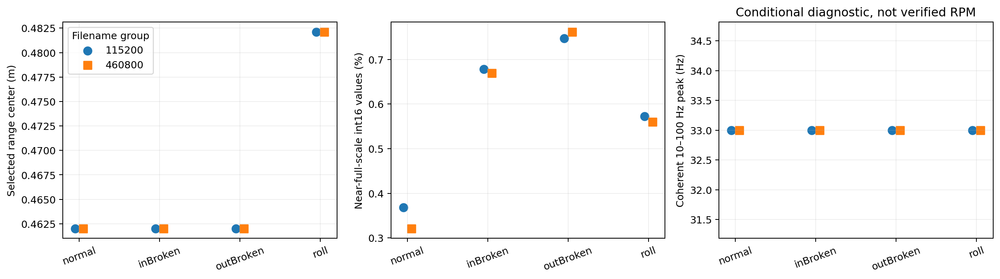
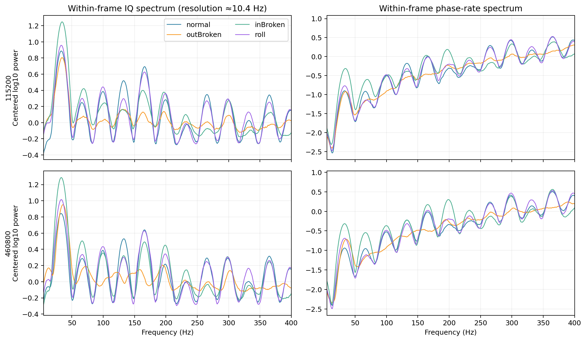
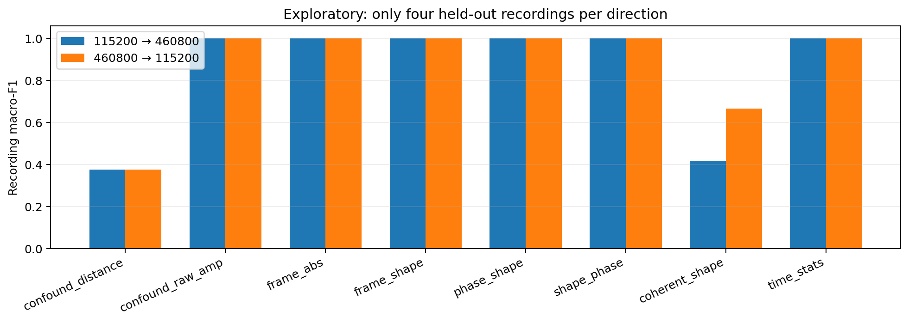

# 四类毫米波特征提取与录制级探索验证

输入为已导出的雷达数据，12 个录制、614 个不重叠的 2 s 窗口；四类为 8 个录制、412 窗。只读输入；未修改原始数据。
用户确认 keep 为保持座/底座故障、bigNormal 为另一台正常电机。均保留原标签 -1，独立用于未知故障/外部正常检查，不纳入四类监督。用户确认两模态同时采集，但仍无逐包时间轴及同步窗口对应关系。
**几何状态：本次从原始 bin 使用统一物理 ROI 重新导出；历史宽 ROI 版本外圈与 keep 曾选择约 0.884 m。统一 ROI 只能排除该显著选门问题，仍须核对实际距离峰、波形质量与反射来源。** 本次距离容限 0.45±0.16 m 外的录制数为 0。

## 可训练接口

`features.npz` 的每一行对应 `metadata.csv` 同一行；`bag_id` 为原雷达 recording_id。
- 主分支 `frame_shape[N,128]`：12 个相邻 RX/bin 单元的逐帧 IQ 功率谱，先做固定频带功率均值，再 log10，再减去本窗口频带均值。
- 可选 `shape_phase[N,256]`：主分支拼接 `phase_shape[N,128]`。相位速率只由同一帧的相邻有效 chirp 计算；按 191 点帧分别计算 PSD，先平均完整帧，再对 12 个单元取中位数。
- `frame_abs` / `phase_abs` 是未减跨频带均值的对照；IQ 已经过逐单元幅度归一化，前者不是物理绝对振动能量。
- `coherent_shape` 是有跨帧相干假设的独立对照，不能自动作为主分支；`time_stats[N,10]` 是无量纲幅度尾部统计和帧内归一化自相关。
- `confound_distance`、`confound_raw_amp` 仅作混杂基线，不进入主学生。去掉距离字段不能消除信号中已有的距离影响。

频带固定为 5–100 Hz 附近 2 Hz、100–400 Hz 5 Hz、400–800 Hz 20 Hz，共 128 个频带；首带为 5–6 Hz。
帧内 192 点、2 kHz，频谱真实分辨能力约 10.42 Hz；0.5 Hz 只是补零求值网格，不能声称分辨 0.5 Hz 的故障边带。每帧独立计算，不跨缺口拼接。

## 数据质量与混杂

| recording_id | state | label | baud_candidate | n_windows | range_center_m | clip_fraction | trailing_bytes | nominal_duration_s | complete_chirp_fraction | median_frame_peak_10_100_hz | median_coherent_peak_10_100_hz | geometry_roi_mismatch | range_status | synchronized_window_pairs |
| --- | --- | --- | --- | --- | --- | --- | --- | --- | --- | --- | --- | --- | --- | --- |
| 20260920-184058-normal-11520 | normal | 0 | 115200 | 61 | 0.46202 | 0.0036865 | 24576 | 122.8 | 1 | 33 | 33 | False | geometry_supplied | False |
| 20260920-184857-normal-460800 | normal | 0 | 460800 | 48 | 0.46202 | 0.0032129 | 565248 | 96.3 | 1 | 33 | 33 | False | geometry_supplied | False |
| 20260920-190512-outBroken-115200 | outBroken | 2 | 115200 | 50 | 0.46202 | 0.0074676 | 507904 | 101 | 1 | 34.5 | 33 | False | geometry_supplied | False |
| 20260920-190913-outBroken-460800 | outBroken | 2 | 460800 | 50 | 0.46202 | 0.007614 | 684032 | 101.6 | 1 | 36 | 33 | False | geometry_supplied | False |
| 20260920-192216-inBroken-115200 | inBroken | 1 | 115200 | 50 | 0.46202 | 0.0067803 | 585728 | 101.8 | 1 | 34.5 | 33 | False | geometry_supplied | False |
| 20260920-192610-inBroken-460800 | inBroken | 1 | 460800 | 51 | 0.46202 | 0.006691 | 53248 | 103.8 | 1 | 33 | 33 | False | geometry_supplied | False |
| 20260920-193718-roll-115200 | roll | 3 | 115200 | 51 | 0.48211 | 0.005728 | 12288 | 102.5 | 1 | 33 | 33 | False | geometry_supplied | False |
| 20260920-194108-roll-460800 | roll | 3 | 460800 | 51 | 0.48211 | 0.0056003 | 65536 | 103.1 | 1 | 33 | 33 | False | geometry_supplied | False |
| 20260920-195424-keep-115200 | keep | -1 | 115200 | 51 | 0.48211 | 0.0043662 | 647168 | 102.1 | 1 | 33.5 | 33 | False | geometry_supplied | False |
| 20260920-195753-keep-460800 | keep | -1 | 460800 | 51 | 0.48211 | 0.0040156 | 45056 | 102.8 | 1 | 33 | 33 | False | geometry_supplied | False |
| 20260920-201757-bigNormal-115200 | bigNormal | -1 | 115200 | 50 | 0.52228 | 0.0014891 | 212992 | 101.2 | 1 | 10 | 13 | False | geometry_supplied | False |
| 20260920-202115-bigNormal-460800 | bigNormal | -1 | 460800 | 50 | 0.52228 | 0.0012767 | 626688 | 101.4 | 1 | 10 | 13 | False | geometry_supplied | False |

历史预处理使用 0.15–2 m 搜索最强峰。每份 NPZ 只保留所选峰附近 3 个 bin，无法仅靠该导出恢复其他距离门；修改 ROI 必须回到原始 bin。
外部电机的频谱与四类测试台不同，须同时核对转速/负载等工况，不能把域差异全部归因于结构变化。
原始 int16 的近满量程占比四类为 0.321%–0.761%；该值是饱和风险指标，不能单独证明每个值均发生硬削顶。相位非线性/谐波不能直接解释为故障。下一批需单独降低接收增益并检查峰值分布。
推荐所有类别统一使用 0.45±0.16 m 的物理 ROI；随后人工检查目标峰。不能按类别选门，不能仅修复某个类别而对其他类别维持另一套筛选规则。
图中 10–100 Hz 主峰是条件性相干谱诊断，不是测得的转速；当前未提供独立转速记录，不能确认各类同速。





## 录制级探索基线

按串口波特率文件组 115200 与 460800 双向训练/测试。波特率仅是串口参数，不表示雷达采样率或环境变化。每组每类仅 1 个录制；不随机划窗、不让同一个 bag 跨集合。
这只是录制分组的探索验证，不能称为跨环境泛化或独立轴承泛化：独立 run、转速和轴承实体均未确认；几何问题见上面的实测状态。
固定 LogisticRegression C=1，source-only StandardScaler，训练窗口按录制等权；无目标调参。测试录制概率为窗口概率均值。
每方向只有 4 个测试录制，每错一个 accuracy 变化 25 个百分点；窗口数不增加独立样本数量。

| source_baud | target_baud | method | n_train_recordings | n_test_recordings | n_train_windows | n_test_windows | file_accuracy | file_macro_f1 | window_accuracy_secondary |
| --- | --- | --- | --- | --- | --- | --- | --- | --- | --- |
| 115200 | 460800 | confound_distance | 4 | 4 | 212 | 200 | 0.5 | 0.375 | 0.495 |
| 115200 | 460800 | confound_raw_amp | 4 | 4 | 212 | 200 | 1 | 1 | 1 |
| 115200 | 460800 | frame_abs | 4 | 4 | 212 | 200 | 1 | 1 | 1 |
| 115200 | 460800 | frame_shape | 4 | 4 | 212 | 200 | 1 | 1 | 1 |
| 115200 | 460800 | phase_shape | 4 | 4 | 212 | 200 | 1 | 1 | 1 |
| 115200 | 460800 | shape_phase | 4 | 4 | 212 | 200 | 1 | 1 | 1 |
| 115200 | 460800 | coherent_shape | 4 | 4 | 212 | 200 | 0.5 | 0.41667 | 0.53 |
| 115200 | 460800 | time_stats | 4 | 4 | 212 | 200 | 1 | 1 | 0.945 |
| 460800 | 115200 | confound_distance | 4 | 4 | 200 | 212 | 0.5 | 0.375 | 0.47642 |
| 460800 | 115200 | confound_raw_amp | 4 | 4 | 200 | 212 | 1 | 1 | 1 |
| 460800 | 115200 | frame_abs | 4 | 4 | 200 | 212 | 1 | 1 | 0.99057 |
| 460800 | 115200 | frame_shape | 4 | 4 | 200 | 212 | 1 | 1 | 1 |
| 460800 | 115200 | phase_shape | 4 | 4 | 200 | 212 | 1 | 1 | 1 |
| 460800 | 115200 | shape_phase | 4 | 4 | 200 | 212 | 1 | 1 | 1 |
| 460800 | 115200 | coherent_shape | 4 | 4 | 200 | 212 | 0.75 | 0.66667 | 0.75943 |
| 460800 | 115200 | time_stats | 4 | 4 | 200 | 212 | 1 | 1 | 0.86792 |



如果距离或原始幅值基线有效，说明采集混杂可预测标签；不能把主方法相似或更高的分数直接解释为捕捉到了故障机制。
测试已用于此次方法对照；后续方法选择后必须重新采独立盲测数据，不能反复针对这 8 个录制调参后作为最终论文结果。

## 最小补采要求

1. 四类在同一转速、同一距离、同一测点/角度/增益下，每类至少 3 次重新启动或重新安装录制；记录轴承实体，实体留出需要每类至少 2 个实体。
2. 同类别跨距离和跨环境采集，使距离与标签交叉；每种故障都覆盖同样距离，不允许某类别只出现于某距离。
3. 保存原始 bin、实际 cfg、ADC/loss 日志、实际转速/距离，以及接触式逐包时间信息；先验证 ROI 与饱和，再训练学生。
4. 教师-学生训练当前只能使用训练 bag 的分布/原型监督。精细逐窗对齐必须依赖同步证据；不要人为把第 i 个雷达窗配给第 i 个接触窗。

## 复现

```bash
OMP_NUM_THREADS=2 OPENBLAS_NUM_THREADS=2 MKL_NUM_THREADS=2 \
/home/huangyating/miniconda3/bin/conda run --no-capture-output -n m2vllm \
python /home/huangyating/anomaly_detection/four_class_chain_20260922/radar/extract_features.py \
  --source /home/huangyating/anomaly_detection/encoder_validation_20260923_v2/geometry_corrected/results \
  --output /path/to/new_empty_radar_output
```

`input_manifest.json` 记录各输入 NPZ/JSON 哈希；`feature_schema.json` 记录接口、频带与限制；`baseline_protocol.json` 记录固定对照协议。
