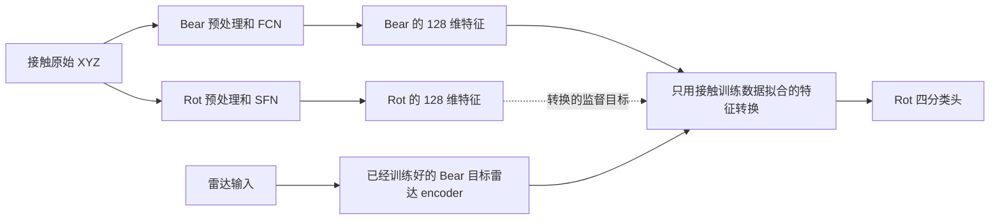

# 教师输入接口与第三模型验证

本轮完成了两件事：逐项核对 BearLLM／RotLLM 的实际输入路径；接入第三个公开预训练接触振动模型 UniFault Tiny，冻结其特征网络后进行接触端验收。这里的“模型结果”均指振动特征网络与分类读取模块的结果，不是大语言模型生成文字的正确率。

## 1. RotLLM 到底用了什么输入

**没有把 BearLLM 生成的 embedding 输入 RotLLM 的 SFN。** 两个模型都从接触原始 XYZ 数据出发，各自计算特征；它们的网络结构和权重没有互换。

| 步骤 | 本轮沿用的 BearLLM 路径 | 本轮 RotLLM 主路径 |
|---|---|---|
| 原始输入 | 一秒 XYZ，每轴 4000 点 | 同一秒 XYZ，每轴 4000 点 |
| 均值处理 | 每轴减均值 | 主分支不减均值；减均值只作完整报告的敏感性分支 |
| 频域处理 | 每轴 DCT-II，保留有正负号的系数，尾部补零到 24000 | 独立完成同样的 DCT-II 和补零 |
| 尺度 | 24000 个系数的 RMS 设为 0.01 | 主分支 RMS=0.01，另外报告 RMS=1 |
| 模型输入 | 当前信号＋健康参考信号；网络内部再计算二者差值 | 单一 DCT 谱，按频率先后折成 3×8000 |
| 特征网络 | FCN，官方代码名为 FaultClassificationNetwork | SFN，Spectral Folding Network |
| 分类前特征 | FCN 输出 128×47，再经过已有线性层和 ReLU 得到 128 维 | SFN 输出展开成 720 维，再经过已有线性层和 ReLU 得到 128 维 |
| 本地 XYZ | 各轴单独计算后平均 | 各轴单独计算后平均 |

BearLLM 的健康参考目前是从公开训练数据中固定选取的 9 条参考，对每个参考运行后平均，**并非严格匹配本台架工况的健康参考**。这一直是本地复现与原参考条件之间的差异。

RotLLM 发布代码中，`process_single_data` 将 RMS 归一至 1，而脚本当前入口又对保存好的数据除以 100。仓库没有给出这份权重对应的数据处理运行记录，因此不能声称已确认唯一原生尺度。此前在首次本地推理前固定 RMS=0.01 为主分支，并完整报告其余尺度／去均值分支。该歧义不会通过挑选测试高分来消除。[官方 DCT 脚本](https://github.com/SIA-IDE/RotLLM/blob/main/code/dataset_constructor/dct_process.py)、[官方 SFN](https://github.com/SIA-IDE/RotLLM/blob/main/code/models/SFN.py)。

4000 点代表一秒实际测量，DCT 第 k 项对应约 k/2 Hz。尾部补零只是满足模型输入长度，**不能把实测带宽从 2 kHz 提高到 12 kHz**。SFN 折叠的三个通道是三段频率范围，不是 XYZ 三轴；在这批 4 kHz 数据中，后两段折叠子谱为零。

本地核验依据：[Bear 数据读取与推理](/home/huangyating/anomaly_detection/four_class_chain_20260922/contact/evaluate_contact.py)、[Bear 预处理分支](/home/huangyating/anomaly_detection/retention_alignment_20260922/preprocessing/export_variants.py)、[Rot 独立输入与推理](/home/huangyating/anomaly_detection/encoder_validation_20260923/rotllm/run_teacher.py)。

## 2. 为什么“两个都是 128 维”也不能直接换用

128 维只说明每个模型输出 128 个数，并不保证“第一个数”具有相同意义。不同网络学到的坐标不同，直接把 Bear 特征送给 Rot 分类头通常没有正确的接口依据。

此前实际做的是两种不同实验：

这里的转换是固定正则强度的线性回归，输入和目标都来自**同一接触窗口经过两个模型后的特征**。只在训练录制上拟合。测试时雷达经过原来的 encoder，再经过这个转换，直接进入 Rot 分类头，**没有再次经过 SFN**。

因此可以准确说“雷达 encoder 参数保持不变，只增加了一个适配模块”；不能说“雷达模型完全原样、直接插入完整 RotLLM”。系统确实增加了特征转换；高分路径还使用了用接触训练数据新建的四分类头。原生 SFN 与原生十五分类头没有被覆盖。[实际转换脚本](/home/huangyating/anomaly_detection/encoder_validation_20260923/scripts/contact_only_stitch.py)。

另一种实验则从头训练一个以 Rot 特征为目标的雷达 encoder。前者检查已有表示能否复用，后者检查训练方法能否换教师。这两类证据需要分别报告。

此外，旧 Rot 结果表中 `demean_rms001` 的 47/58 是**新四分类头**的成绩；该分支原生头实际为 14/58。不能把两行互换。[旧结果原表](/home/huangyating/anomaly_detection/encoder_validation_20260923/rotllm/pooled_metrics.csv)。

## 3. 第三个教师：UniFault Tiny

采用作者仓库链接的公开预训练权重，而不是临时随机初始化后重新训练。它使用时域 patch Transformer，与 Bear／Rot 的 DCT 卷积网络有明显区别。官方代码将时间片分为 patch、经过 Transformer，并对 token 求均值后分类。[作者仓库](https://github.com/emadeldeen24/UniFault)、[官方模型代码](https://github.com/emadeldeen24/UniFault/blob/main/model/model.py)。

核验信息：

- 官方仓库 commit：`4b20ce54f31507bfb9e486e5126cb025bf46e194`。
- 下载文件：作者 README 中 Tiny 链接的 `pretrain-epoch=1.ckpt`；权重 SHA256 为 `a00b8aa0220f7ce4bdfa5e4f91d1a923a880ffa6f5fa0f7369d3b46e87335ed7`。
- 823376 个参数，128 维、4 层、4 个注意力头。
- 83 个状态条目全部严格加载，`torch.load(weights_only=True)`，没有缺失层随机混入。
- 为避免引入无关训练依赖，只将 LightningModule 替换为 PyTorch Module，将一个固定的 einops reshape 替换为等价 reshape。实际前向计算与状态名称保留作者代码；Transformer 辅助代码原样使用。
- checkpoint 包含 16 输出分类头，但未找到其 16 类语义映射。因此保留权重并导出分数，**不编造原生四分类准确率**。

**预先声明的主输入：**每个一秒窗口切成十个 0.1 秒片段，每片段 400 个原始点；用 polyphase 插值变为 1024 点，每轴按照训练录制确定的最小／最大值归一化。每个片段得到 16 个 patch，每 patch 64 点。先对 token、再对轴和十个片段取等权均值，形成该一秒窗口的 128 维特征。

这一选择参考论文的 0.1 秒、1024 点与训练集 min-max 处理。论文描述主要针对原始点数较多的情况；本数据只有 400 点，因此此处是有明确带宽限制的插值适配，不能声称恢复了高频信息。[论文方法 3.3](https://arxiv.org/html/2504.01373v2)。

同时完整报告一个代码示例敏感性分支：直接使用每秒中前三个不重叠的 1024 原始点窗口，每个 0.256 秒，末尾 928 点不参与该分支。它与主分支不能混为相同输入。主分支并未根据最终结果改变。

所有特征网络权重冻结。两种分支分别在每个训练折拟合一个 StandardScaler 和四分类 LogisticRegression，超参数与先前 Rot 接触头实验相同。测试录制、keep、bigNormal 都不参与归一化拟合或头训练。由于归一化只由本折训练录制确定，两个折需要各自保存一份教师特征。

## 4. 接触端实际结果

主四类沿用两个互补留出方向：115200 训练→460800 测试及反向。数字只是串口波特率对应的录制组，不是加速度采样率；本地采样率始终为 4000 Hz。

| 接触方法 | 窗口答对／总数 | 录制答对／总数 |
|---|---:|---:|
| UniFault 冻结特征＋新接触头，0.1 秒主输入 | 58/58，100% | 8/8，100% |
| UniFault 冻结特征＋新接触头，1024 原始点分支 | 58/58，100% | 8/8，100% |
| 仅 3 轴静态均值＋同样的线性头 | 29/58，50.00% | 5/8，62.50% |
| 仅 3 轴去均值 RMS＋同样的线性头 | 56/58，96.55% | 8/8，100% |
| 12 个简单幅度／统计指标＋同样的线性头 | 57/58，98.28% | 8/8，100% |
| 64 个归一化频带特征＋同样的线性头 | 57/58，98.28% | 8/8，100% |

后四项是看到 UniFault 结果后增加的诊断对照，单独记录其时间顺序，没有据此选择或修改 UniFault。数据没有增加：58 个窗口来自 8 次录制，同故障两次录制使用同一物理轴承。

**这些数字说明 UniFault 的冻结表示可以被本地接触四分类头读取；也说明现有任务用少量 RMS／频带特征就接近满分。不能把 100% 当作已经验证丰富预训练知识的证据。** 它也不是“修改后的 BearLLM 接触准确率达到 100%”，更不是此前原模型的保持性验收。

外部 bigNormal 的主分支结果也必须保留：在一个折拟合的头下 0/12 个正常窗口答对，另一个折为 12/12。这种不稳定性表明跨设备适用性仍不足；不能用主四类 100% 扩大解释。1024 原始点敏感性分支两个折均为 12/12，但没有据此替换主分支。

## 5. 换教师时发现的实际接口问题

Bear 和 Rot 的分类前特征经过 ReLU，因此非负；UniFault 的特征经过 LayerNorm，有正也有负，本次约 47%–49% 的元素为负。

如果雷达学生仍强制输出非负数，就不可能严格匹配负的教师特征。对任一负目标 t，要求学生输出 s≥0 时，最小平方误差只能在 s=0 取得，仍为 t²。对所有维度平均就得到无法靠继续训练消除的误差下界。

本次用四个训练录制的教师均值计算，两个折的非负输出原始 MSE 下界分别为 0.362、0.384；除以各折训练特征标准差后，下界约为 39.00、15.64。[数值核验](/home/huangyating/anomaly_detection/encoder_validation_20260923_v2/teachers/unifault/signed_output_check.json)。

因此，适合通用框架的做法是：**学生学习标准化的教师特征，输出层允许正负；送入原分类头前再恢复教师尺度。** 也可以按教师接口选用线性输出。这是为满足特征表示范围而做的必要适配，不是为了在测试集上追高分。后续雷达实验应将固定 ReLU 与正确接口作控制，报告特征误差和分类共同结果。

第三教师只增加了“跨网络结构适用”的证据。丰富故障知识仍需额外任务，例如真实严重度、同类故障的物理属性读取、受控故障参数变化等，并与人为四类向量比较。仅增加更多四分类教师不能替代这些实验。

## 6. 文件与复现

- [实验前协议](/home/huangyating/anomaly_detection/encoder_validation_20260923_v2/teachers/protocol_before_results.json)
- [UniFault 执行脚本](/home/huangyating/anomaly_detection/encoder_validation_20260923_v2/teachers/run_unifault.py)
- [完整来源与 SHA](/home/huangyating/anomaly_detection/encoder_validation_20260923_v2/teachers/unifault/provenance.json)
- [分折与合并成绩](/home/huangyating/anomaly_detection/encoder_validation_20260923_v2/teachers/unifault/pooled_metrics.csv)
- [无权重修改、仅训练录制拟合等核验](/home/huangyating/anomaly_detection/encoder_validation_20260923_v2/teachers/unifault/verification.json)
- [教师特征／分类头接口清单](/home/huangyating/anomaly_detection/encoder_validation_20260923_v2/teachers/teacher_interfaces.json)
- [简单信号对照](/home/huangyating/anomaly_detection/encoder_validation_20260923_v2/teachers/contact_sanity_controls/pooled_metrics.csv)

使用 `/home/huangyating/miniconda3/envs/m2vllm/bin/python`。脚本拒绝覆盖已完成成绩；重复实验应先复制到新输出目录并保存新协议，不覆盖旧结果。
