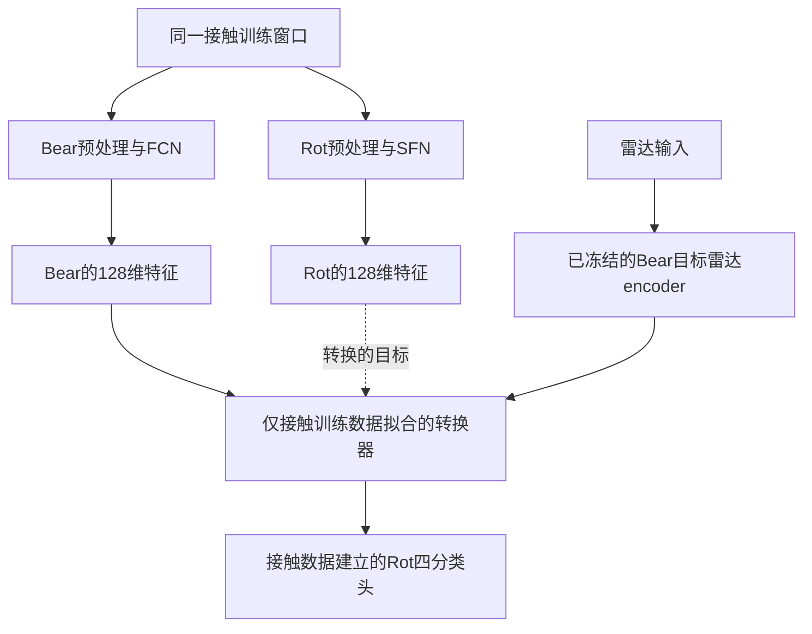

# 第二轮验证：故障知识、多教师复用与原始数据修复

日期：2026-09-23；环境：`m2vllm`。本轮实际完成原始数据重处理、第三个官方预训练教师接入、**204 个雷达模型训练**、接触端连续量读出以及独立复核。本文同时回答六个问题，区分已经得到的结果和还需要新增数据才能验证的部分。

## 1. 先给明确结论

**真实接触特征监督确实带来了比人为类别向量更好的特征复用，但当前还没有充分证明“丰富故障知识”已经迁移。** 新实验把这个边界定位得更清楚：

| 本轮问题 | 实际结果 | 目前能说什么 |
|---|---|---|
| 原始雷达距离是否修好了 | 外圈两条由约0.884米改到0.462米 | 已排除这项已知距离选择错误 |
| 能否接入不同教师 | BearLLM、RotLLM、UniFault均跑通 | 方法可适配三种特征接口，仍有教师专属处理 |
| 第三模型是否暴露真正接口问题 | UniFault允许负特征后，均值蒸馏雷达从47.25%到99.84% | 不能把Bear/Rot的末层非负约束照搬给所有教师 |
| 真实特征是否比人为向量有用 | 换Rot读取模块时，整段100%对75%；一般振动统计误差也更低 | 支持真实特征监督的复用价值 |
| 是否超过只知道四类的能力 | 连续量读取多数仍不如“真类别→训练类均值”基线 | 尚不能充分排除类别代表信息的解释 |
| 能否识别雷达没训练过的故障类 | 96个留类模型，对被排除类别的召回全部0% | 当前encoder不具备已验证的这类外推能力 |

这些仍是 **8条已有开发录制、每类同一物理轴承的两次录制**；不是新增故障实体。主接触58个一秒窗口、主雷达412个两秒窗口。三个随机种子重复训练，不增加物理样本量。窗口准确率统一为每种子合并两个方向，再平均种子；录制结果平均窗口概率后判断。

## 2. 怎样证明“丰富知识”，而不只是四类表示

需要把“丰富”换成可检验的能力。例如：**同样属于内圈故障，仍能区分轻重程度，或读出故障冲击／包络结构的变化；这些问题在训练雷达时没有提供答案。**

仅看四分类、MSE、cosine，或者再加几个教师模型，都不能完成这个证明。一个简单解释是：如果雷达只输出四个固定代表向量之一，它可以完成四分类，但同一类内部的不同严重度会得到相同向量。任何只读取这个向量的判断模块，都无法进一步区分这些严重度。

因此，最有力的验证是：

1. 在同一故障类型内部采集多个不同属性值，并控制转速、距离、安装、会话等因素。
2. 雷达训练完成后冻结encoder，不再用新增任务的雷达标签训练。
3. 只用接触训练数据建立一个小型新任务判断模块，例如严重度分类器。
4. 先确认这个模块在留出接触数据上有效，再直接读取雷达encoder的输出。
5. 在留出实体／会话上比较真实教师监督、类别原型、人为类别向量、只学类别，以及同类错配等对照。

如果真实教师学生能完成这个新任务，且稳定优于这些对照，才能支持“迁移了四类答案之外的这个诊断属性”。若只证明一个属性，就写这个属性；有限实验不能证明所有故障知识或任意教师通用。

文献也要求类似谨慎：模型拼接成功时，两种表示仍可能保留不同信息，甚至按类别聚集的随机表示也可以被拼接。因此“换模型还能分类”不是信息相同的充分证据。[Smith等，ICML 2025](https://proceedings.mlr.press/v267/smith25a.html) 读取器自身也可能学会任务，所以需要控制容量、数据划分和对照任务；这里借鉴的是评估原则，原论文实验属于语言模型领域。[Hewitt与Liang，EMNLP 2019](https://aclanthology.org/D19-1275/)

完整调研核验了10篇原论文页面／全文和3个作者仓库，另核验轴承诊断教程；并详细说明了CKA、拼接、类别原型和物理读出的边界。见 [文献复核与实验协议](/home/huangyating/anomaly_detection/encoder_validation_20260923_v2/literature/literature_review.md)。

## 3. 本轮已经实际做了“额外信息读取”

### 3.1 新任务不是再分四类

从原始接触信号计算六项一般振动统计：

- 振动强弱：20–800Hz带内RMS，取自然对数。
- 峰值相对均方根的大小：峰值因子，取对数。
- 幅度分布的尖锐程度：Pearson峭度，取对数。
- 20–200、200–400、400–800Hz三个频带的能量比例。

三个比例相加为1，因此这不是六个独立诊断维度。RMS、峰值因子和峭度也会受工况和安装影响，**它们不等于真实故障严重度**。

处理固定为：每轴去均值，4000Hz下四阶Butterworth 20–800Hz零相位滤波，每侧去掉0.1秒边缘，再计算指标。RMS在时间和XYZ上汇总；峰值因子与峭度先分别按轴计算再平均；Welch功率先平均三轴，再做频带比值。每条录制的目标是各接触窗口指标的平均，未替换成“整段信号先合并再求指标”。

针对每个教师、每个训练方向，只用接触训练窗口拟合标准化＋Ridge线性读取器，正则alpha=10在结果之前固定。随后冻结它，读取接触留出数据和雷达表示。没有假定一秒接触与两秒雷达已经逐窗同步。

### 3.2 必须加入更强的“只知道类别”基线

除人为向量外，本轮增加一个刻意有利于对照的基线：**直接告诉它测试样本的真实类别，然后让它输出这个类别在训练接触录制中的平均统计量。**

例如，知道测试样本属于内圈，就始终预测“训练内圈录制的平均RMS”。它不使用测试接触指标，不会泄露目标值；但它拥有真实类别，是分析用的强基线，不是实际部署流程。

如果雷达特征只保存了某类的典型信息，它就很难稳定超过这个基线。只超过人为向量、却不超过这个基线，仍不足以证明保留了同类内部的细节。

### 3.3 BearLLM路径的完整结果

下表是误差，**越小越好**。每项误差除以训练接触目标的标准差，再按录制等权平均；不同目标之间不直接比较数值大小。

| 输入给固定接触读取器的表示 | 振动强弱 | 峰值因子 | 峭度 | 20–200Hz | 200–400Hz | 400–800Hz |
|---|---:|---:|---:|---:|---:|---:|
| 真实留出接触特征 | 0.276 | 0.203 | 0.141 | 0.205 | 0.111 | 0.124 |
| 只知道真实类别，输出训练类均值 | 0.290 | 0.220 | 0.204 | 0.140 | 0.219 | 0.328 |
| 雷达只学类别 | 0.694 | 0.624 | 0.612 | 0.746 | 0.747 | 0.717 |
| 雷达只学真实接触均值 | 0.310 | 0.291 | 0.261 | 0.245 | 0.296 | 0.351 |
| 雷达完整方法 | 0.322 | 0.277 | 0.246 | 0.224 | 0.288 | 0.349 |
| 雷达只学人为类别向量 | 0.626 | 0.675 | 0.647 | 0.720 | 0.763 | 0.722 |

这里有两项同时成立的发现：

**真实特征监督有用。** 它比只学类别和人为向量更适合被接触端读取器解释，例如峭度误差从人为向量的0.647降至完整方法的0.246。

**证据仍然主要停留在类别代表信息附近。** 同一项只知道类别的基线已经是0.204，优于完整方法。更值得注意的是，真实接触特征的误差能达到0.141，说明这个读取协议下接触表示还含有可用信息；同一个读取器在雷达表示上尚未获得同等表现。原因可能涉及学生、训练目标和观测条件，不能由本表单独认定。

该表不能单独证明因果上的故障严重程度，更不能把六个目标中表现好的几个事后选成全部结论。

### 3.4 三个教师的检查结果

在18个“教师×目标”组合中，留出接触读取器优于类别均值的组合为：Bear 5/6，Rot 1/6，UniFault 3/6。这个门槛是描述性检查，不是统计显著性测试。未过门的目标不适合用于指责雷达“没有学会教师知识”，因为读取器在老师自己身上就不可靠。

UniFault完整雷达方法在400–800Hz比例上出现一个小幅正向结果：误差0.316，对照为0.328；接触自己为0.310。不能把这个零散改善隐藏掉，但也不能据此宣布丰富知识迁移。补充的平方误差增益只有约0.09%，且属于多目标、小样本检查。

全部三教师、所有方法、全部目标见 [物理统计汇总](/home/huangyating/anomaly_detection/encoder_validation_20260923_v2/results/physical_readouts/summary.csv)，逐录制数值和读取器参数也已保存。独立复算88窗口统计量最大误差约3.33×10⁻¹⁶；接触读取器及36个Uni雷达检查点均全量复核，额外独立抽查了第一方向的216组物理雷达读取结果。

## 4. RotLLM预处理是否更改，SFN与FCN怎样接入

**没有把BearLLM生成的embedding送进SFN，也没有互换FCN与SFN。** 接触教师从同一批原始XYZ信号出发，各走自己的输入流程：

| 项目 | 本轮BearLLM路径 | 本轮RotLLM路径 |
|---|---|---|
| 原始信号 | 每轴一秒4000点 | 同样的原始4000点 |
| 均值处理 | 当前v0分支每轴减均值 | 主分支不减均值；其他分支作为敏感性检查 |
| 频域输入 | 独立DCT、补到24000、RMS=0.01 | 独立DCT、补到24000、主分支RMS=0.01 |
| 网络输入 | 查询、健康参考及网络内构造的差值 | 按频率顺序折成3×8000的一个谱 |
| 特征网络 | FCN | SFN |
| 分类前表示 | 各自网络产生的128维向量 | 各自网络产生的128维向量 |

SFN的三个折叠通道是三段频率范围，不是XYZ轴。XYZ分别前向后再平均。4000点DCT补零后，SFN后两段频谱通道没有新增观测；补零不能补回高频。

Rot官方处理代码存在RMS=1与后续除以100的尺度线索，发布权重没有完整处理运行记录。此前已预先固定RMS=0.01主分支并报告其他分支，本轮只修雷达距离，**没有根据本轮得分重新挑接触预处理**。这属于本地输入适配与契约审计，不是已经证明官方模型对本硬件无须适配。[官方处理代码](https://github.com/SIA-IDE/RotLLM/blob/main/code/dataset_constructor/dct_process.py)

详细逐层核验、来源和第三模型输入见 [教师接口报告](/home/huangyating/anomaly_detection/encoder_validation_20260923_v2/teachers/教师输入接口与第三模型验证.md)。

## 5. 原生头只学类别略低，能否证明“必须接触对齐”

原先把“原生头＋只学类别”和“新头＋均值对齐”比较，**同时改变了分类头和损失，不能把差异归因于对齐**。修正原始雷达后，同一数据上的结果如下：

| Rot最终分类头 | 雷达学习方法 | 两秒窗口正确率 | 录制正确率 |
|---|---|---:|---:|
| 原生15类头，按轴承四组合并 | 只学类别 | 99.51% | 100% |
| 同上 | 只学接触均值 | 26.46% | 25% |
| 同上 | 完整方法 | 27.43% | 25% |
| 接触训练数据新建的四分类头 | 只学类别 | 99.92% | 100% |
| 同上 | 只学接触均值 | 99.76% | 100% |
| 同上 | 完整方法 | 99.84% | 100% |

同一新头下，只学类别这次反而略高。因此不能声称分类分数已经证明特征对齐必要。

对齐的价值应从另外的证据解释：向量是否能被接触端其他模块读取、额外信息误差是否降低、标注预算减少时是否更好。原生头CE高分也不是代码泄露了测试答案；它只在训练集合使用了故障标签，是正规的监督分类，但没有约束学生复现真实教师特征。

旧原生接触Rot窗口仍为13/58＝22.41%，新接触四类头为49/58＝84.48%。原生头不适用的问题没有因雷达CE高分而消失。所有新增读取头均与原文件分开保存。

## 6. “特征转换＋接触头适配”到底改了哪些部分

两条路线需要分开：

这里SFN只用来生成训练转换器时的接触目标。实际雷达推理经过“原雷达encoder→转换器→Rot分类头”，不会再经过SFN。

所以，“雷达encoder参数不变”是准确的；“系统没有任何改变、直接接完整Rot模型”不准确。我们增加了一个作用于雷达输出的转换模块，而且高分路径使用了新的接触四类头。

修复距离后的冻结雷达结果：

| 原雷达的训练方法 | 换Rot读取模块后的窗口正确率 | 录制正确率 |
|---|---:|---:|
| 只学类别 | 74.19% | 75% |
| 只学真实接触均值 | 99.84% | 100% |
| 完整方法 | 99.92% | 100% |
| 只学人为向量 | 73.95% | 75% |
| 人为向量＋类别 | 76.29% | 79.17% |

与上一轮不同，这个优势现在已在修正外圈距离后保留。因此可以支持：**真实接触特征监督使表示更容易被另一个接触判断模块复用。**

重新训练Rot目标雷达与转换现有雷达，两条路径在这8条录制上都很高；任务已经接近饱和，不能据此认定两者等价或普遍通用。转换模块自己也有误差：直接Rot接触为8/8录制正确，Bear接触先转换为Rot则是7/8。

## 7. 第三个公开教师，以及实际需要修改的地方

第三教师使用 [UniFault Tiny作者代码与官方预训练权重](https://github.com/emadeldeen24/UniFault)，它是时域patch Transformer，与两种DCT卷积网络不同。没有从头训练其backbone；全部83个权重状态严格加载。

接触主输入按预先固定方案：每个一秒窗口分成10段0.1秒，每段400个原始点插值为1024点，使用训练录制决定的各轴min-max尺度，再平均各轴和各片段表示。插值不补回高频。由于原checkpoint的16类语义映射未找到，本轮不捏造原生四分类结果，另用接触训练集建立四分类头。

该路径接触为58/58窗口、8/8录制正确。但三个RMS值的普通分类器已达到56/58，简单频带为57/58，说明现有四分类任务容易饱和。这个100%不能替代修改后BearLLM的接触目标，也不能自动解释为丰富预训练知识。

**真正暴露的接口问题是输出符号。** Bear和Rot分类前有ReLU，特征非负；UniFault经过LayerNorm，约一半元素为负。强制雷达输出非负，无法拟合负教师向量。我们实际做了36个相同训练设置的对照：

| UniFault雷达输出接口 | 训练方法 | 窗口正确率 | 录制正确率 | 测试特征MSE↓ |
|---|---|---:|---:|---:|
| 沿用末层ReLU | 只学接触均值 | 47.25% | 50% | 27.071 |
| 允许正负输出 | 只学接触均值 | 99.84% | 100% | 0.387 |
| 沿用末层ReLU | 完整方法 | 99.68% | 100% | 27.475 |
| 允许正负输出 | 完整方法 | 99.84% | 100% | 0.392 |

错误接口下，完整方法仍可借类别监督答对，却没有拟合好教师特征。这又说明准确率会掩盖接口错误。

在实际雷达训练所用的“按录制均衡”标准化坐标中，非负限制导致两个方向的训练MSE理论下界为40.246848和12.804135，平均26.525492；实际均值26.548739，接近这个不可突破的下界。教师子报告中39.00/15.64是另一套未按录制加权尺度的计算，不能与本表训练误差混用。

已落实的改动是：保持相同雷达网络主体，UniFault输出层允许正负，恢复教师尺度后进入冻结读取头。它增强了框架的接口适用范围；这是一项必要适配，不能单独作为丰富诊断知识的证明。

## 8. 进一步的泛化检查：雷达没见过一种故障时怎么办

本轮另外运行96个模型。每次从雷达训练数据中完全移除一种类别，依次移除正常、内圈、外圈和滚动体；雷达标准化也不看被移除类别。原四类接触头保留，三类训练接触用于特征标准化，所有方法按相同预算训练。

| 方法 | 见过三类的窗口正确率 | 没训练过那一类的窗口召回 | 没训练过那一类的录制召回 |
|---|---:|---:|---:|
| 只学类别 | 99.81% | 0% | 0% |
| 只学真实接触均值 | 99.78% | 0% | 0% |
| 完整方法 | 99.87% | 0% | 0% |
| 人为类别向量 | 99.81% | 0% | 0% |

同一个接触头判断真实接触留出录制仍为8/8正确，第四类输出没有被删掉。这里允许教师已有第四类接触知识，所以准确名称是“雷达未见类别的迁移”，不是整个系统零样本。

当前版本没有展示这一能力。失败不意味着跨模态方法永远做不到，也不能只归因某个损失权重；它说明当前训练数据与目标尚不足以支持“encoder在所有故障类别上通用”的说法。

完整排除清单、全部模型和独立重算见 [留一雷达类别报告](/home/huangyating/anomaly_detection/encoder_validation_20260923_v2/heldout_radar_class/留一雷达类别实验_结果与解释.md)。

## 9. 为什么均值蒸馏会遇到这个边界

当前核心约束是：

\[
L_{\mathrm{mean}}=\sum_b\left\|\operatorname{mean}_{r\in b}E_r(r)-\operatorname{mean}_{c\in b}E_c(c)\right\|^2.
\]

如果每类只有一条训练录制，那么右侧目标就是该类的一个代表向量。只要学生能分清类别，每个输入都输出该类代表向量，就能让这项误差为零。这样的解不需要保留同类内部的变化。

这说明目标**允许**只保存类别代表，不能证明实际网络已经完全变成四个常量。当前实验中有些额外信息仍可能残留；问题是训练目标没有要求保留这些信息，而现有数据也无法充分辨别它们。

因此，复杂损失不是越多越能保证丰富知识。加上只依赖同一四类答案的监督，也不会自动补上缺失的同类变化。

## 10. 下一步怎样改，以及哪些需要新增数据

### 10.1 已经完成的修改

统一物理距离范围、修复外圈与keep；补齐第三教师独立输入；将教师特征的维度、尺度、符号约束明确到接口；对UniFault使用允许正负的输出；新增接触连续量读取器、类别均值强基线、雷达留类实验。原始模型和旧结果没有覆盖。

### 10.2 接下来应修改训练目标，而非继续追四分类小数点

建议保留“无需逐振动周期同步”的总体思路，但把只匹配整次均值扩展成多个稳定状态片段：同一转速／负载稳定区间内，对齐均值、变化范围以及有诊断意义的频带／包络关系。只能匹配边际分布时，要承认它不保证逐瞬间对应。

一个候选损失可以写成：

\[
L=\lambda_m L_{\mathrm{mean}}+\lambda_d L_{\mathrm{distribution}}+\lambda_p L_{\mathrm{physical}}+\lambda_y L_{\mathrm{class}}.
\]

其中，分布项可比较固定投影下的分位数；物理项比较训练阶段选定且双方可观测的冲击／频带量；有类别标签时才使用类别项。所有新增项都必须与“同类其他录制的目标”“只保留类别及相同变化幅度的伪目标”等对照比较。仅匹配分布仍可由类别代表加噪声实现，不能直接宣称解决了知识问题。

如果某个物理量直接加入训练损失，它之后的读取成功只能算任务学习成功，**不能再被称作训练中从未教过的新任务迁移**。至少预留严重度或另一诊断属性作为冻结模型后的独立检查。

还应检查蒸馏层的位置：分类前128维可能已经丢掉部分细节，可对比Bear更早的特征图、Rot的720维特征、UniFault token表示。更早层维度高也可能包含更多环境噪声，因此必须先过接触读取器检查，再考虑跨模态传递。不能仅以MSE更低挑层。

以上是根据本轮失败定位提出的待验证设计，本轮没有把未运行的分布损失或多层蒸馏写成完成。

### 10.3 最有说服力的新增数据：同类严重度，而非更多相同四类切片

建议先做可控小试：一种故障类型、两个可靠严重度、每级三个不同轴承实体、两个转速、三次会话，共36条双模态录制。严重度来自缺陷规格或独立检查，不能用教师预测生成“真值”。36是设计示例，不是保证统计显著性的样本数。

两级严重度覆盖相同转速、距离、配置和接触位置；顺序交错。按轴承实体留出，不能只留某个实体的另一次录制。训练／验证／最终测试在切窗前确定，正式样本量依实体间方差再估计。

验收顺序固定为：

1. 接触新任务读取器在留出实体有效。
2. 雷达encoder冻结，新增任务没有使用雷达严重度标签。
3. 真实教师学生优于只知道粗类别、类别原型、人为向量和同类错配。
4. 改变转速、会话等条件后优势仍在；按实体计算不确定性，不把窗口当独立轴承。
5. 再扩展第二种故障类型，避免结论只适用于一种损伤。

如果暂时拿不到不同严重度，可以先补每类多个独立录制并取得实际转速、轴承型号／几何参数，验证统一提取的候选故障阶次包络分量；但要确认两模态带宽足够，不能从接触高频信号存在的信息推定雷达一定可见。轴承故障常涉及冲击激励共振与包络结构，并非只看一个原始频谱尖峰。[Randall与Antoni教程](https://doi.org/10.1016/j.ymssp.2010.07.017)

这些实验不要求把跨电机结构泛化作为主线。当前最缺的是同一大类内部、具有真实不同诊断属性的多个独立样本。

## 11. 原始数据核验还发现了什么

本轮实际读取 `/media/nas_users/huangyating/data`，12个bin和12个DAT的SHA全部匹配归档。雷达全部统一在0.29–0.61米候选范围内用同一无标签规则选距：外圈改到0.462米，keep改到0.482米。其余录制基本不变，没有按分类准确率选择距离。

DAT重新解析后，全部88个接触窗口与旧导出逐点一致，主四类仍58个，说明旧导出没有漏掉大量完整数据。质量问题来自原文件内部：

| 录制组 | 包起点数 | 完整4096点包 | 其他发现 |
|---|---:|---:|---|
| 115200组，六个文件 | 54 | 48 | 主要为首尾截断 |
| 460800组，六个文件 | 220 | 40 | 612处非法记录、30处计数断点 |

放宽到连续完整4000点也只多出一个正常候选，本轮未把它额外加入训练。不能把含内部断点的样本简单拼接成一秒连续信号。

这一发现说明需要改善采集链路完整性，不能把所有接触低分都解释成模型不懂故障；但它也不能证明已经保留的所有完整窗口都没有故障特征。后续应保存设备采样计数、完整包和主机接收时间，明确缺包／断点，再固定质量门槛，不按模型答错删数据。

此外，修复后仅用雷达回波幅度统计的普通逻辑回归，也是412/412窗口、8/8录制正确；频谱形状线性分类同样满分。这不证明存在某个具体泄露，但表明当前任务可能受强幅度差异或采集条件影响，无法仅由高分类分数认定学到了机理知识。

详见 [原始数据核验与距离修复报告](/home/huangyating/anomaly_detection/encoder_validation_20260923_v2/raw/原始数据核验与距离修复.md)。

## 12. 当前如何向导师汇报

可以说：

> 已完成三种异构接触特征模型的雷达接入，并发现输出表示范围是跨教师复用的实际障碍。真实特征监督比类别向量更适合接触模块复用，但现有均值蒸馏尚未充分保留同类诊断细节；雷达未见类别实验也失败。因此，下一阶段将以冻结接触新任务读取和同类受控故障属性为核心验证，研究怎样保留真正有用的诊断信息。

目前不应写成“任意教师、任意故障通用”，也不能说SenSys投稿已具备充分证据。新增UniFault路径在已有开发数据上达到接触100%／雷达99.84%，属于该路径的开发结果；原Bear接触路径仍为46/58＝79.31%，没有达成其98%窗口目标。原权重保持不变；Rot与Uni新增四类头没有原公开任务回归结果，不能宣称通过0.5个百分点保持性验收。此前Bear保持性实验仍按其独立历史报告解释，本轮没有重新改写那项结果。

## 13. 代码、结果和复核

| 内容 | 入口 |
|---|---|
| 固定实验协议 | [protocol.json](/home/huangyating/anomaly_detection/encoder_validation_20260923_v2/protocol.json) |
| 修复后的IQ衍生输入 | [features.npz](/home/huangyating/anomaly_detection/encoder_validation_20260923_v2/geometry_corrected/radar/features.npz) |
| Bear/Rot原算法重跑及转换 | [执行代码](/home/huangyating/anomaly_detection/encoder_validation_20260923_v2/scripts/run_corrected_models.py) |
| UniFault有符号接口对照 | [训练代码](/home/huangyating/anomaly_detection/encoder_validation_20260923_v2/scripts/train_unifault_radar.py) |
| 额外物理统计读取 | [代码](/home/huangyating/anomaly_detection/encoder_validation_20260923_v2/scripts/physical_readouts.py) · [结果目录](/home/huangyating/anomaly_detection/encoder_validation_20260923_v2/results/physical_readouts) |
| 96个留类实验 | [代码和结果](/home/huangyating/anomaly_detection/encoder_validation_20260923_v2/heldout_radar_class) |
| 全部统一口径汇总 | [CSV与彩图](/home/huangyating/anomaly_detection/encoder_validation_20260923_v2/results/summary) |
| 独立复算与下界检查 | [核验说明](/home/huangyating/anomaly_detection/encoder_validation_20260923_v2/results/independent_audit/独立核验说明.md) |
| 文献和下一轮详案 | [literature_review.md](/home/huangyating/anomaly_detection/encoder_validation_20260923_v2/literature/literature_review.md) |

为保留历史执行记录，重跑时导入的旧脚本有少量协议文字仍描述“外圈ROI错误”的历史状态；本轮输入状态以根目录新协议、`geometry_corrected`核验及逐窗metadata为准。训练算法与历史版本相同，实际源路径和修改记录保存在 `results/replay_provenance.json`。
