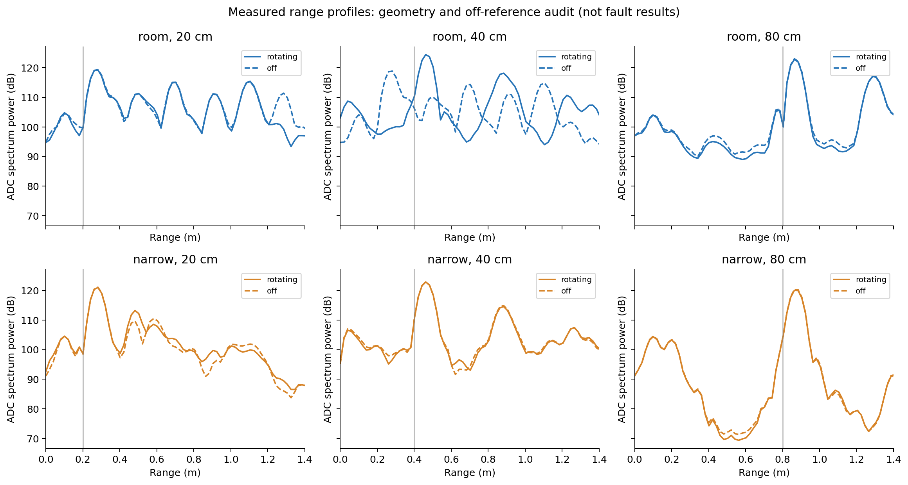
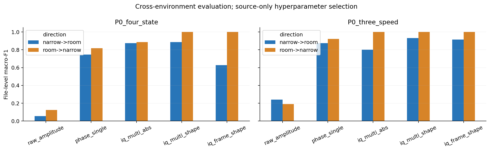
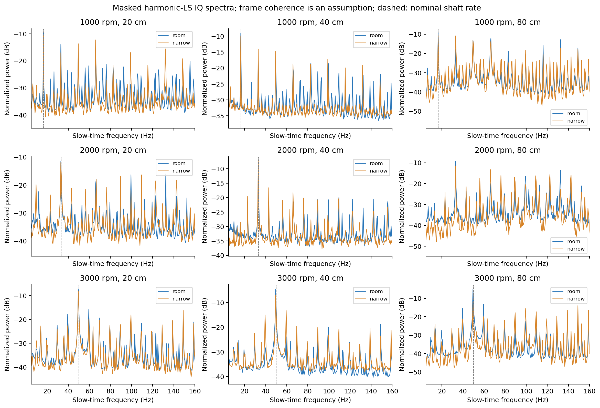
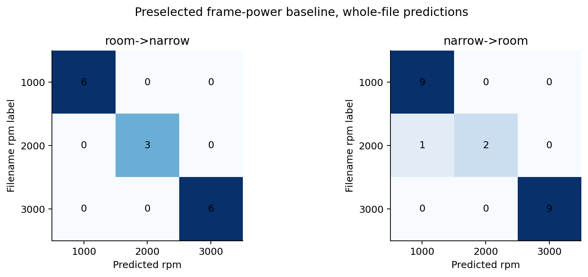

# room/narrow 毫米波环境验证：实际数据结果

已在 conda `m2vllm` 中完成。建议先读 [实验结论与算法细节](实验结论.md)，并结合 [未见距离与主频对照](补充验证.md)：简单主频对照同样达到 100%，而未见距离测试出现明显下降，不能仅凭下方主表认定环境影响已被消除。

本报告基于目录的一次稳定输入快照，处理前后 manifest 不变；是否与上传源文件完整一致，应结合上传完成确认和源端校验和。数据包含正常轴承旋转与停止状态，没有故障类或同步加速度，因此这里的分类结果是运动状态/转速结果，不是故障诊断或跨模态迁移结果。

## 解析与协议

假设使用用户前述 cfg：256 ADC、4RX、192 chirp/100 ms、chirp 周期 500 μs；按 TI 两 lane 的 2I/2Q 布局解析，使用固定共轭方向使目标距离峰位于正频率。仅有 bin 时，不能严格证明帧起点与 UDP 缺包重排正确；具体配置、采集版本及独立 run 信息仍需采集记录佐证。

各窗口 2 秒，不重叠；每次训练只用一个环境。所有标准化和分类器参数由源环境训练产生，C=0.1/1/10 只在源环境按距离留出验证选择。先平均同一文件的窗口概率，再计算文件级 macro-F1 与 balanced accuracy。训练权重使同类文件等权、类别总权重相同。文件名转速没有输入模型；距离只用于所有方法一致的几何 ROI。

同一次采集拆分文件必须合并为同一 run；当前结果按文件计数。在未确认独立录制前，不把它称为独立 run 泛化。两个环境不足以估计任意新环境的总体表现。

## 数据清点

共 42 个文件，约 10.556 GB，652 个完整 2 秒窗口。末尾非整帧余量逐文件记录，不作为零填充测量。

| environment | label | distance_cm | files |
| --- | --- | --- | --- |
| narrow | 1000 | 20 | 2 |
| narrow | 1000 | 40 | 2 |
| narrow | 1000 | 80 | 2 |
| narrow | 2000 | 20 | 1 |
| narrow | 2000 | 40 | 1 |
| narrow | 2000 | 80 | 1 |
| narrow | 3000 | 20 | 2 |
| narrow | 3000 | 40 | 2 |
| narrow | 3000 | 80 | 2 |
| narrow | off | 20 | 1 |
| narrow | off | 40 | 1 |
| narrow | off | 80 | 1 |
| room | 1000 | 20 | 3 |
| room | 1000 | 40 | 3 |
| room | 1000 | 80 | 3 |
| room | 2000 | 20 | 1 |
| room | 2000 | 40 | 1 |
| room | 2000 | 80 | 1 |
| room | 3000 | 20 | 3 |
| room | 3000 | 40 | 3 |
| room | 3000 | 80 | 3 |
| room | off | 20 | 1 |
| room | off | 40 | 1 |
| room | off | 80 | 1 |

## 处理方法

- `raw_amplitude`：ROI 三 bin×4RX 的 log 幅度功率，检查对静态几何/环境的依赖。
- `phase_single`：最强单元的包内相位增量，真实 mask 上作谐波回归；不跨帧差分。
- `iq_multi_abs`：按复幅度尺度归一化的多单元 IQ、帧内去均值、mask 谐波回归、稳健功率汇聚。
- `iq_multi_shape`：上一方法的 log 频带谱减频带均值，检验幅值归一化是否保留任务信息。
- `iq_frame_shape`：完整帧内估谱，跨帧平均功率；不要求绝对帧间相干，但实际分辨率受 96 ms 片段限制。
- `iq_multi_off` / `iq_frame_off`：分别在上述前端上使用同环境同距离 off 的噪声谱归一化。仅评价旋转记录，off 参考不进入测试状态分类。

mask 谐波回归包含常数、cos、sin 项，已与直接最小二乘对照核查。它没有把缺口当成观测零值，但也不保证消除全部谱泄漏；跨帧相干性未经独立标定时，相应结果属于条件性结果。原始 ADC 削顶无法通过这些算法恢复。

## 实际结果

| task | direction | method | C | source_cv_macro_f1 | macro_f1 | balanced_accuracy | n_files |
| --- | --- | --- | --- | --- | --- | --- | --- |
| P0_four_state | room->narrow | raw_amplitude | 0.1 | 0.064 | 0.125 | 0.250 | 18 |
| P0_four_state | room->narrow | phase_single | 1.0 | 0.688 | 0.817 | 0.833 | 18 |
| P0_four_state | room->narrow | iq_multi_abs | 0.1 | 0.905 | 0.887 | 0.917 | 18 |
| P0_four_state | room->narrow | iq_multi_shape | 0.1 | 0.821 | 1.000 | 1.000 | 18 |
| P0_four_state | room->narrow | iq_frame_shape | 0.1 | 0.626 | 1.000 | 1.000 | 18 |
| P0_four_state | narrow->room | raw_amplitude | 10.0 | 0.095 | 0.056 | 0.250 | 24 |
| P0_four_state | narrow->room | phase_single | 1.0 | 1.000 | 0.747 | 0.778 | 24 |
| P0_four_state | narrow->room | iq_multi_abs | 0.1 | 1.000 | 0.874 | 0.833 | 24 |
| P0_four_state | narrow->room | iq_multi_shape | 0.1 | 1.000 | 0.886 | 0.889 | 24 |
| P0_four_state | narrow->room | iq_frame_shape | 0.1 | 0.875 | 0.629 | 0.667 | 24 |
| P0_three_speed | room->narrow | raw_amplitude | 0.1 | 0.170 | 0.190 | 0.333 | 15 |
| P0_three_speed | room->narrow | phase_single | 0.1 | 1.000 | 0.922 | 0.944 | 15 |
| P0_three_speed | room->narrow | iq_multi_abs | 0.1 | 1.000 | 1.000 | 1.000 | 15 |
| P0_three_speed | room->narrow | iq_multi_shape | 0.1 | 1.000 | 1.000 | 1.000 | 15 |
| P0_three_speed | room->narrow | iq_frame_shape | 0.1 | 1.000 | 1.000 | 1.000 | 15 |
| P0_three_speed | narrow->room | raw_amplitude | 10.0 | 0.164 | 0.241 | 0.333 | 21 |
| P0_three_speed | narrow->room | phase_single | 0.1 | 0.730 | 0.875 | 0.926 | 21 |
| P0_three_speed | narrow->room | iq_multi_abs | 0.1 | 1.000 | 0.800 | 0.778 | 21 |
| P0_three_speed | narrow->room | iq_multi_shape | 0.1 | 1.000 | 0.933 | 0.963 | 21 |
| P0_three_speed | narrow->room | iq_frame_shape | 0.1 | 1.000 | 0.916 | 0.889 | 21 |
| P1_matched_geometry_three_speed | room->narrow | phase_single | 0.1 | 0.543 | 1.000 | 1.000 | 10 |
| P1_matched_geometry_three_speed | room->narrow | iq_multi_shape | 0.1 | 1.000 | 1.000 | 1.000 | 10 |
| P1_matched_geometry_three_speed | room->narrow | iq_frame_shape | 0.1 | 1.000 | 1.000 | 1.000 | 10 |
| P1_matched_geometry_three_speed | room->narrow | iq_multi_off | 0.1 | 0.911 | 1.000 | 1.000 | 10 |
| P1_matched_geometry_three_speed | room->narrow | iq_frame_off | 0.1 | 1.000 | 0.852 | 0.833 | 10 |
| P1_matched_geometry_three_speed | narrow->room | phase_single | 0.1 | 0.556 | 0.822 | 0.889 | 14 |
| P1_matched_geometry_three_speed | narrow->room | iq_multi_shape | 0.1 | 1.000 | 1.000 | 1.000 | 14 |
| P1_matched_geometry_three_speed | narrow->room | iq_frame_shape | 0.1 | 1.000 | 0.944 | 0.944 | 14 |
| P1_matched_geometry_three_speed | narrow->room | iq_multi_off | 0.1 | 0.667 | 1.000 | 1.000 | 14 |
| P1_matched_geometry_three_speed | narrow->room | iq_frame_off | 0.1 | 1.000 | 0.944 | 0.944 | 14 |

### 预先指定比较的解读

- room->narrow：完整帧多单元谱形状为 1.000，单单元相位基线为 0.922，差值 +7.8 个百分点。
- narrow->room：完整帧多单元谱形状为 0.916，单单元相位基线为 0.875，差值 +4.1 个百分点。

在这两个固定方向上，该预先指定前端均提高了三转速识别的文件级分数；样本量、独立性和故障任务外推仍受下述限制。不能仅凭这两个点宣称统计显著或普适改进。

P1 与 P0 的公平比较仅使用相同有效校准距离子集；不要把该子集上的分数直接与全距离主表比较。

P1 两环境共同有效距离：[20, 80] cm；几何一致性采用统一 10 cm 残差容许值。待核查 off 文件：`[{"file": "room-off-40cm-motor.bin", "range_residual_m": 0.18254533323188077, "reason": "off target range inconsistent; pending acquisition metadata"}]`。

## 数据质量与解释边界

以下文件至少 0.1% 的已处理 int16 数值接近上下限（阈值 |x|≥32760），需要核查增益/削顶；主表保留它们，没有依据性能删除：

| file | clip_fraction | roi_peak_m |
| --- | --- | --- |
| room-1000r-40cm-normal1.bin | 0.0037526448567708334 | 0.46201871256321575 |
| room-1000r-40cm-normal2.bin | 0.003561965624491374 | 0.46201871256321575 |
| room-1000r-40cm-normal3.bin | 0.003526631991068522 | 0.46201871256321575 |
| room-2000r-40cm-normal.bin | 0.0034039815266927085 | 0.46201871256321575 |
| room-3000r-40cm-normal1.bin | 0.0037603266098920037 | 0.46201871256321575 |
| room-3000r-40cm-normal2.bin | 0.0032061258951822918 | 0.46201871256321575 |
| room-3000r-40cm-normal3.bin | 0.002732198378619026 | 0.46201871256321575 |

域差异变小本身不是成功：应同时保持不同转速的可分性。更高的正常旋转/停止识别分数不证明保留了轴承故障信息。若复杂前端没有超过简单前端，应按实测结果缩减设计；不能把候选算法写成已经有效。

## 图与复现产物

结果明细在 `results/cross_environment_metrics.csv`、`file_predictions.csv`、`per_distance_metrics.csv`；数据与配置在 `input_manifest.json`、`quality.json`、`processing_config.json`。保留输入快照、源环境参数选择日志与全部逐文件预测。

解析依据：[TI RAW Capture](https://www.ti.com/lit/an/swra581b/swra581b.pdf)、[TI 对 AWR1843 格式的确认](https://e2e.ti.com/support/sensors-group/sensors/f/sensors-forum/967227/dca1000evm-raw-data-format)。
