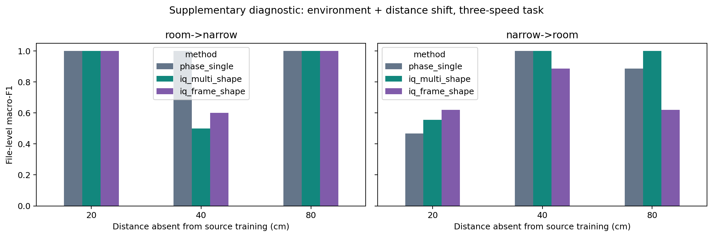
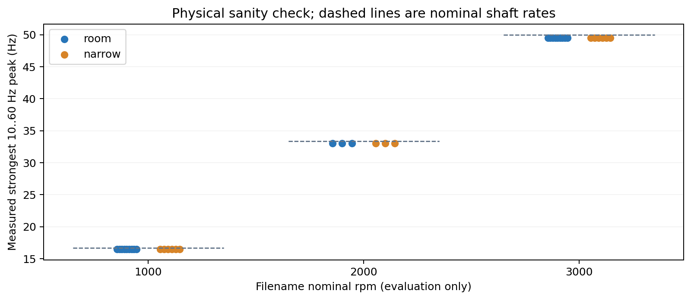

# 补充诊断检查：距离外推与转频基线

这部分在查看主实验后增加，用于检查“高分是否只是转频容易识别”和“距离变化是否仍然稳健”。它是事后诊断性补充；主实验处理规则、参数网格及结果没有依据这些目标域结果修改。

## 环境与距离同时留出

训练只用源环境的两个距离，测试仅用目标环境的第三个距离。C 仍只在源环境剩余两距离交叉验证选择。目标距离作为已知部署几何用于相同 ROI 规则，未给分类器输入距离/转速标签。每个测试单元只有 5 或 7 个文件，结论应克制。

| direction | held_distance_cm | method | C | source_cv_macro_f1 | macro_f1 | balanced_accuracy | n_files | n_classes |
| --- | --- | --- | --- | --- | --- | --- | --- | --- |
| room->narrow | 20 | phase_single | 0.1 | 0.810 | 1.000 | 1.000 | 5 | 3 |
| room->narrow | 20 | iq_multi_shape | 0.1 | 1.000 | 1.000 | 1.000 | 5 | 3 |
| room->narrow | 20 | iq_frame_shape | 0.1 | 1.000 | 1.000 | 1.000 | 5 | 3 |
| room->narrow | 40 | phase_single | 0.1 | 0.543 | 1.000 | 1.000 | 5 | 3 |
| room->narrow | 40 | iq_multi_shape | 0.1 | 1.000 | 0.500 | 0.667 | 5 | 3 |
| room->narrow | 40 | iq_frame_shape | 0.1 | 1.000 | 0.600 | 0.667 | 5 | 3 |
| room->narrow | 80 | phase_single | 0.1 | 0.410 | 1.000 | 1.000 | 5 | 3 |
| room->narrow | 80 | iq_multi_shape | 0.1 | 0.911 | 1.000 | 1.000 | 5 | 3 |
| room->narrow | 80 | iq_frame_shape | 1.0 | 1.000 | 1.000 | 1.000 | 5 | 3 |
| narrow->room | 20 | phase_single | 0.1 | 0.373 | 0.467 | 0.667 | 7 | 3 |
| narrow->room | 20 | iq_multi_shape | 0.1 | 1.000 | 0.556 | 0.556 | 7 | 3 |
| narrow->room | 20 | iq_frame_shape | 0.1 | 0.750 | 0.619 | 0.667 | 7 | 3 |
| narrow->room | 40 | phase_single | 0.1 | 0.556 | 1.000 | 1.000 | 7 | 3 |
| narrow->room | 40 | iq_multi_shape | 0.1 | 1.000 | 1.000 | 1.000 | 7 | 3 |
| narrow->room | 40 | iq_frame_shape | 0.1 | 1.000 | 0.886 | 0.889 | 7 | 3 |
| narrow->room | 80 | phase_single | 0.1 | 1.000 | 0.886 | 0.889 | 7 | 3 |
| narrow->room | 80 | iq_multi_shape | 0.1 | 1.000 | 1.000 | 1.000 | 7 | 3 |
| narrow->room | 80 | iq_frame_shape | 0.1 | 1.000 | 0.619 | 0.667 | 7 | 3 |

## 无复杂分类器的物理对照

固定在 10–60 Hz 运行频带内选最大峰，每文件取窗口峰值中位数；用源环境每类的峰值中位数作为原型，对目标文件做最近原型分类。目标文件名转速只用于事后评价，没有用于寻峰。该范围利用了本任务已知运行范围，不是任意转速算法。

主频对照共用已处理的多单元 IQ 频谱；它检验的是复杂谱特征分类是否必要，不是完全独立的原始信号前端对照。

- room->narrow：macro-F1=1.000，balanced accuracy=1.000，n=15；源原型 Hz：{'1000': 16.5, '2000': 33.0, '3000': 49.5}。
- narrow->room：macro-F1=1.000，balanced accuracy=1.000，n=21；源原型 Hz：{'1000': 16.5, '2000': 33.0, '3000': 49.5}。

若这个简单基线已足够准确，说明本数据最稳健的信息是主转频；不能用转速分类高分证明复杂环境算法或故障诊断创新。后续需要故障状态×相同转速的独立采集。

## 可复用处理产物

`models/` 保存四个主实验谱形状模型的 scaler、线性系数、类别与训练文件列表。导出时逐文件验证预测及概率与主结果一致。它们识别转速/停止状态，不是 BearLLM 教师、跨模态学生或故障分类模型。`results/features.npz` 保存全部处理特征，行顺序对应 `results/windows.csv`。
