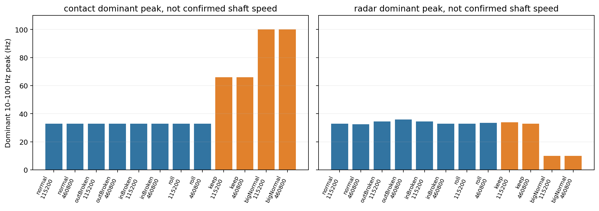

# 主周期归一化：事后诊断检查

**这是受到另一台正常电机预测失败启发的 posthoc 检查。所有新增设置在本检查计算结果前写入 protocol.json；原主实验协议及结果未修改。不能将这里的新外部结果继续称为独立封存测试。**

**结果：六个固定方法对 bigNormal 均为 0/2 正常接受。雷达主周期归一化的两方向文件 macro-F1 从原谱的 1.000 / 1.000 降至 0.667 / 0.333，没有得到稳定补救收益；接触式四种方法两方向均为 1.000，但外部仍全部失败。**

主台四类接触主峰全部为 33 Hz，keep 接触主峰为 66 Hz。bigNormal 两份接触主峰落在搜索上界 100 Hz，雷达落在下界 10 Hz：边界命中说明本搜索不能提供可信的周期基频估计，不能将它们乘 60 当作已知 rpm。本检查保留这些失败，不扩大搜索范围追求更好的外部分类结果。

## 固定算法

逐文件在 10–100 Hz 内选窗口中位功率谱最大峰 f0。接触式先对 XYZ 功率取中位数，雷达使用原 frame_log_power 还原的逐帧谱。估计不用故障标签，也不针对外部健康记录挑峰。f0 只是主周期候选，不是已知轴转频；机械谐波、共振和雷达帧滤波都可能影响它。

把每个窗口 log10 功率插值到固定相对频率 q=0.5…20 的 128 点线性网格，实际查询频率为 q×f0。在原始 5–800 Hz 之外记缺测，不外推。仅在有效点减去本窗口均值；分类器按训练文件等权拟合列均值/方差，缺测映射到标准化后的零，训练全缺列忽略。mask 单独保存但不作为分类输入。

f0 使用该文件所有无标签窗口，因此属于离线录制级自归一化；不能据此声称在线首窗部署已验证。毫米波帧谱真实分辨能力约 10.42 Hz，0.5 Hz 网格并不提高真实分辨率。

原谱与相对频率谱的网格、支持范围也随之改变，当前差异不能全部归因于“除以主周期”这一个因素。该检查回答固定的简单补救方案是否有效，不是孤立所有频谱处理因素的最终消融。

模型固定 L2 多项逻辑回归 C=1；只做两个串口波特率整录制互换方向，以及全部八个已知类录制拟合后的外部案例。keep/bigNormal 全部排除拟合、scaler 与阈值选择。冻结接触式 hidden 来自主实验固定的 BearLLM FCN 及外部参考方案。

## 全部主峰估计

| modality | state | baud | f0_hz | observed_relative_bins | max_observed_relative_frequency | geometry_roi_mismatch |
| --- | --- | --- | --- | --- | --- | --- |
| contact | normal | 115200 | 33 | 128 | 20 | False |
| contact | normal | 460800 | 33 | 128 | 20 | False |
| contact | outBroken | 115200 | 33 | 128 | 20 | False |
| contact | outBroken | 460800 | 33 | 128 | 20 | False |
| contact | inBroken | 115200 | 33 | 128 | 20 | False |
| contact | inBroken | 460800 | 33 | 128 | 20 | False |
| contact | roll | 115200 | 33 | 128 | 20 | False |
| contact | roll | 460800 | 33 | 128 | 20 | False |
| contact | keep | 115200 | 66 | 76 | 12.016 | False |
| contact | keep | 460800 | 66 | 76 | 12.016 | False |
| contact | bigNormal | 115200 | 100 | 49 | 7.8701 | False |
| contact | bigNormal | 460800 | 100 | 49 | 7.8701 | False |
| radar | normal | 115200 | 33 | 128 | 20 | False |
| radar | normal | 460800 | 32.5 | 128 | 20 | False |
| radar | outBroken | 115200 | 34.5 | 128 | 20 | True |
| radar | outBroken | 460800 | 36 | 128 | 20 | True |
| radar | inBroken | 115200 | 34.5 | 128 | 20 | False |
| radar | inBroken | 460800 | 33 | 128 | 20 | False |
| radar | roll | 115200 | 33 | 128 | 20 | False |
| radar | roll | 460800 | 33.5 | 128 | 20 | False |
| radar | keep | 115200 | 34 | 128 | 20 | True |
| radar | keep | 460800 | 33 | 128 | 20 | True |
| radar | bigNormal | 115200 | 10 | 128 | 20 | False |
| radar | bigNormal | 460800 | 10 | 128 | 20 | False |

## 两个方向全部结果

| method | fold | n_train_bags | n_test_bags | file_accuracy | file_macro_f1 | file_balanced_accuracy | window_accuracy_secondary | ignored_source_absent_features |
| --- | --- | --- | --- | --- | --- | --- | --- | --- |
| contact_spectral | 115200_to_460800 | 4 | 4 | 1 | 1 | 1 | 1 | 0 |
| contact_period_normalized | 115200_to_460800 | 4 | 4 | 1 | 1 | 1 | 1 | 0 |
| contact_hidden | 115200_to_460800 | 4 | 4 | 1 | 1 | 1 | 1 | 0 |
| contact_hidden_plus_period_normalized | 115200_to_460800 | 4 | 4 | 1 | 1 | 1 | 1 | 0 |
| radar_frame_shape | 115200_to_460800 | 4 | 4 | 1 | 1 | 1 | 1 | 0 |
| radar_period_normalized | 115200_to_460800 | 4 | 4 | 0.75 | 0.66667 | 0.75 | 0.845 | 0 |
| contact_spectral | 460800_to_115200 | 4 | 4 | 1 | 1 | 1 | 0.96875 | 0 |
| contact_period_normalized | 460800_to_115200 | 4 | 4 | 1 | 1 | 1 | 0.96875 | 0 |
| contact_hidden | 460800_to_115200 | 4 | 4 | 1 | 1 | 1 | 0.84375 | 0 |
| contact_hidden_plus_period_normalized | 460800_to_115200 | 4 | 4 | 1 | 1 | 1 | 0.84375 | 0 |
| radar_frame_shape | 460800_to_115200 | 4 | 4 | 1 | 1 | 1 | 0.99528 | 0 |
| radar_period_normalized | 460800_to_115200 | 4 | 4 | 0.5 | 0.33333 | 0.5 | 0.59434 | 0 |

四类中外圈已有距离门错误，当前表格仅诊断算法与混淆风险。谱归一化不能恢复未保存的目标距离单元。两个方向仅各四个测试文件，不是新的独立轴承试验。

## 全部外部结果

| method | external_healthy_files | healthy_accepted | healthy_acceptance | mean_healthy_probability | unknown_base_fault_files | unknown_rejection_metric |
| --- | --- | --- | --- | --- | --- | --- |
| contact_spectral | 2 | 0 | 0 | 0.00056914 | 2 | not calibrated, not measured |
| contact_period_normalized | 2 | 0 | 0 | 0.010382 | 2 | not calibrated, not measured |
| contact_hidden | 2 | 0 | 0 | 6.2271e-37 | 2 | not calibrated, not measured |
| contact_hidden_plus_period_normalized | 2 | 0 | 0 | 1.6038e-22 | 2 | not calibrated, not measured |
| radar_frame_shape | 2 | 0 | 0 | 1.2223e-07 | 2 | not calibrated, not measured |
| radar_period_normalized | 2 | 0 | 0 | 5.0037e-19 | 2 | not calibrated, not measured |

| method | state | bag_id | prediction | healthy_probability |
| --- | --- | --- | --- | --- |
| contact_spectral | keep | 20260920-195424-keep-115200 | 3 | 0.008054 |
| contact_spectral | keep | 20260920-195753-keep-460800 | 3 | 0.0044382 |
| contact_spectral | bigNormal | 20260920-201757-bigNormal-115200 | 2 | 0.00081512 |
| contact_spectral | bigNormal | 20260920-202115-bigNormal-460800 | 2 | 0.00032316 |
| contact_period_normalized | keep | 20260920-195424-keep-115200 | 2 | 0.031889 |
| contact_period_normalized | keep | 20260920-195753-keep-460800 | 2 | 0.051265 |
| contact_period_normalized | bigNormal | 20260920-201757-bigNormal-115200 | 2 | 0.0088259 |
| contact_period_normalized | bigNormal | 20260920-202115-bigNormal-460800 | 2 | 0.011939 |
| contact_hidden | keep | 20260920-195424-keep-115200 | 3 | 0.0090429 |
| contact_hidden | keep | 20260920-195753-keep-460800 | 3 | 0.01253 |
| contact_hidden | bigNormal | 20260920-201757-bigNormal-115200 | 2 | 1.2454e-36 |
| contact_hidden | bigNormal | 20260920-202115-bigNormal-460800 | 2 | 8.7599e-42 |
| contact_hidden_plus_period_normalized | keep | 20260920-195424-keep-115200 | 2 | 0.019177 |
| contact_hidden_plus_period_normalized | keep | 20260920-195753-keep-460800 | 2 | 0.027435 |
| contact_hidden_plus_period_normalized | bigNormal | 20260920-201757-bigNormal-115200 | 2 | 3.2047e-22 |
| contact_hidden_plus_period_normalized | bigNormal | 20260920-202115-bigNormal-460800 | 2 | 2.7891e-25 |
| radar_frame_shape | keep | 20260920-195424-keep-115200 | 2 | 0.031607 |
| radar_frame_shape | keep | 20260920-195753-keep-460800 | 2 | 0.013617 |
| radar_frame_shape | bigNormal | 20260920-201757-bigNormal-115200 | 2 | 1.913e-07 |
| radar_frame_shape | bigNormal | 20260920-202115-bigNormal-460800 | 2 | 5.3161e-08 |
| radar_period_normalized | keep | 20260920-195424-keep-115200 | 2 | 0.0046934 |
| radar_period_normalized | keep | 20260920-195753-keep-460800 | 2 | 0.027177 |
| radar_period_normalized | bigNormal | 20260920-201757-bigNormal-115200 | 1 | 1.9159e-19 |
| radar_period_normalized | bigNormal | 20260920-202115-bigNormal-460800 | 1 | 8.0916e-19 |

bigNormal 只有另一台电机的正常类，不能证明外部故障分类；keep 是未知底座故障且距离门错误，未拟合开放集拒识阈值，所以不报告未知故障拒识准确率。表中保留所有方法和失败。若某个特征组合改善，仅说明值得按预先冻结方案补采独立数据复验，不能据此选择“最佳模型”后宣布泛化成功。

## 可复现文件

- `protocol.json`：计算前固定的新增协议。
- `run_posthoc.py`：完整计算脚本。
- `features.npz`：原谱/主周期归一化特征、相对频率轴及缺测 mask。
- `recording_frequencies.csv`：逐文件 f0 及有效频率覆盖。
- `training_frequency_prototypes.csv`：各训练折的类别主频均值/范围，仅作诊断。
- `metrics.csv`、`file_predictions.csv`、`external_predictions.csv`：全部结果。
- `models/`：训练来源统计和线性模型参数。

下一步应先确认各录制真实转速，再判断主峰对应基频还是谐波；随后用同转速、同距离和同负载的额外故障/正常电机数据检验是否仍需要此归一化。
