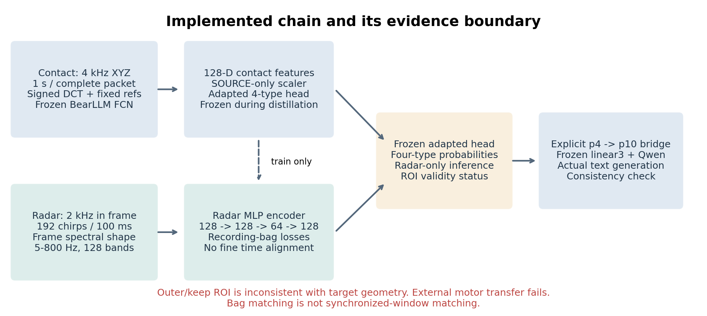
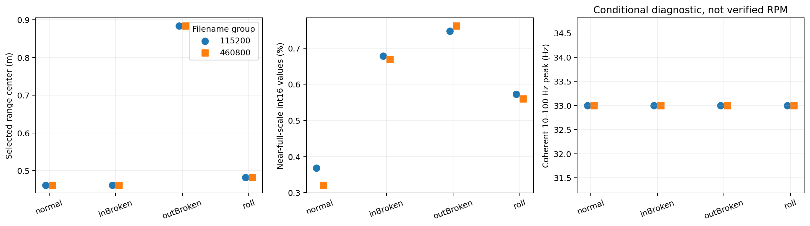
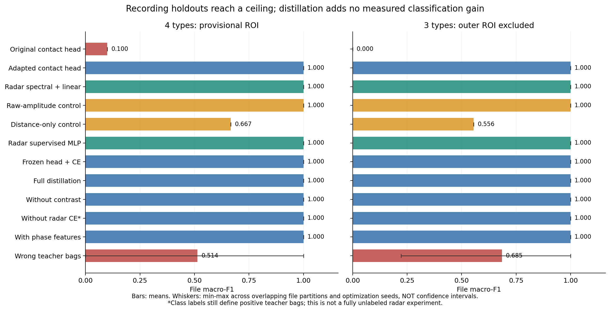
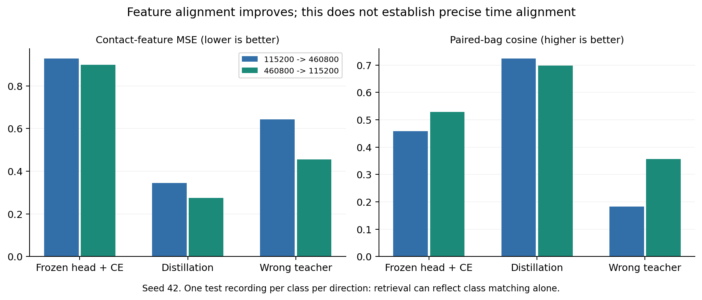
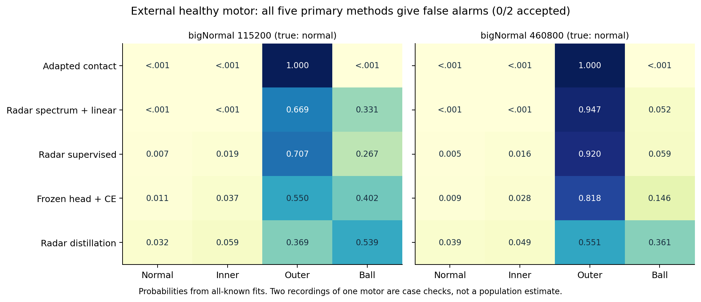

# 接触式 BearLLM → 毫米波学生 → 语言诊断：全链条实测报告

2026-09-22；全部计算使用 conda `m2vllm`。输入为 `four_class_preprocessing_20260921`，新增代码、特征、模型和结果均保存在本目录。原预处理数据、BearLLM 仓库及已有权重未修改。

**已经实际跑通接触式推理、教师适配、毫米波特征提取、学生训练、仅雷达推理和真实 BearLLM/Qwen 语言生成。当前结果证明软件链路可以执行，但没有证明跨电机泛化，也没有证明蒸馏比普通雷达监督更好。外圈雷达距离门存在错误，四分类结果必须保留为候选数据上的工程验证。**

## 1. 最重要的实测结论

| 问题 | 本轮实际结果 | 可以得出的结论 |
|---|---|---|
| 现有接触式模型能否直接判断？ | 重训原 FCN 对 8 个主文件全部判外圈，准确率 25%，macro-F1 0.10；官方最终适配器同样失败 | 不能直接把原预测当可靠蒸馏标签 |
| 做什么修改后可用？ | 冻结 FCN，仅用训练文件拟合标准化及四类线性头，文件留出 macro-F1 1.00 | 本地接触表示可以适配；不等于原模型零样本成功 |
| 雷达 encoder 能否接入接触分类头？ | 可以；冻结适配后的接触头，训练雷达 MLP，全部预设留出划分 macro-F1 1.00 | 已验证输入接口及优化链路 |
| 蒸馏是否比简单方法好？ | 雷达频谱线性分类、普通监督 MLP、原始单元能量基线也都达到 1.00 | 当前数据无法证明分类收益，存在条件混杂与性能天花板 |
| 对另一正常电机是否有效？ | 四类全部 21 个方法对 bigNormal 都是 0/2 正常接受 | 当前四分类跨电机迁移失败 |
| 有无例外？ | 去掉外圈后的三类接触频谱基线为 2/2 正常；主接触 hidden、雷达及所有学生仍为 0/2 | 保留这个有限例外；不能据此宣称完整跨结构故障泛化 |
| 语言模型是否真的运行？ | 110 条真实生成，对输入概率最大类别忠实度 109/110；1 条加入独立规则回退 | 语言接口已验证；它没有纠正外部电机的分类错误 |
| 精细时序对齐是否完成？ | 同步采集关系已确认，但无可靠逐包采样时刻；当前用整段录制集合蒸馏 | 未证明逐窗或逐点同步，也未消除结构传递函数 |

## 2. 数据与物理有效性先于模型分数

用户已确认：接触式实际采样率 **4000 Hz**，每包 4096 个时域 XYZ 点；两模态对应文件同时采集；`115200/460800` 仅表示串口波特率；主测量目标距离都在四十多厘米、雷达 cfg 相同。`keep` 是四类之外的保持座/底座故障，`bigNormal` 是另一台正常电机。实际逐录制转速、负载和是否独立重新启停仍缺完整记录。

| 数据状态 | 录制对数 | 接触式合格 1 s 窗口 | 雷达 2 s 窗口 | 雷达已保存候选距离 |
|---|---:|---:|---:|---|
| normal | 2 | 13 | 109 | 0.462 m |
| inBroken | 2 | 15 | 101 | 0.462 m |
| outBroken | 2 | 18 | 100 | **0.884 m，几何不符** |
| roll | 2 | 12 | 102 | 0.482 m |
| keep，未知故障 | 2 | 18 | 102 | **0.884 m，几何不符** |
| bigNormal，外部正常 | 2 | 12 | 100 | 0.522 m，当前宽容限内 |
| 合计 | 12 | 88 | 614 | 主四类实际只有 8 个录制对 |

全部 24 个 NPZ 的 SHA256 与上传清单一致；数组有限性、行数、标签、mask 和主要预处理计算通过复核。88 个接触窗口的 DCN 由导出 raw_xyz 重算最大误差约 `1.19e-7`，符合 float32 舍入；原预处理提供的 5 项科学/接口测试通过。详见[数据审计](audit/数据与评估协议审计.md)。

**外圈和 keep 的 0.884 m 不能视为电机表面信号已被正确提取。** 原处理在 0.15–2 m 搜索最强峰，每份 NPZ 只保存该峰附近 3 个距离单元。缺失的 0.45 m 附近 IQ 无法通过修改距离字段、PCA、归一化或重采样恢复。本次检索的服务器目录中没有找到这批原始 bin；因此没有声称已经修复。

已新增[统一距离门重处理脚本与说明](scripts/统一距离门重处理.md)，取得原始 bin 后，对全部 12 份录制统一使用初始物理范围 `0.45±0.16 m` 重导出，并复核距离峰。该范围是基于已确认几何制定的候选门，还需用实际 range profile 验收。所有类别都必须遵循同一规则。

另外，460800 的 roll 文件只有 3 个完整接触包；这不能通过跨包补齐制造连续波形。雷达四类近 int16 满量程数值占比约 0.32%–0.76%，属于需要核查的失真风险指标，尚不能单凭这个比例证明模拟削顶。去掉幅值输入也不会修复已有波形失真。

## 3. 接触式教师：先实测原权重，再做最小必要修改

### 3.1 输入与实际模型

每个完整包取中心 `raw_xyz[48:4048]`，得到 4000 点、1 秒；每轴去均值后做有符号 DCT-II，在系数域补零到 24000 维，归一化至整体 RMS 0.01。1 秒 DCN 的第 k 项对应约 `k/2 Hz`，当前只有 0–2 kHz 的观测支持。补零只适配接口，不能生成高频信息。

BearLLM 的两个输入通道是 **query 与 healthy reference**，不是两个加速度轴。本轮从 MBHM 的训练来源中固定选取 9 条健康参考，所有本地查询共用同一集合；按参考与 XYZ 汇聚隐藏表示及概率。没有从本地测试正常文件取参考。该外部参考与本地工况不匹配，因此本轮属于跨工况接口验证，不是原论文同工况参考设置的严格复现。

实际运行了重训独立 FCN、重训最终适配器与官方最终适配器，分别比较固定外部参考和零参考。最终适配器使用与其对应的 LoRA；合并实现与原 PEFT 实现的最大 logit 差小于 `4e-6`。原权重详情、哈希、完整 6 组原模型结果见[接触式教师验证](contact/接触式教师验证.md)。

主教师表示为 FCN 分类层第一层 ReLU 后的 128 维 `hidden_mean`。原十类概率合并为四类的正确映射为：正常 `[0]`、内圈 `[1:4]`、外圈 `[7:10]`、滚动体 `[4:7]`。不能直接将本地四类编号送入原十类分类器。

### 3.2 为什么只改分类头

对每个训练划分，冻结 FCN，按录制等权拟合 `StandardScaler` 和 `LogisticRegression(C=1)`。一条录制的每个窗口权重为 `N/(B·n_b)`，其中 N 是训练窗口总数，B 是训练录制数，n_b 是该录制窗口数；窗口多的文件不会因此占据更大权重。

记标准化后的接触表示为 `z_c`，本地四类头为 `g(z)=Wz+b`。后续雷达训练固定 W、b，不再更新教师。只有 58 个主接触窗口、8 个主录制时，先验证线性适配比直接微调整个大模型更容易解释。本轮线性头已经达到留出分数上限，因此没有继续针对这几个测试文件反复调 FCN、LoRA、SFN 或 RAG。

**这项修改复用了预训练表示和后续语言接口，替换了不适用的故障分类头。** 保留原头的学生对照仍失败，不能称为原 BearLLM 分类器已直接适配毫米波。

## 4. 雷达前端与学生输入

这批数据沿用 R0：帧内 chirp 起点间隔 500 μs，即 **帧内 2000 Hz**；192 chirp/100 ms，一秒平均 1920 个 chirp，但不是均匀 1920 Hz。帧内跨度对应约 96 ms；帧间额外空闲约 4 ms，上一帧末 chirp 起点到下一帧首 chirp 起点为 4.5 ms。

主输入选择逐帧谱形状，避免直接把帧间缺口当连续采样：

1. 使用导出 IQ 的 4 RX × 3 个相邻距离单元。这里是 12 个相关空间单元，不是 12 个独立虚拟天线；R0 的 TX=7 也不能据此解释为已完成 TDM-MIMO 分离。
2. 每帧去均值、加 Hann 窗求谱，对有效完整帧汇聚，再跨空间单元稳健汇聚。主分支不要求跨帧绝对相位连续。
3. 固定在 5–800 Hz 池化 128 个频带，先平均功率再取 log10，最后减去该窗口各频带均值。频带细节见 [feature_schema.json](radar/feature_schema.json)。
4. 仅用训练录制拟合特征标准化，输出 `frame_shape[N,128]`。

帧内只有 192 点，真正的频率分辨能力约 **10.42 Hz**；0.5 Hz 求值网格与较细的特征频带不意味着能分辨相隔 0.5 或 2 Hz 的故障边带。IQ 已做单元幅度归一化，`frame_abs` 也不能解释为物理绝对位移能量。

相位分支仅用帧内相邻有效 chirp 的相位变化率，每帧 191 个差分点，得到另一个 128 维谱形状。`distill_phase` 拼接为 256 维输入。另保留跨帧相干谱、无量纲时域统计作对照；相干谱并未自动当作主方法。

距离、原始单元能量只用于混杂对照，不进入主 encoder。但去掉这些字段并不等于从信号中消除了距离、散射体、安装、结构响应的影响。环境不变性必须通过完整环境留出验证，不能由归一化操作本身保证。

本轮没有加入 PHI-S。全局线性旋转/统一缩放可以改变表示的数值条件，不能一般地逆掉不同电机、不同测点的未知传递函数；按训练数据拟合后可作为未来独立消融。当前没有证据表明这个步骤是主要瓶颈。

## 5. 已训练的 encoder 与损失

### 5.1 网络及训练对象

主学生：`Linear(128,128) → LayerNorm → GELU → Dropout(0.1) → Linear(128,64) → GELU → Linear(64,128)`。相位增强版仅将第一层输入改为 256。输出位于标准化后的接触 hidden 坐标系，送入固定的本地接触分类头。

用户确认的是“文件同时采集”，没有可靠逐包绝对采样时间，所以本轮选择 **recording-bag 蒸馏**。一对同步录制分别构成接触窗口集合 C_b 与雷达窗口集合 R_b，集合窗口数可以不同，不把第 i 个接触窗口硬配给第 i 个雷达窗口。

设 `z_ri=E_r(x_ri)`，`μ_cb=mean(z_cj, j∈C_b)`，`μ_rb=mean(z_ri, i∈R_b)`。训练时每个 bag 随机有放回抽取 16 个雷达窗口，教师中心使用该训练 bag 的全部合格接触窗口。

### 5.2 四项损失的实际定义

分类项使用训练录制标签：

\[
L_{CE}=\operatorname{mean}_{b,i} CE(g(z_{ri}),y_b).
\]

表示项约束录制集合中心：

\[
L_{feat}=\operatorname{mean}_{b,d}(\mu_{rb,d}-\mu_{cb,d})^2.
\]

温度蒸馏先对窗口做 softmax，再在 bag 内平均：

\[
q_b^T=\operatorname{mean}_{j\in C_b}\operatorname{softmax}(g(z_{cj})/T),\quad
p_b^T=\operatorname{mean}_{i\in R_b}\operatorname{softmax}(g(z_{ri})/T),
\]
\[
L_{KD}=T^2\operatorname{mean}_b KL(q_b^T\Vert p_b^T),\quad T=2.
\]

令 `s_bk=cos(μ_rb,μ_ck)/τ`，`τ=0.2`，P(b) 为训练中与 b 同类的接触 bag：

\[
L_{con}=\operatorname{mean}_b\left[\log\sum_k e^{s_{bk}}-\log\sum_{k\in P(b)}e^{s_{bk}}\right].
\]

总损失固定为：

\[
\boxed{L=L_{CE}+L_{feat}+0.5L_{KD}+0.1L_{con}}.
\]

AdamW，学习率 0.001、weight decay 0.01、梯度范数截断 5，固定训练 200 步。留出实验使用 seed 17/42/73；全部已知类拟合后的外部检查只用预设 seed42。没有按测试结果早停、选最佳轮次或挑随机种子。

每类只有一个训练 bag 时，bag 中心同时就是该类唯一原型；所以这个实验无法区分同录制的细粒度对应与类别级迁移。`no_radar_CE` 仅删除直接雷达 CE，教师及对比正例仍使用类别信息，不能叫“完全无标签雷达学习”。

## 6. 留出协议、强基线和消融结果

四类每类两份录制，一份训练另一份测试，穷举 `2^4=16` 个划分；同一个录制对的全部接触窗口、雷达窗口和三轴始终在同一侧。另排除错误外圈距离门，做 `2^3=8` 个几何相容三类划分，作为敏感性分析，不替代四类任务。

scaler、接触头、教师中心、学生训练均只访问训练录制。测试时仅雷达数据即可计算预测；测试接触表示只用于事后评价对齐程度。keep 和 bigNormal 不进入训练、正常参考选择、标准化、阈值拟合或模型选择。每文件先平均窗口概率，再计算分类指标。

下表是预设文件划分/seed 上的 **文件 macro-F1 描述性平均**。原始全量结果见 [method_summary.csv](results/chain_v1/method_summary.csv) 和 [metrics.csv](results/chain_v1/metrics.csv)。

| 方法 | 四类候选 ROI | 几何相容三类 | 解释 |
|---|---:|---:|---|
| 原接触头 | 0.100 | 0.000 | 四类准确率 0.25；三类时外圈输出仍记错误 |
| 冻结接触 hidden + 新线性头 | 1.000 | 1.000 | 主教师 |
| 接触 XYZ hidden 拼接 | 0.854 | 0.833 | 不把轴当独立样本 |
| 最终 LoRA 接触 hidden + 新头 | 0.938 | 1.000 | 与独立 FCN 区分 |
| 接触频谱 / 接触简单统计 + 线性头 | 1.000 / 1.000 | 1.000 / 1.000 | 强简单基线 |
| 雷达帧谱 / 帧谱与相位 + 线性头 | 1.000 / 1.000 | 1.000 / 1.000 | 无教师也满分 |
| 雷达相干谱 + 线性头 | 0.563 | 0.472 | 跨帧相干并非自动更好 |
| 雷达帧内时域统计 + 线性头 | 0.750 | 0.778 | 保留未满分结果 |
| 仅原始单元能量 | 1.000 | 1.000 | 混杂诊断，不是理想主输入 |
| 仅候选距离 | 0.667 | 0.556 | 显示几何与标签有关联 |
| `supervised`：雷达 MLP + 自己的头 | 1.000 | 1.000 | 无教师对照 |
| `head_only`：固定适配接触头 + CE | 1.000 | 1.000 | 无表示/分布/对比蒸馏 |
| `distill`：完整损失 | 1.000 | 1.000 | 主学生 |
| 去对比 / 去雷达 CE / 加相位 | 全部 1.000 | 全部 1.000 | 当前分数无法识别组件收益 |
| `shuffled`：错类教师集合 | 0.514 | 0.685 | 四类范围 0–1，三类 0.222–1 |
| 表示回归后直接接原十类头 | 0.100 | 0.000 | 原分类头复用仍失败 |

`shuffled` 使用预先固定的跨类循环错配，保留正确 CE，只打乱教师目标。其下降表明错误教师会伤害训练；它不证明精确同步必不可少，也不是“同类不同录制的时间对应打乱”实验。

在 seed42 两个完整波特率留出方向，主蒸馏的接触表示 MSE 为 **0.346/0.275**，固定头仅 CE 为 **0.928/0.898**；对应 bag 余弦相似度从 **0.459/0.529** 提高至 **0.723/0.698**。这支持“学生更接近指定教师坐标系”，但分类率没有提高。每类一个测试 bag 的检索命中率同样无法区分实例对应与类别对应。

**统计单位仍是 8 个主录制对，而不是 412 个雷达窗口、16 个折或 592 次训练。** 16 个四类划分只有 8 组互补分区；折和种子并非独立物理实验。本报告不据此计算独立实验置信区间或显著性，不把串口波特率留出称为跨环境留出。

## 7. 外部电机与未知故障：保留失败，不做后验包装

对全部已知类录制拟合后，独立评估 keep 和 bigNormal。四分类的主方法如下：

| 方法 | bigNormal 两文件正常概率 | 正常接受数 |
|---|---|---:|
| 适配接触 hidden | `1.25e-36 / 8.76e-42` | 0/2 |
| 雷达谱形状线性基线 | `1.91e-7 / 5.32e-8` | 0/2 |
| 普通雷达监督 MLP | `0.00695 / 0.00490` | 0/2 |
| 完整雷达蒸馏 | `0.0322 / 0.0387` | 0/2 |

四类全部 21 个方法均为 0/2；三类任务存在接触频谱线性基线 2/2 的例外，正常概率约 0.886/0.945，另外 20 个方法仍为 0/2。删除外圈类会改变决策边界，这个结果不能外推为四类或完整故障泛化成功。完整外部结果见 [external_summary.csv](results/chain_v1/external_summary.csv)。

keep 是未知底座故障，闭集模型将其分到某个已知类并不表示正确识别了未知故障；雷达还存在错误 ROI。没有独立校准拒识阈值，所以不报告未知拒识准确率。`1-max(p)` 仅作描述性分数，不是已验证的开放集能力。

针对外部失败，另做了预写方案的**事后主周期归一化检查**：逐文件无标签地在 10–100 Hz 找主峰，插值到相对频率坐标，训练来源拟合缺测处理与线性分类器。六个四类方法对 bigNormal 仍全部 0/2；雷达归一化两方向 macro-F1 从 1/1 降到 **0.667/0.333**。没有再扩大频带挑选更好外部成绩。

主台四类接触峰均为 33 Hz；bigNormal 接触/雷达峰分别碰到 100/10 Hz 搜索边界，不能解释为可靠转频，更不能直接换算成 6000/600 rpm。现有外部差异混合了电机、工况及测量路径因素，不能归因于结构一种因素。详见[主周期归一化事后检查](period_normalization/主周期归一化事后检查.md)。

## 8. 实际接入 BearLLM 语言生成

主链的四类概率明确展开为原十类概率：`q0=p正常`，`q1:4=p内圈/3`，`q7:10=p外圈/3`，`q4:7=p滚动体/3`。送入实际最终适配器的冻结 LoRA `linear3`，产生 `5×1536` 个信号嵌入，再调用冻结 Qwen2.5-1.5B-Instruct + BearLLM LoRA 生成。

这是新增的四类语义桥，不是原始波形 encoder 对雷达的直接零样本推理。严重度槽位均分只是兼容接口，**没有严重度证据**，提示词也明确只要求故障部位。真值没有进入提示或嵌入。

实际执行 110 条主生成，含 70 条留出方法/任务组合和 40 条外部组合；这些仍来自 8 个主文件和 4 个外部文件。所选 5 个接口方法的留出输出全对，外部正常仍全部误报。原始语言对概率最大类别的忠实度为 **109/110=99.09%**，无解析失败或截断。

保留的一例：三类 `no_radar_CE` 对 bigNormal 第二文件的概率为内圈约 0.574、滚动体约 0.378，实际文本却输出滚动体。新增独立后处理仅在文本类别与概率 argmax 不一致时回退为标准类别短语，原始生成、概率与原指标不改。规则后 110/110 一致性是确定性保证，不是 LLM 诊断性能提升。根据真实质量元数据，对错误雷达 ROI 标记无效，不依赖故障真值。

真实生成证据：[LLM 语义桥报告](contact/llm_bridge_chain_v1/LLM语义桥验证.md)、[原始逐条生成](contact/llm_bridge_chain_v1/generation_predictions.csv)、[独立一致性输出](contact/llm_bridge_chain_v1/guarded_predictions.csv)。

## 9. 已完成的可复现验证及尚未完成的物理验证

正式运行包含 **592 次固定 200 步学生训练、888 行文件指标**；保留全部划分、基线、消融、逐文件概率和训练轨迹。两个完整方向与 all_known 的 seed42 学生检查点均保存，共 48 个；其他种子的指标和轨迹全量保留，未将每次中间模型都保存为独立交付。

48 个保存模型重新加载后，CPU 仅雷达预测与原预测一致；最高概率绝对差小于 `1e-6`。测试接触样本和标签不参与推理。独立复核从 3256 条重复文件预测重算全部 888 行指标，均一致；确认训练/测试 bag 隔离、外部样本未参与拟合、脚本/协议哈希与运行记录一致。证据：[verification.json](results/chain_v1/verification.json)、[最终独立审查](audit/final_result_review.md)。

另用已删除标签、state 和接触信息的输入，实跑[独立推理命令](scripts/雷达独立推理.md)：614 行雷达特征汇聚为 12 文件，经保存学生、固定头、真实 Qwen 和一致性规则输出。概率与原仅雷达结果最大差约 `1.08e-8`，4 文件按实际几何标无效。该演示包含训练录制，只验证接口，不计测试准确率。

CPU 两线程微基准中，学生 encoder 33,344 参数，加四类头共 33,860 参数，checkpoint 为 150,191 字节。预载单窗口特征的标准化→encoder→固定头→softmax，预热 200 次、测量 500 次，p50/p95 为 **0.0282/0.0325 ms**。不含 ADC 解析、特征提取、2 秒采集、文件读取和 LLM；不能把它当作全链路实时延迟。详见[成本测量](results/latency_benchmark.md)。

仍未完成的项目需要新的信息或测量：正确目标 ROI 的四类验证、可靠逐窗时间对应、独立轴承/启停留出、故障与环境完全交叉的环境测试、跨电机故障泛化、开放集阈值校准。这些不是再提高当前文件分数就能替代的。

## 10. 下一轮优先顺序与入口

第一优先是从原 bin 统一修复 ROI；第二是独立本地正常参考和同条件四类重新采集；第三是完整条件留出和仅正常外部电机检查。待这些通过后，再检验更复杂的对应算法、结构鲁棒表示或大模型改造。当前数据不足以判断 PHI-S、SFN、RAG 是否有诊断增益。

建议把论文核心验证问题收紧为：**接触式监督能否在标签稀缺、正确目标门、未见环境的测试中，让雷达比同预算普通监督有更高准确率和更少误报？** 当前结果没有回答“能”，但已给出可以继续检验它的完整代码和明确失败案例。

具体采集矩阵、对齐算法下一版、14 天安排及停止/继续准则见[下一轮算法与补采实验方案](下一轮算法与补采实验方案.md)。复现命令、模型入口和目录索引见 [README](README.md)。
