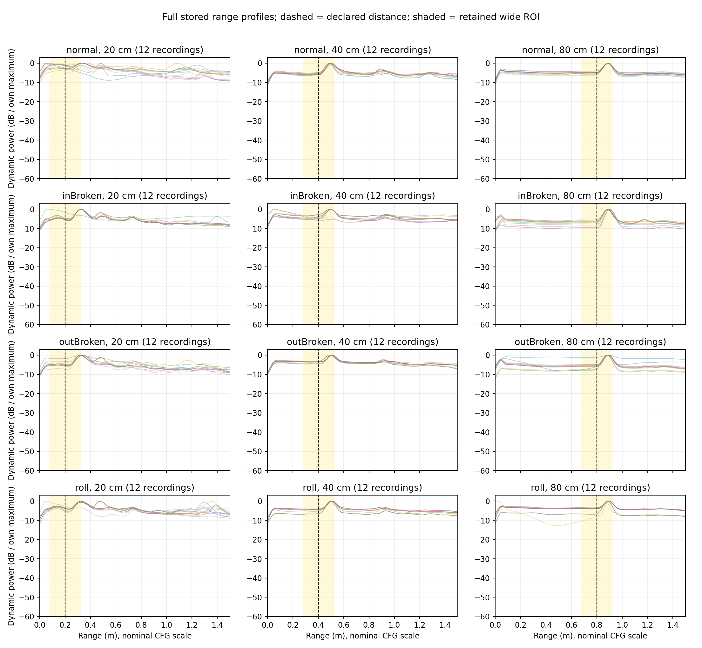
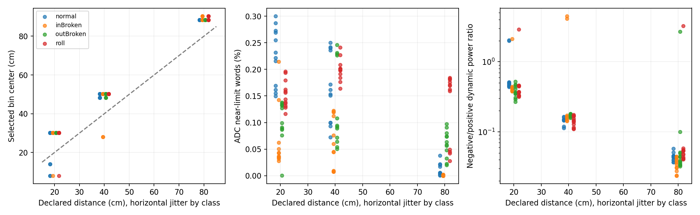
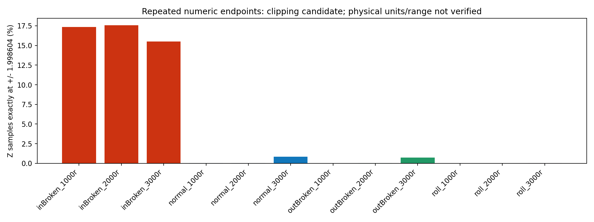
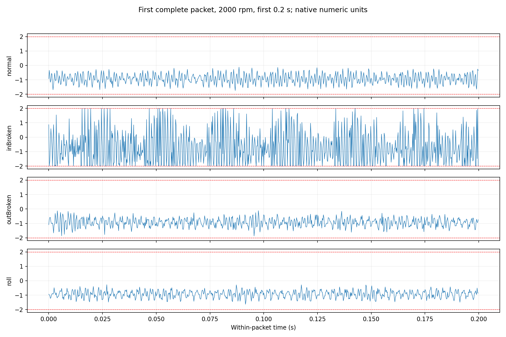

# 新 R2 批次的数据完整性与质量审计

审计日期：2026-09-28。原始上传目录只读，未修改任何源文件、未筛掉录制或数据包、未训练模型。

## 能确认的内容

- 144 段雷达，四类 × 三转速 × 三距离 × 四段；110,791 帧，2,158 个完整两秒窗口，另保留窗口末尾帧。名义雷达总时长 4,431.64 秒，单段 27.08–34.24 秒。
- 12 条接触会话，343 个完整 4096 点 XYZ 包；每条 DAT 被 12 段雷达共同引用。不能把这些关联算作 144 份独立的接触录制。
- 按每个上传目录内的 `DONE.json`，重新流式读取 468 个文件、3,383,955,566 字节，文件大小和 SHA256 全部一致。
- 12 个 `contact_original.DAT.gz` 解压后的 SHA256 与导出时记录的原 DAT SHA256 全部一致。
- 元数据中的 144 个雷达原始源 SHA256 彼此不同；12 个接触源 SHA256 彼此不同。这排除了元数据记录的同一原文件重复使用，不能证明录制的统计独立性。
- 全部 144 条雷达抽查开头、中间、末尾五帧，合计 2,764,800 个紧凑复数值，与相应宽 ROI 的对应值完全一致。此项是抽样，未重做本地交付报告声称的全元素比对。
- 形状、5000 Hz 帧内名义时间索引、40 ms 帧周期均一致。所有 `valid_chirp` 为真只说明原导出没有发现全零 chirp，不能证明 ADC 无丢包。

完整性校验验证上传一致性；它不能替代原 BIN 字节布局、IQ 符号、采集帧起点、真实 cfg 或 DCA 丢包日志的核验。服务器这次没有收到原始 BIN 和上述采集日志。

## 雷达距离选区需要复核，但不能直接说全部解码错误

| 标记距离 | 边界峰 / 48 段 | 下界 / 上界 | 负频率镜像提示 | ADC 接近极限提示 |
|---|---:|---:|---:|---:|
| 20 cm | 46 | 4 / 42 | 4 | 47 |
| 40 cm | 41 | 2 / 39 | 2 | 44 |
| 80 cm | 8 | 0 / 8 | 0 | 28 |

全距离轮廓比“边界峰数量”提供了更多信息：

- 20 cm：全局动态能量最大值有 31 段在 0.321 m，6 段在 0.341 m；当前宽 ROI 上界为 0.320 m，实际保存的最后一个 bin 为约 0.301 m。这些录制的峰顶没有包含在上传的宽复数 ROI 内。
- 40 cm：37 段的全局动态峰在 0.502 m，8 段在 0.482 m。
- 80 cm：40 段在 0.884 m，8 段在 0.904 m。

峰的位置随摆放距离变化，普遍比标记距离大约 8–14 cm。可能涉及实际反射位置、测距参考点或固定距离偏置；当前不能确定原因，也不能由边界峰单独认定解码失败。固定按标记距离取中心 bin 的结果同样不能被称作已修复。

建议现有主实验维持既定紧凑输入，并完整报告几何选区敏感性；若要修正 20 cm 峰顶缺失，需要从本地原 BIN 重新导出更宽的正、负距离复数区间。不能只修改当前窄 ROI 的索引来恢复已经没保存的复数信号。距离幅度轮廓还在，但它不能恢复相位。

`|int16 ADC| >= 32760` 是工具的接近数值极限提示，不是确定的模拟饱和证据；位序或解码也会影响这个比例。本次没有根据该提示删掉 119 段录制。

## 接触式的重要新问题：内圈大量取值停在相同端点

| 内圈会话 | 完整包 | XYZ 中绝对值 ≥ 1.99 | Z 轴精确为 ±1.998604 |
|---|---:|---:|---:|
| 1000 rpm | 19 | 7.07% | 17.35% |
| 2000 rpm | 15 | 6.45% | 17.56% |
| 3000 rpm | 14 | 5.82% | 15.52% |

大量样本精确停在正负相同数值，波形出现削顶。**用户在本轮随后明确接触式量程为 2 g**，这与约 ±1.998604 的平台一致，是强截顶证据；超出量程的真实幅度不能从现有数值恢复。用户确认是新增的设备信息，原导出 H5 仍标记单位未确认，审计没有改写源文件。其它类别也存在少量端点样本，但比例明显较低。

这有两方面影响：物理幅度、峭度、冲击形状可能已失真；类别又可能通过截顶程度轻易被区分。即使接触分类很高，也不能由此认定学习了完整故障波形知识。任何阈值筛选必须与类别无关，并报告被筛掉的各类数量；不能把内圈坏包大量删除后只报剩余高分。

12 个 DAT 共识别 3,063 个候选包起点，完整 343 个，占 11.20%；不完整候选 2,720 个。这个比例不是“88.8% 的采样点丢失”，因为不完整包仍可能有有效局部数据。主要解析问题记录为无效字段/断行 9,880 次、计数不连续 554 次、异常计数或非有限值 102 次、意外包标记 31 次、未完包重启 1 次、尾部截断 12 次。计数来自完整问题统计；部分逐条问题日志只保留前 1,000 项。

只有包内 4000 Hz 时间成立，包间时间缺口未知，不能把保存的 343 包拼成连续时间序列，也不能从这些包计算接触记录的真实覆盖率。每个完整包的原始值和源文件字节区间均保留，可进一步检查解析与设备输出。

## 后续模型实验采用什么分组

1. 主跨转速实验：依次留出 1000、2000、3000 rpm；对应的四条 DAT 会话及所有关联雷达都在测试侧。接触头适配、教师均值、StandardScaler、其他可学习变换只能使用训练侧的八条 DAT。测试侧接触数据可作评估参考，不能再参与训练。
2. 留出雷达录制或距离：可以检查同接触会话内的条件变化，但必须写明共享 DAT；不能把结果当作新接触会话泛化。
3. `rep1…rep4` 只是文件名时间排序；导出说明明确未证明独立重新采集，更没证明跨距离相同 rep 是同一轮。不要凭编号创造独立会话或随机把一个长录制的窗口分进训练/测试。
4. 现在每个类别有三种转速下的不同教师目标，能比旧的每类一个教师均值增加验证条件；但每个“类别×转速”仍只有一个接触会话，不能证明该条件内部的录制或瞬态知识转移。
5. 故障、转速、距离做到了平衡；未提供 bearing_id、环境、独立日期/重装会话。因此当前不能宣称跨轴承个体、跨环境或跨结构验证完成。

## 文件与复现

- `run_audit.py`：全审计脚本，m2vllm 环境运行。
- `audit_summary.json`：机器可读总计与限制。
- `integrity_checks.csv`、`contact_archive_checks.csv`：上传及原 DAT 归档校验。
- `derived_inventory.csv`：从逐条 `recording.json` 重建的**派生**清单，非本地原始 manifest；未自作主张分配 split。
- `radar_qc.csv`、`radar_qc_grouped.csv`：逐雷达、按类/转速/距离的质量统计。
- `compact_wide_sample_checks.csv`：复数 ROI 抽样一致性检查。
- `contact_sessions_qc.csv`、`contact_packet_qc.csv`：共享会话、每包三轴质量指标。

原始顶层 `manifest.csv`、`export_catalog.json`、`source_checksums.json`、`wide_cache_checksums.json`、`pilot_decision.json` 本次未收到。逐录制元数据足以继续有边界地开展实验，不能假装已取得原表或本地的人工处理决策记录。
