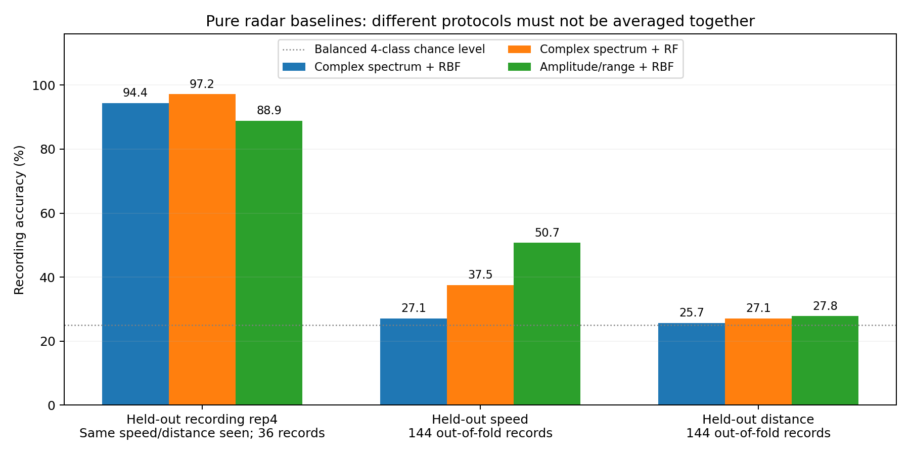

# R2 新数据的纯雷达分类对照与跨条件诊断

这些是**直接用雷达特征训练的独立分类器**，用来定位数据与表示的问题；不是“雷达进入 BearLLM 接触模型”的最终成绩。它们没有读取接触波形、接触 embedding 或教师目标，也没有修改任何已有接触模型。

本批同转速、同距离条件下的不同录制可以被区分；但是换成训练没见过的转速或距离，准确率明显下降。三个协议回答不同问题，不能把它们合成一个平均准确率，也不能拿其中最高的 97.22% 作为跨条件泛化成绩。

## 主实验：训练没见过的转速

分别留出 1000、2000、3000 rpm。每折训练 96 段雷达，测试 48 段雷达；对应的 8 条训练接触会话与 4 条测试接触会话不重叠。虽然本节不使用接触数据，保留同样的分组便于和跨模态方法比较。

2,158 个完整两秒窗口全部使用，没有按质量、预测或类别筛掉窗口。每段录制只进入一次测试，表中合计为 144 个录制预测；这些录制同属本次采集，不能进一步宣称 144 个独立轴承或独立安装。

| 输入与分类器 | 录制准确率 | 录制 macro-F1 | 窗口准确率 |
|---|---:|---:|---:|
| 主复数频谱形状 + 线性 SVM | 33.33% | 31.16% | 30.68% |
| 主复数频谱形状 + RBF SVM | 27.08% | 22.90% | 26.18% |
| 主复数频谱形状 + 5 近邻 | 26.39% | 21.95% | 26.14% |
| 主复数频谱形状 + 随机森林 | 37.50% | 36.69% | 33.27% |
| 相位增量频谱形状 + RBF SVM | 29.17% | 29.42% | 30.12% |
| 按标记距离固定选区的复数频谱 + RBF SVM | 25.69% | 23.82% | 26.09% |
| 幅度、功率和距离 12 维统计 + RBF SVM | 50.69% | 50.10% | 47.17% |
| 仅录制质量元数据 5 维 + RBF SVM | 43.06% | 42.62% | 不适用 |

最后两行是诊断对照。12 维输入包含 IQ 的平均/中位/分位功率、动态功率、各接收通道功率、选中距离和标记距离；5 维输入只有时长、选中距离相对标记距离的偏移、接近 ADC 极限比例、负/正动态能量比和边界峰标记。

它们取得相对高分，说明现有数据里幅度和采集质量统计具有类别区分能力，需要在跨模态模型里检查是否也在依赖这些信息。**不能由这项结果单独认定数据泄露，也不能说这些统计全是无用干扰**：幅度和动态功率也可能包含真实故障信息。当前证据不支持“去掉绝对幅度后，故障频谱形状已经跨条件稳定”。

## 主实验之后增加的定位实验

它们在看到主实验后增加，明确属于开发诊断；固定使用原先相同超参数，不做搜索，不改主实验，不从多个版本中挑最好版本。

| 协议 | 主频谱 + RBF SVM | 主频谱 + 随机森林 | 幅度/距离 + RBF SVM |
|---|---:|---:|---:|
| 同条件 rep1/2/3 训练，rep4 测试，36 段 | 94.44%（34/36） | **97.22%（35/36）** | 88.89%（32/36） |
| 留一转速，144 个测试预测，主实验 | 27.08%（39/144） | 37.50%（54/144） | 50.69%（73/144） |
| 留一距离，144 个测试预测 | 25.69%（37/144） | 27.08%（39/144） | 27.78%（40/144） |

rep4 是文件时间排序的第四段，不是已经证明独立重新安装的第四轮。第一行训练时见过全部转速与距离，也和测试录制共享同一批采集会话。97.22% 说明这些已见条件中的新录制容易分类，不能证明新转速、新距离或新轴承泛化。

留一距离实验分别在另两个距离训练、在 20/40/80 cm 之一测试，训练见过全部转速，训练/测试雷达文件不交叉。接触会话 ID 会重叠，因为这是同一接触长记录覆盖多个距离；本节完全没有加载接触数据，因此这种重叠不是教师目标泄露，但限定了物理独立性。

| 测试距离 | 主频谱 + RBF SVM | 主频谱 + 随机森林 | 幅度/距离 + RBF SVM |
|---|---:|---:|---:|
| 20 cm，48 段 | 31.25% | 25.00% | 31.25% |
| 40 cm，48 段 | 20.83% | 22.92% | 27.08% |
| 80 cm，48 段 | 25.00% | 33.33% | 25.00% |

因此，当前低跨条件成绩不能简单解释为“雷达一点故障相关信息都没有”。更准确的结论是：**在当前采集和输入处理下，模型找到的区分规则依赖已见工况，迁移到未见转速/距离时不稳定。** ROI 偏移、20 cm 峰顶没有包含在已上传复数选区、低相位质量等问题要与模型问题一起检查；不能仅增加分类头训练轮数就宣称解决。

## 固定训练细节

- 输入来自 `../radar/features.npz`，主输入是每个两秒窗口的 128 维复数频谱形状。相位和几何分支单独列出，不挑一个最高值替代主输入。
- `StandardScaler` 只在训练窗口拟合；让每段录制的总权重相同，防止较长录制因为窗口多而主导均值与方差。
- 线性 SVM：`C=1, class_weight=balanced, max_iter=20000`。
- RBF SVM：`C=1, gamma=scale, probability=False`。
- KNN：5 近邻，预测按距离加权。KNN 不支持训练 `sample_weight`，因此只对它的 scaler 做每录制等权；这个区别已记录。
- 随机森林：300 棵树，`class_weight=balanced, random_state=42`。
- 支持样本权重的分类器传入的 `sample_weight` 同样令每段训练录制总权重相同，并把平均窗口权重归一到 1，保持 `C=1` 的常规尺度。线性 SVM 和随机森林还会按指定的 `class_weight=balanced` 乘以类别权重，因此其最终有效权重也包含类别调整。
- 窗口预测采用分类器标准 `predict`。录制预测把窗口的四类分数取平均后选最大值。SVM 的分数是对四类 OvR 决策值做 softmax，**不是校准后的置信概率**。
- SVC 的标准窗口投票与其 OvR 分数最大值在投票平局时可能不同。本次跨转速全部 SVM 分支合计有 240 条窗口的两种规则不同；窗口使用标准预测，录制使用事先规定的分数平均，二者分别保留。

主协议文件是 `protocol.json`，追加定位实验的协议在 `diagnostics/protocol.json`。两者没有使用测试侧数据拟合 scaler 或搜索超参数，但这些结果仍属于已经查看过的开发结果，需要新的独立采集作最终验收。

## 已完成的校验

主实验独立复核了 240 行准确率/macro-F1、1,008 次录制分数聚合，及 3 折训练/测试接触会话和雷达录制的完全隔离；保存了 15,106 行窗口预测和 1,152 行录制预测。追加诊断复核了 174 行指标、540 次录制聚合，保存 8,097 行窗口预测。

`verification.json`、`diagnostics/verification.json` 均通过；输入特征 SHA256、运行脚本和协议 SHA256 记录在各自 `evidence.json`。每段录制的真实类别、预测类别和四类原始分数可直接复查，没有只保存汇总高分。

主要文件：

- `metrics_pooled.csv`、`metrics_by_fold.csv`：跨转速汇总、分折及按距离结果。
- `recording_predictions.csv`、`window_predictions.csv`：跨转速逐条结果。
- `diagnostics/metrics.csv`、`diagnostics/recording_predictions.csv`：另外两个协议的逐项结果。
- `splits.json` 与 `diagnostics/splits.json`：完整训练、测试文件 ID。
- `run_baselines.py`、`verify_results.py`：主实验和独立复核。
- `diagnostics/run_diagnostics.py`、`diagnostics/verify_results.py`：追加诊断和独立复核。
