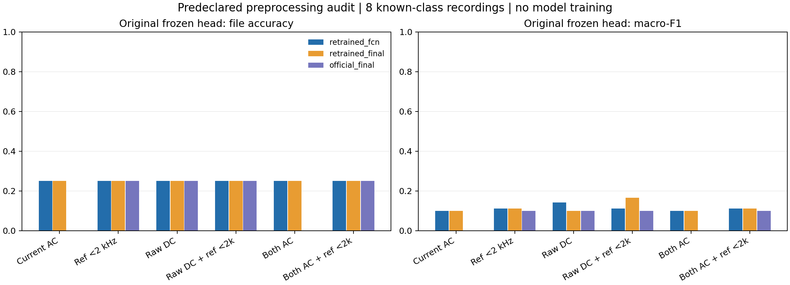
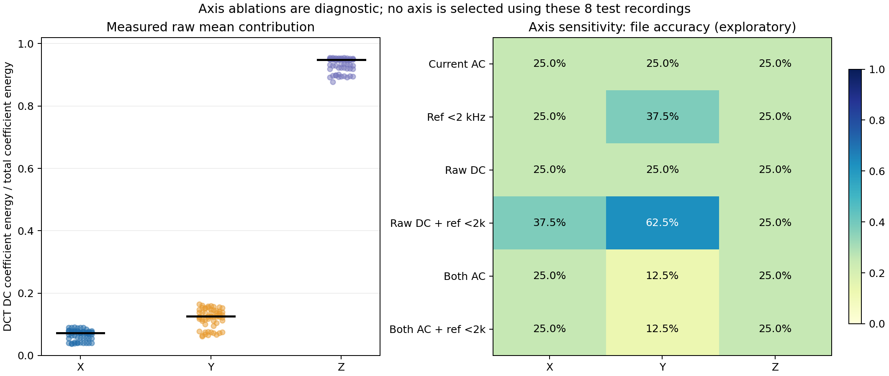

# 接触式预处理根因核查与 RotLLM 改进边界

日期：2026-09-22。运行环境：`conda m2vllm`，PyTorch 2.11.0，GPU 1。本报告的预测均来自冻结权重；没有在这里训练分类头、FCN 或 LLM。原始数据、旧处理结果和权重均未覆盖。

## 1. 核查结论

**25% 不能简单归因于“新台架与训练集不同”，也不能说去掉减均值就能解决。** 本次发现官方 demo、数据构造代码与已发布 DCN 数据之间确实存在直流处理差异；随后预先定义了六种处理，分别在三套冻结权重上实际推理，共 18 组。复训 FCN 和复训 final 的六种处理在 8 份主台架文件上均为 25% 准确率。参考带宽和直流会改变概率及个别类别，但未恢复可靠四分类。

额外采用另一录制的本地正常数据作为健康参考时，不减均值的原 FCN 文件准确率升到 37.5%，仍不足以解决问题。这是**额外健康校准协议**，不能混入“无本地校准”的主实验。现阶段支持进一步进行受原域保持约束的适配，不能跳过旧数据复测，也不能以当前几份文件的得分证明任意转速、尺寸泛化。

完整证据：[冻结原头 18 组指标](frozen_variant_metrics.csv)、[各轴指标](axis_metrics.csv)、[本地健康校准](local_healthy_reference/metrics.csv)、[实现与输入校验](verification.json)。

## 2. BearLLM 的统一表示实际保证了什么

BearLLM 的方法由固定时长截取、带符号 DCT 与固定维数归一化、健康参考及差分分支组成；健康参考在训练方法中要求与查询信号属于同一工况。论文并未给出对任意未知轴承尺寸、速度和传递路径的数学不变性保证。[原论文 §4.1](https://arxiv.org/html/2408.11281v2#S4.SS1)

以下为根据 DCT 基函数与当前设备条件的数学分析，不是额外的模型泛化实测。

对于采样率 \(f_s\)、长度 \(N\) 的 DCT-II，索引 \(k\) 的物理频率为

\[
f_k=\frac{k f_s}{2N}=\frac{k}{2T},\qquad T=N/f_s.
\]

因此，统一取 **1 秒**，不同采样率的同一 DCT 下标对应相同 Hz，间隔为 0.5 Hz。这个坐标间隔不代表能凭 1 秒观测稳定分开任意相差 0.5 Hz 的谱线。24,000 维是一种统一输入长度；4 kHz 设备仅支持前 4,000 个 DCT 系数，随后补零并不会补回 2 kHz 以上的振动信息。

当前设备每包 4,096 点，按已确认的 4,000 Hz，对应 1.024 秒。旧预处理从完整包取 `[48:4048]`，恰好 4,000 点、1 秒，两端各舍弃 12 ms。因此该截窗**符合固定时长契约**。直接将全部 4,096 点当作 1 秒使用，才会使相同下标的 Hz 解释发生 2.4% 偏差。当前 NPZ 只保留这 4,000 个原始点，不能伪造剩余 96 点比较。

固定时长和补零解决的是**采样率引起的坐标与输入长度差异**；它不会将 1,000 rpm 的特征自动移动到 3,000 rpm 的同一阶次。归一化消除统一幅值缩放，但不消除频率相关的结构滤波。实际 DCN 为

\[
c=\operatorname{DCTII}(x),\quad
u=\operatorname{pad/cut}_{24000}(c),\quad
\operatorname{DCN}(x)=0.01\sqrt{24000}\frac{u}{\|u\|_2}.
\]

这是 RMS=0.01 的能量归一化，不是逐元素硬截断到 [-1,1]。它保留 DCT 系数正负；取绝对值、功率或对数谱会改变预训练输入含义。DCT 本身也不具备任意时间平移不变性。

速度变化以及滚动体数、滚动体直径、节圆直径、接触角会改变轴承故障频率；故障识别常需参考谐波、边带及包络信息。[SKF 技术说明](https://evolution.skf.com/us/vibrations-help-find-faulty-components-3/)

按轴速归一化到阶次可以消除理想稳态速度的比例变化，但尺寸比与接触角仍会影响故障阶次。因此“做了 DCN”或“做了阶次”均不足以保证尺寸泛化。更合理的保持方式是：保存原 Hz/DCN 分支，健康参考按速度、负载、安装和传感器条件匹配；新增带置信度的阶次或包络分支必须与原域回放共同验证，不能直接改写预训练 FCN 的 Hz 坐标。

## 3. 官方资产的直流契约不一致

| 实际对象 | 处理 | 本次判断 |
|---|---|---|
| BearLLM `functions/dcn.py`，demo 调用 | 不减均值，直接 DCT、补/裁、能量归一化 | 官方演示接口 |
| MBHM `src/dcn.py` 数据构造代码 | 先减均值并除标准差，再 DCT、补/裁、能量归一化 | 标准差缩放最终被能量归一化抵消；减均值不能抵消 |
| 已发布 `data.hdf5` | 前轮全量审计发现 134,525 / 135,516 条第 0 系数绝对值 > 0.001 | 数据与上述减均值代码不能视为完全等价；原资产未擅自重写 |
| 当前本地预处理 | 每轴减均值，4,000 系数补到 24,000 | 与构造代码一致，但与 demo/大部分已发布样本的 DC 分布不同 |
| 前轮外部健康参考 | 固定 9 个原训练集健康样本，保留已发布 DCN | query 去直流而 reference 通常保留直流，需对照核查 |

代码证据：[官方 demo DCN](https://github.com/SIA-IDE/BearLLM/blob/main/functions/dcn.py)、[官方 MBHM 构造 DCN](https://huggingface.co/datasets/SIA-IDE/MBHM/blob/main/src/dcn.py)。本地资产审计见 [dcn_first_coefficient_diagnostic.json](/home/huangyating/BearLLM/outputs/data_setup/dcn_first_coefficient_diagnostic.json)。Hugging Face 本次网页工具未能读取正文，构造代码结论来自已下载的官方本地文件；不声称网页访问成功。

本地 `raw_xyz` 确实保留原始均值，所以可开展不减均值对照。主台架正常数据 Z 轴不减均值 DCT 的 DC 能量占比中位数为 95.3%；内圈 93.0%、外圈 94.9%、滚动体 89.5%。这些比例提示静态分量很强，但不能仅凭数据将其确定为重力：传感器单位、姿态、校准与输出是否含重力尚无设备证据。保留 DC 可能更接近某个已发布接口，也可能使姿态/偏置主导表示；两者必须区分。

9 个外部健康参考在 2 kHz 以上的能量占比从 0.7% 到 93.0% 不等。以它们作为参考时，查询高频补零与参考高频实测形成很大的残差，并不都是故障信息。频带一致化是合理的敏感性实验，但裁参考也改变其训练分布，不能未经旧域验证就默认开启。

## 4. 六种预处理，三种冻结权重

[protocol.json](protocol.json) 在推理前写入，六种假设和固定参考均未根据结果改变。所有变体都保留带符号 DCT，最终 RMS=0.01；参考裁频/去 DC 后重新归一化。`ref2k` 将索引 `>=4000` 置零，其保留最高基函数中心频率为 1,999.5 Hz。

| 标识 | query | reference | 所检验的因素 |
|---|---|---|---|
| v0 | 减均值 | 已发布全频带 | 前轮处理复核 |
| reference_bandlimited2k | 减均值 | 裁至共同 2 kHz 支持 | 参考超带宽残差 |
| query_no_demean | 保留均值 | 已发布全频带 | 官方 demo DC 契约 |
| query_no_demean_ref2k | 保留均值 | 裁至共同 2 kHz 支持 | DC 与带宽联合因素 |
| query_ref_demean | 减均值 | DCT 第 0 项置零 | query/ref 直流一致性 |
| query_ref_demean_ref2k | 减均值 | 去 DC 并裁共同支持 | DC 与带宽均一致 |

三套权重分别为复训预训练 FCN、复训 final（已合并其实际 adapter LoRA）、官方 final（同样合并相应 LoRA）。没有漏掉 LoRA 再错误地比较 final 头。每轴对 9 个参考分别推理，平均概率和隐藏表示，再在 XYZ 上平均；输入轴不混成一个虚构的物理方向。

| 变体 | 复训 FCN acc / macro-F1 | 复训 final acc / macro-F1 | 官方 final acc / macro-F1 |
|---|---:|---:|---:|
| v0 | 25.0% / 0.100 | 25.0% / 0.100 | 0.0% / 0.000 |
| reference_bandlimited2k | 25.0% / 0.111 | 25.0% / 0.111 | 25.0% / 0.100 |
| query_no_demean | 25.0% / 0.143 | 25.0% / 0.100 | 25.0% / 0.100 |
| query_no_demean_ref2k | 25.0% / 0.111 | 25.0% / 0.167 | 25.0% / 0.100 |
| query_ref_demean | 25.0% / 0.100 | 25.0% / 0.100 | 0.0% / 0.000 |
| query_ref_demean_ref2k | 25.0% / 0.111 | 25.0% / 0.111 | 25.0% / 0.100 |

指标先平均同一文件窗口概率，再预测整份文件。仅 8 个已知类别文件用于上述指标；keep 与 bigNormal 只导出结果，均未用于选择变体。58 个已知类别窗口不是 58 次独立录制。



单轴敏感性中，`query_no_demean_ref2k` 的 Y 轴达到 62.5% 文件准确率。这是已经看过当前 8 份文件后的探索发现，不能反过来把 Y 轴定为主方案，再把同样 8 份文件称作未见测试。当前正式导出仍保留全部 XYZ 及均值，供预先定义的源域保持实验比较。



## 5. 本地健康参考的额外诊断

统一规则：每份主台架查询都用**相反波特率的正常录制**，X 对 X、Y 对 Y、Z 对 Z；参考窗口按 `linspace` 固定选最多 4 个。这个规则不读取查询故障类别。正常查询也来自另一录制，没有健康窗口与自身相减。没有使用 keep 或 bigNormal。波特率只用于区分录制，不解释为机械工况。

| 处理 | 全部 8 文件 acc / F1 | 查询 115200 的 4 文件 | 查询 460800 的 4 文件 |
|---|---:|---:|---:|
| query/ref 均减均值 | 25.0% / 0.100 | 25.0% / 0.100 | 25.0% / 0.100 |
| query/ref 均保留均值 | 37.5% / 0.278 | 25.0% / 0.100 | 50.0% / 0.375 |

不减均值后，两份正常录制都判断正确；两份内圈和两份外圈都误判正常；滚动体仅 460800 录制正确。去均值版仍把 8 份都判为外圈。可见参考选择影响偏置，但这个校准实验仍不支持“原模型已经恢复”。

同台架、雷达配置与距离已由用户确认；转速、负载及接触安装是否严格相同尚未完整确认，因此这里只称本地健康校准。它需要一份额外已知正常数据，且采用与此前留出不同的参考协议，**不能当作零校准方法或与之前的留出分数直接合并**。详见 [参考文件逐项清单](local_healthy_reference/reference_manifest.json)、[保留 DC 的 8 文件预测](local_healthy_reference/query_no_demean_file_predictions.csv)。

## 6. RotLLM：可以借鉴什么，不能直接替换什么

RotLLM 的 SFN 是 **Spectral Folding Network，频谱折叠网络**。官方代码把 24,000 维输入重排为 `3×8000` 后编码，而不是一个可插入 BearLLM 的通用平滑函数。[官方 SFN](https://github.com/SIA-IDE/RotLLM/blob/main/code/models/SFN.py)

实际代码核查如下，属于本地官方源码和接口的分析：

1. 3 个 8,000 系数频带，对 1 秒 DCT 依次对应约 0–4、4–8、8–12 kHz。当前 4 kHz 加速度只有前一个通道的前半段有物理支持，后两个通道完全为空。直接套用这种折叠未必有收益。
2. 第一层是可学习 `Conv1d(kernel_size=8,stride=8)`，不是 4 Hz 固定平均平滑。0.5 Hz/bin 下，8 系数的名义覆盖区间与步长约 4 Hz；多尺度块另含残差 `AvgPool1d(4,padding=1)`，作用在学习后的特征上。本次可访问的官方代码未发现单独的“原谱先 4 Hz 平滑”预处理。出版社完整方法正文未能下载，不能声称已核对全部论文细节。
3. SFN 在宽卷积中实际使用通道注意力，多尺度块加入池化残差；BearLLM 对应宽卷积中虽声明 `ca`，`forward` 未调用。把 SFN 完整网络替换 FCN 会改变维度、分布与权重语义，需要重新训练和原域验证，不是无损升级。
4. RotLLM 的投影包括一条类别概率分支和一条连续特征残差分支：`720→128→15→softmax→11×2048` 加 `720→11×2048`。转换脚本把残差初始化为零。这个结构可以作为降低纯概率瓶颈的信息损失的设计依据。[官方投影代码](https://github.com/SIA-IDE/RotLLM/blob/main/code/fine_tune/convert_weights.py)
5. 当前 BearLLM 为 10 类、5 个视觉/振动 token、Qwen hidden 1536；RotLLM 的发布接口是 15 类、11 token、hidden 2048。两者不能直接交换 projector 或 LLM 权重。
6. 官方 README 将端到端联合调整作为高层工作流，但所发布 `VibEmbed.forward` 的 encoder 实际包在 `torch.no_grad()` 内。这个代码路径不会让语言损失更新 encoder；不能把 README 叙述当作当前源码已经实现的训练行为。[官方推理/模型代码](https://github.com/SIA-IDE/RotLLM/blob/main/code/fine_tune/rotllm.py)
7. 公开仓库说明代码来自研究草稿，完整 LMR 信号和语料未全部提供。本次未复现论文全部训练或 RAG；不能把“采用几项想法”写成“已复现 RotLLM”。[官方仓库](https://github.com/SIA-IDE/RotLLM)、[出版社论文](https://doi.org/10.1016/j.engappai.2025.112544)

建议分层实施：当前先保留 BearLLM encoder 和原 10 类回归路径，4 类作为概率边缘化或经旧域回放训练的共享头；雷达学习相同连续隐藏空间并经过同一头。以后若加入 RotLLM 式连续残差，令其零初始化，在源数据上同时约束旧 logits、隐藏特征和语言输出，再决定是否启用。零初始化只能保证**训练开始前**无改动，训练后的能力保持仍须实测验收。

对于当前低带宽雷达，研究支持掩码与有效频带内多尺度编码比把全零高频段折成多通道更有针对性。新分支必须注明可观测带宽；不能把 2 kHz 或更低频带的输入学习成“测量到了”未观测高频。

## 7. 接下来怎样判断是否确实修好

- 旧域保留：同一原测试集、同一健康参考协议，分别记录 10 类原输出和 4 类合并输出；新适配不得以本地提升换取未经批准的旧域下降。
- 预处理：区分官方接口复现（保留 DC）与物理 AC 分支，两者均固定保存；硬件姿态/静止记录用于确认 DC 来源。没有证据时不以当前分类准确率替代传感器标定。
- 数据协议：独立健康基准录制、确认转速/负载/安装；不要把测试 normal 变成参考，再报告未校准测试成绩。
- 带宽：在原训练集与原验证集同样施加 2 kHz 或雷达共同带宽掩码，量化性能损失，判断缺失频带到底多重要。物理缺失信息不能靠补零或 LLM 补造。
- 泛化：新速度、不同轴承实体和尺寸必须独立留出。已看过结果的 bigNormal 仅作失败案例或开发集，下一轮跨电机结论需要新的盲测样本。

## 8. 复现与导出接口

```bash
conda run --no-capture-output -n m2vllm python preprocessing/export_variants.py --device cuda:1 --output /path/to/new_audit
conda run --no-capture-output -n m2vllm python preprocessing/verify_and_plot.py
```

脚本默认输出为当前目录；已有最终指标时拒绝覆盖。参考均来自原 MBHM **训练查询**中的固定健康样本，seed=42，每个来源 1 个。元数据与前轮 88 行顺序相同。每组在 `variants/<variant>/<model>/` 提供：

| 文件/键 | 含义 |
|---|---|
| `contact_features.npz:hidden_mean` | `[88,128]`，参考与三轴平均的冻结隐藏特征 |
| `hidden_axes` | `[88,3,128]`，保留三轴差异 |
| `feature_map_mean` | `[88,128,47]`，原 FCN 特征图 |
| `probs10_mean/probs4_mean` | 原头 10 类概率及按部位合并的 4 类概率 |
| `metadata.csv` | 原录制 ID、行号、波特率及标签；标签只用于结果计分 |
| `provenance.json` | 权重哈希、LoRA 合并信息、处理契约与冻结状态 |

四类顺序固定为 `[normal, inner, outer, ball]`，映射为 `[[0],[1,2,3],[7,8,9],[4,5,6]]`。按类别概率求和与“先取十类最大项再映射标签”不总等价，应分别说明并评估；四类数据也不提供严重度真值。
