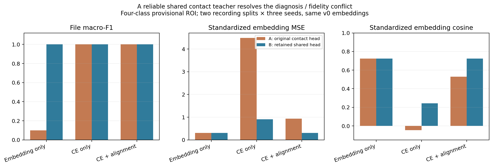
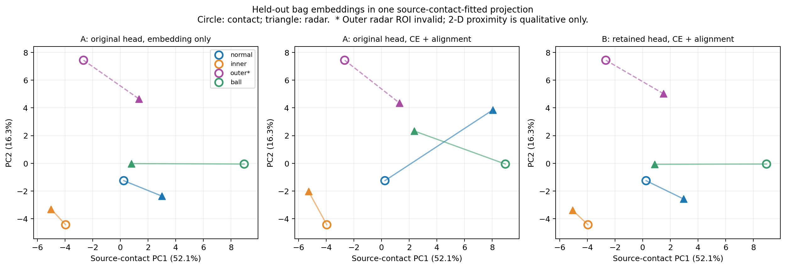

# 雷达与保持旧域能力的接触式共享头：Stage B 实测

## 结论

在旧接触式源数据回放约束下适配共享十类头，再把它冻结给雷达使用，可以同时保持较好的 teacher embedding 对齐和本地文件分类。**这比对一个本地判错的原头强行训练 radar CE 更符合目标。** 接触式 FCN 与 linear1 未改变，接触式和雷达使用同一 128-D 表征接口与同一 shared linear2；雷达没有独立分类头。

以原预处理 v0 为例，旧原头下 pure embedding 的文件 F1=.10，而在受旧域保持约束的新共享头下 pure embedding 的 F1=1.00，embedding MSE 都为约 .305；全损失也同时得到 F1=1.00、MSE≈.305、cos≈.723。这里的 teacher 特征本身未变，修正的是错误的决策边界。它说明当前数据上的“embedding像但判断错”不是必须放弃跨模态保真来解决。

bigNormal 仍然两条录制均错误，外圈错误距离门仍未修复，所以这不是跨电机、跨环境或四类物理泛化已经完成的证据。

## 训练和评估

读取 root 在每一录制留出折单独训练的 `retained_head.npz`：直接使用作用于原 hidden 的 `weight10,bias10`。检查其 `local_training_bags` 与雷达训练袋精确相同，检查源域保持 acceptance 通过，检查 local teacher hidden 和原始接触式特征逐值相同。共享头在雷达优化期间完全冻结。

输入、模型、源域标准化、步数及种子与 Stage A 相同。四类做两方向×3 seed，每种输入预处理比较三种方法：

* `embedding_only`：只匹配同步录制袋的平均标准化隐藏向量。
* `ce_only`：只用共享接触式头的四类 group CE；仍不另训雷达头。
* `ce_feat_1_kd`：CE + bag MSE + .1 类别正例 contrast + .5 KD(T=2)。此时 KD teacher 已由受旧域约束的共享头修正。

对比损失仍是袋级/类别级监督，没有伪造毫秒时间配对。每类只有两条录制，三种随机种子不增加独立样本数。outer 和 keep 的几何无效标记来源于实际距离元数据，与故障标签无关。

## 实测指标

| variant | method | n | accuracy | macro_f1 | macro_f1_min | macro_f1_max | MSE | cosine |
| --- | --- | --- | --- | --- | --- | --- | --- | --- |
| v0 | ce_feat_1_kd | 6 | 1.00000 | 1.00000 | 1.00000 | 1.00000 | 0.30531 | 0.72338 |
| v0 | ce_only | 6 | 1.00000 | 1.00000 | 1.00000 | 1.00000 | 0.90725 | 0.24346 |
| v0 | embedding_only | 6 | 1.00000 | 1.00000 | 1.00000 | 1.00000 | 0.30515 | 0.72319 |
| query_no_demean | ce_feat_1_kd | 6 | 1.00000 | 1.00000 | 1.00000 | 1.00000 | 2.34750 | 0.57111 |
| query_no_demean | ce_only | 6 | 1.00000 | 1.00000 | 1.00000 | 1.00000 | 2.95031 | 0.18389 |
| query_no_demean | embedding_only | 6 | 1.00000 | 1.00000 | 1.00000 | 1.00000 | 2.34405 | 0.57282 |

`embedding_only` 在此阶段已经满分，完整损失没有额外的分类收益；这是应保留的消融结论。它说明本地数据太容易或存在采集条件混杂，不能用本结果宣称复杂损失优于简单对齐。

## 旧接触式数据保持核验

| variant | fold | old_test_acc10 | old_test_acc4 | delta10_pp | delta4_pp | global_gate |
| --- | --- | --- | --- | --- | --- | --- |
| v0 | 115200_to_460800 | 0.98811 | 0.99006 | -0.05701 | -0.04886 | True |
| v0 | 460800_to_115200 | 0.98835 | 0.99015 | -0.03258 | -0.04072 | True |
| v0 | all_known | 0.98518 | 0.98721 | -0.35019 | -0.33390 | True |
| query_no_demean | 115200_to_460800 | 0.98787 | 0.98974 | -0.08144 | -0.08144 | True |
| query_no_demean | 460800_to_115200 | 0.98803 | 0.99006 | -0.06515 | -0.04886 | True |
| query_no_demean | all_known | 0.98404 | 0.98624 | -0.46421 | -0.43163 | True |

`delta*_pp` 是相对旧模型的百分点变化，不是相对百分比。本表的 test acc 是**旧源域测试集在新共享头下的值**。两方向留出头和 all_known v1 都满足全局下降不超过 .5pp；但 v1 的 all_known 在若干独立源数据子集上下降大于 .5pp，随后另做了更保守 all_known 候选，见下方追加结果。这里保留 v1 作为完整对照，不把 global gate 误说成所有工况皆通过。保守版本单独保存，不覆盖此结果。

## 外部正常电机

| variant | method | n | healthy_correct | normal_probability_mean |
| --- | --- | --- | --- | --- |
| query_no_demean | ce_feat_1_kd | 2 | 0 | 0.05333 |
| query_no_demean | ce_only | 2 | 0 | 0.00606 |
| query_no_demean | embedding_only | 2 | 0 | 0.09204 |
| v0 | ce_feat_1_kd | 2 | 0 | 0.05371 |
| v0 | ce_only | 2 | 0 | 0.00457 |
| v0 | embedding_only | 2 | 0 | 0.08005 |

keep 无四类真值、且距离门无效，不能视为已识别的未知故障。bigNormal 仅两条录制，所有方法 0/2 正常识别，对应跨结构验证仍失败。

## 真正的模型接口

`infer_fixed_head.py` 同时支持旧原头与新共享头检查点，实际推理只读毫米波特征与几何元数据。输出原十类概率 `p10_0..p10_9` 和精确分组的四类概率。真实语言模型可将原 p10 直接送入既有 LoRA 的 linear3/Qwen，避免“先预测四类再人为分配严重度”的接口变化。严重度没有本地标签，不能声称已诊断。

`llm_original_p10_inputs.csv` 汇总了 A/B、v0/保留DC、pure embedding/CE/full 两方向留出和 all_known 外部的144个文件推理结果，36个保存模型重载最大概率误差低于2e-7。真值列仅供事后评分，不进入编码器、分类器或语言 prompt。语言模型测试由独立脚本完成，不能把这里导出的概率当作已生成的语言结果。

本阶段42个学生训练、18个种子42保存模型已逐一重载并核验共享头权重未在雷达训练中变化。主代码 `train_shared_head.py`，固定设计 `protocol_stage_b.json`，结果 `stage_b_v0/` 与 `stage_b_no_demean/`；各目录保留生成当时的脚本快照。

另一个重要口径：`softmax(head(mean(hidden)))` 与 `mean(softmax(head(hidden)))` 不可交换。无去均值分支在前者接口为 1/8 正确，后者为 2/8；本对齐采用前者作为 teacher，Stage A 和 B 始终使用一致接口，不能将两者数字混用。

## 追加：逐源数据集保持门槛下的保守 all_known 版本

原 v1 保留作对照；追加模型根据旧 source validation 每个数据集十类/四类下降不超过 .5pp 选择，随后在旧 source test 每个数据集回归核验。选择没有使用 bigNormal 或 keep。由于旧 source test 本轮已检查过，这属于重复使用的回归集，不能称为新的盲测集。

| variant | lambda_source | step | source_test_acc10 | source_test_acc4 | global_delta10_pp | worst_source_delta10_pp | worst_source_delta4_pp | bigNormal_correct | bigNormal_n | mean_normal_probability |
| --- | --- | --- | --- | --- | --- | --- | --- | --- | --- | --- |
| v0 | 10 | 800 | 0.98860 | 0.99047 | -0.00814 | -0.10373 | -0.10373 | 0 | 2 | 0.07620 |
| query_no_demean | 10 | 400 | 0.98795 | 0.98998 | -0.07330 | -0.15913 | -0.15913 | 0 | 2 | 0.07179 |

两个新共享头各训练400步 full 雷达学生（seed42），头固定且重载验证通过，bigNormal仍均0/2。新增结果目录 `stage_b_conservative_v0/` 与 `stage_b_conservative_no_demean/`；原p10导出到 `llm_conservative_p10_inputs.csv`（8行）。完整152行放在 `llm_original_p10_inputs_plus_conservative.csv`，以 `head_version` 和 `source_scope` 区分原头、较松v1和保守版本。

## 128维共同空间的二维可视化

PCA仅拟合115200训练接触式窗口，以同一个源接触式标准化和投影显示460800留出袋的接触式/雷达均值；不使用雷达或测试接触式来拟合PCA。图为定性辅助，结论仍以128维MSE、cosine与原头margin为准。Stage B重新提取v0隐藏向量与归档Stage A的最大数值差为1.74e-4，MSE=8.99e-11，encoder权重/接口未变；不是声称两次浮点提取逐bit相等。原始点和投影协议单独保存。

## 最终仅雷达接口验证

`radar_only_conservative_v0/` 使用保守 v0 all_known 模型实际推理12个录制，输入 metadata 只有 bag_id、range_center_m、intended_distance_m、geometry_roi_mismatch 四列，没有 label、state 或 contact。文件p4与训练阶段最大误差1.79e-7，p10与完整特征独立推理误差9.72e-17。

几何标记严格解析：只有明确False才能验证有效；True为几何无效，缺列、NaN、空列表、无法识别字符串或数值均为未验证，不发出诊断结论。10个边界用例通过，当前4个错误ROI文件均被标记无效。`verify_radar_only.py` 与该目录 `verification.json` 提供可复查证据。
