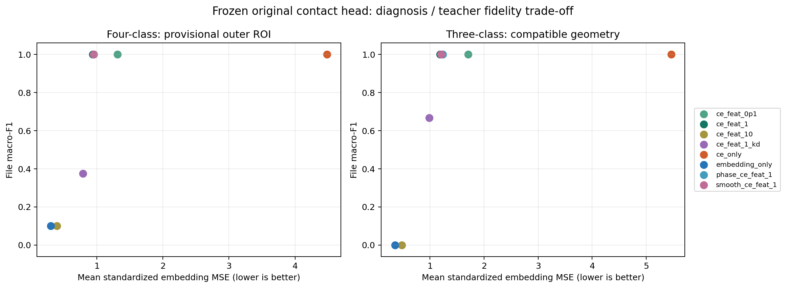

# 雷达接入原接触式模型：固定原头对齐的实测结果

本实验让毫米波 encoder 输出 **128 维接触式分类隐藏向量**，然后通过原 BearLLM FCN 的 **未修改十类 linear2** 作判断。四类只是在输出概率端合并十个类别；没有另训练雷达分类头。前轮简单频谱分类器是“输入是否能区分类别”的对照，此处才是在原接触式模型中运行的路径。

## 1. 这次究竟改了什么

原模型的 FCN、linear1、linear2 和旧权重文件均只读；只训练新增雷达 encoder。因此这一路径不会改变原接触式模型对任何旧输入的输出。它不能改善原接触式模型在本地数据上的错误，此问题须另做预处理审计和受旧任务保持约束的共享模型适配。

原 FCN 流程为 `振动特征图 → flatten(6016) → linear1(128) → ReLU → linear2(10)`。本实验对齐的是 **linear1 后的 128 维隐藏向量**，并非重建 6016 维特征图或原始波形。雷达输出约束非负以符合 ReLU 支持，但这不足以证明它位于真实 FCN 的特征流形上。单靠经过原 linear2 分类正确，仍可能主要学到了分类器的判别方向。

四类顺序为正常、内圈、外圈、滚动体。十类成员为 `[0]`, `[1,2,3]`, `[7,8,9]`, `[4,5,6]`。实现严格采用 `g_k=logsumexp(l_j, j∈G_k)`，故 `softmax(g)_k = Σ softmax(l)_j`。不能把各故障严重度的权重直接平均代替。三类敏感性测试仍保留四个输出，预测外圈会记错，绝不删去外圈概率再归一化掩盖错误。

## 2. 雷达的处理和输入

沿用真实可取得的 3 个距离单元 × 4 RX 的复 IQ。每个 96 ms 的完整帧独立去静态量、加窗、求功率谱，对帧求平均、对空间单元做稳健聚合；只在 5–800 Hz 的 128 个固定频带上积分，再取 log 功率并减去该窗口的频带均值。距离数值、绝对原始幅度不作为主 encoder 输入。

频率网格 0.5 Hz 来自零填充，物理分辨率仍约 `2000/192=10.42 Hz`。不把帧与帧之间的采集缺口当成连续样本，也不跨缺口做相位差分。相位分支由帧内相邻相位增量得到归一谱，与主谱拼成 256 维。另预定 5 Hz 标准差的高斯平滑谱作为敏感性对照；它不会凭空改善真实频率分辨率。

以上归一化可以减弱统一增益影响，**不能消除频率相关的外壳传递函数、多径凹陷或转速变化**。外圈和 keep 的 NPZ 只保存约 0.884 m 范围，和用户确认的四十多厘米不符，因此对应输出标记 `invalid_geometry_do_not_issue_diagnosis`。现有 NPZ 无法恢复遗漏的正确距离门，本实验没有假装修复。

## 3. 训练、数据隔离与损失

只做 115200→460800 和反方向两次录制留出；它们表示串口波特率与不同录制，不是不同采样率或环境。与留出雷达同步的接触式数据也同时留出，不能进入标准化、teacher 原型或训练。已知四类只有 8 个录制袋，3 个随机种子是优化重复，不能当作新增实体或独立实验。四类和去掉外圈的三类分别训练；bigNormal、keep 从不用于拟合。

每个源录制总权重相同，雷达和接触式的标准化器只拟合训练袋。encoder 为 `d→128 LayerNorm GELU dropout(.1)→64 GELU→128`，输出 `h_r=ReLU(μ_c+σ_c z_r)`；AdamW 400 步，学习率 .001，weight decay .01，每步每个袋取 16 个雷达窗口。

* `L_feat = mean ||mean(z_r in bag)-mean(z_c in paired bag)||²`：接触式和雷达只按同步录制袋对应，未声称逐窗口或逐时刻对齐。
* `L_CE = CE(group_logits(original_linear2(h_r)), fault_type)`：使用训练录制的真实四类标签，只更新雷达 encoder。
* `L_con`：标准化袋均值的余弦对比损失，温度 .2，同类源袋为正例。每类只有一个源袋时，它近似类别原型监督，不能支持精细时序对齐的主张。
* `L_KD`：原十类 logits 除以温度 2，转概率再按组求和，匹配真实接触式 teacher 的袋平均概率。错误 teacher 不会被事后改写为正确标签。

预注册主消融是 `CE+λ_feat L_feat+0.1 L_con`，λ固定 .1/1/10。纯回归、纯 CE、加 .5 KD、相位输入和平滑输入全部报告，没有拿目标文件挑最优 λ。λ=1 是事先指定的折中比较项。

## 4. 原预处理分支的结果

以下为两方向 × 3 seed 的文件级指标均值（每个方法6次评估）；区间列仅最小/最大值，不是独立实体置信区间。

| method | n | accuracy | macro_f1 | macro_f1_min | macro_f1_max | MSE | cosine |
| --- | --- | --- | --- | --- | --- | --- | --- |
| ce_feat_0p1 | 6 | 1.0000 | 1.0000 | 1.0000 | 1.0000 | 1.3124 | 0.4942 |
| ce_feat_1 | 6 | 1.0000 | 1.0000 | 1.0000 | 1.0000 | 0.9371 | 0.5305 |
| ce_feat_10 | 6 | 0.2500 | 0.1000 | 0.1000 | 0.1000 | 0.3986 | 0.6440 |
| ce_feat_1_kd | 6 | 0.5000 | 0.3750 | 0.3750 | 0.3750 | 0.7917 | 0.5685 |
| ce_only | 6 | 1.0000 | 1.0000 | 1.0000 | 1.0000 | 4.4830 | -0.0461 |
| embedding_only | 6 | 0.2500 | 0.1000 | 0.1000 | 0.1000 | 0.3052 | 0.7232 |
| phase_ce_feat_1 | 6 | 1.0000 | 1.0000 | 1.0000 | 1.0000 | 0.9526 | 0.5309 |
| smooth_ce_feat_1 | 6 | 1.0000 | 1.0000 | 1.0000 | 1.0000 | 0.9528 | 0.5299 |

| method | n | accuracy | macro_f1 | macro_f1_min | macro_f1_max | MSE | cosine |
| --- | --- | --- | --- | --- | --- | --- | --- |
| ce_feat_0p1 | 6 | 1.0000 | 1.0000 | 1.0000 | 1.0000 | 1.7036 | 0.4561 |
| ce_feat_1 | 6 | 1.0000 | 1.0000 | 1.0000 | 1.0000 | 1.1893 | 0.4939 |
| ce_feat_10 | 6 | 0.0000 | 0.0000 | 0.0000 | 0.0000 | 0.4815 | 0.6073 |
| ce_feat_1_kd | 6 | 0.6667 | 0.6667 | 0.6667 | 0.6667 | 0.9884 | 0.5296 |
| ce_only | 6 | 1.0000 | 1.0000 | 1.0000 | 1.0000 | 5.4615 | 0.1605 |
| embedding_only | 6 | 0.0000 | 0.0000 | 0.0000 | 0.0000 | 0.3526 | 0.6825 |
| phase_ce_feat_1 | 6 | 1.0000 | 1.0000 | 1.0000 | 1.0000 | 1.2339 | 0.4918 |
| smooth_ce_feat_1 | 6 | 1.0000 | 1.0000 | 1.0000 | 1.0000 | 1.2078 | 0.4933 |



关键现象：**纯 embedding 回归能靠近错误 teacher，却继承其错误；纯 CE 能令原头输出正确，却使标准化特征余弦显著变差。** 两者结合可以降低这种偏离，但不能同时要求“完全复制一个判错的 teacher”且“同一原头判断正确”。λ=10 强制更紧保真时分类重新退化；蒸馏错误 teacher 概率也明显拖累结果。这是目标函数的真实矛盾，不能把它包装为无监督跨模态成功。

原尺度 cosine 会受到所有类共有的正偏置影响，因此同时报告训练源统计标准化后的 cosine、MSE 和四类 margin。seed17/73 及无去均值分支还分解原 head 的分类相关行空间误差和不改变相对 logits 的零空间误差，避免“整体向量很像”掩盖关键判别方向变化。

## 5. 预处理修正对照

接触式审计发现官方输入的 DC 通常非零，故**依据官方接口而非雷达测试分数**增加 `query_no_demean/retrained_fcn` 分支。比较 pure embedding、CE-only、CE+MSE(λ=1) 三种预定方法，仍是两方向×3 seed：

| task | method | n | accuracy | macro_f1 | MSE | cosine |
| --- | --- | --- | --- | --- | --- | --- |
| four_class_provisional_roi | ce_feat_1 | 6 | 1.0000 | 1.0000 | 2.5200 | 0.4201 |
| four_class_provisional_roi | ce_only | 6 | 1.0000 | 1.0000 | 4.4912 | -0.0295 |
| four_class_provisional_roi | embedding_only | 6 | 0.1250 | 0.0625 | 2.3440 | 0.5728 |
| three_class_geometry_compatible | ce_feat_1 | 6 | 1.0000 | 1.0000 | 2.8314 | 0.4217 |
| three_class_geometry_compatible | ce_only | 6 | 1.0000 | 1.0000 | 5.1100 | 0.0891 |
| three_class_geometry_compatible | embedding_only | 6 | 0.1667 | 0.1111 | 2.6617 | 0.5255 |

修正 DC 处理并没有自动解决本地 teacher 的低准确率。这里更高的 embedding MSE 也提醒：不同预处理/源标准化之间的 MSE 不能当作同一物理距离横向比较。

## 6. 外部电机与可部署性

全部已知袋训练后，原预处理分支每个方法对 bigNormal 两条正常录制均为 0/2 正确；无去均值分支同样每方法 0/2。四类内录制留出满分不能推导跨电机成功。大规模训练源保持、共同物理带宽、转速/结构变化仍需继续解决。keep 不属于四类且距离门错误，不计算四类准确率，也没有声称未知故障已识别。

## 7. 可复现产物与接口

* `protocol.json`：先于训练写入的固定设计。
* `train_fixed_head.py`：源域拟合、训练、袋级测试和验证。
* `stage_a_seed42/`、`stage_a_replicates/`：原分支的所有预注册结果，含每文件概率、fidelity、margin、训练曲线。源脚本快照保留在各结果目录。
* `stage_a_no_demean/`：官方 DC 接口修正对照，含元数据一致的 88 个接触式窗口。
* `infer_fixed_head.py`：仅雷达推理，不读取接触式数据和标签；输出 128-D embedding、原 10 类概率、合并 4 类概率及距离门有效标记。
* `radar_only_v0_ce_feat_1/`：实际执行的仅雷达推理结果。其原 p10 可以直接送入原 `linear3→Qwen`，无需给严重度人为均分；但本地没有严重度真值，因此只评价故障类型。

本轮完成 154 个固定头学生训练、66 个种子42模型保存与重载核对；概率与原十类分组合并的数值恒等已检查，原 contact head 参数未修改。

```bash
/home/huangyating/miniconda3/bin/conda run --no-capture-output -n m2vllm python radar/train_fixed_head.py --output radar/new_stage_a
```

应使用新的输出目录，脚本拒绝覆盖非空目录。改进重点是先获得可信且保持旧域性能的接触式 teacher，再将新 teacher 的判别与几何一致特征同时蒸馏到雷达；不能仅靠让雷达 encoder 绕过一个判错的 head。
