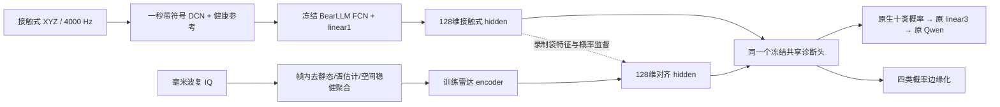

# 原能力保持、接触式预处理与毫米波共享模型对齐：实测报告

日期：2026-09-22。环境：`conda m2vllm`。验收约束：用户确认原准确率最多下降 **0.5 个百分点**。本目录是新增实验；原数据、原 BearLLM 权重和前轮实验均保留。

**本次已实现并运行“接触式/毫米波 → 同一 128 维隐藏空间 → 同一个诊断头 → 原生十类概率 → 原 BearLLM 语言投影与 Qwen”的链路。** 接触式只微调分类头，使用原训练数据回放与旧输出蒸馏；FCN 和 linear1 冻结。最终保守候选在原训练集、原测试集的总体及九个来源数据集上均通过 0.5 个百分点约束。但个别细分工况没有通过；当前八份录制的高分也不能证明新转速、新轴承实体、环境或电机结构泛化。

四类雷达物理验证仍有一个必须修复的输入问题：外圈录制保存的距离门约 0.884 m，与确认的四十多厘米不符。另一台正常电机的两份录制仍被误报。因此本报告分别陈述已经验证的算法接口、旧能力保持、本地录制留出，以及尚未通过的物理泛化。

## 1. macro-F1、准确率与这次“25%”分别是什么意思

准确率 Acc 是全部样本中判断正确的比例。对每个类别单独计算：

\[
P_c=\frac{TP_c}{TP_c+FP_c},\quad R_c=\frac{TP_c}{TP_c+FN_c},\quad
F1_c=\frac{2TP_c}{2TP_c+FP_c+FN_c};\qquad
\mathrm{macro\!\!\!-F1}=\frac{1}{4}\sum_{c=1}^4 F1_c.
\]

macro-F1 给四种故障类型相同权重，避免正常样本很多时掩盖某个故障类全部判错。当前每类两份录制，共八份；如果全部预测外圈，外圈 TP=2、FP=6、FN=0，F1=0.4，其他三类 F1=0，故 **Acc=25%，macro-F1=0.10**。这正是原预处理原头的退化表现，不能把“25%”理解为每个类别都掌握了四分之一。

本地主要按**整份录制**平均窗口概率再计分。58 个接触式窗口、412 个雷达窗口来自八份已知类别录制，不等于 470 次独立实验。三个随机种子也只是优化重复。原数据回归则按 query 计数，同一个 query 的三个参考不重复计三个独立样本。

## 2. 之前的重新训练与本次微调有何区别

| 操作 | 实际更新 | 对原能力的含义 |
|---|---|---|
| 较早的 BearLLM 基线复现 | 按原流程重新训练独立 FCN；实际 19 epoch、选择 epoch 11 | 得到本次可复查的原能力基线，不能与官方 final 权重混称同一模型 |
| 上一轮本地四分类探针 | 冻结 FCN 特征，另训本地线性四类头 | 原文件没变，但这个新头没有旧能力保证 |
| 本次 Stage A 雷达训练 | 原 FCN、linear1、十类 linear2 全冻结，只训练雷达 encoder | 原接触式分支严格不变；本地 teacher 判错的问题仍存在 |
| 本次 Stage B 共享头适配 | 冻结 FCN、linear1；对 linear2 增加可合并的线性残差，并用旧域回放约束 | 属于**分类头微调**；新头必须实际验收旧数据 |
| Stage B 雷达训练 | 将适配后的共享头再冻结，只训练雷达 encoder | 雷达没有独立分类头，接触式与雷达真正共用决策层 |

你的担忧确实有依据：上一轮本地独立四类头在原测试集上的四类 Acc 只有 **16.54%–17.11%**，全部本地数据训练的版本为 **16.89%**。虽然原模型文件没有被覆盖，它也不能作为通用模型的替代品。本次已将它保留为负对照，不沿用为最终共享头。[原始回归表](/home/huangyating/anomaly_detection/retention_alignment_20260922/results/retained_head_v1/previous_local_head_regression.csv)

“冻结 encoder”本身并不能保证准确率：同一特征换了决策边界，也会改变旧样本判断。“不覆盖原权重”和“新模型能力不下降”是两个不同的检查，本次两者都做了。

## 3. 接触式预处理：哪些正确，哪些有问题

### 3.1 采样率与固定频率坐标

当前确认是 **4000 Hz**，每包 4096 点，即 1.024 秒。现有处理取 `[48:4048]` 共 4000 点，正好一秒，两端各舍弃 12 ms；这一项是正确的。不能跨接收间隙拼接成连续一秒，串口接收时间也不能当作精确采样时钟。

BearLLM 使用带符号 DCT，不是 FFT 幅度谱。对长度 N、时长 T 的 DCT-II：

\[
f_k=\frac{kf_s}{2N}=\frac{k}{2T},\qquad
u=\operatorname{pad/cut}_{24000}(\operatorname{DCTII}(x)),\qquad
\mathrm{DCN}(x)=0.01\sqrt{24000}\,u/\|u\|_2.
\]

固定一秒，使不同采样率的相同下标对应相同 Hz；补到 24000 维使网络接口一致，RMS 归一化减弱整体增益变化。当前 4 kHz 传感器仅有低于 2 kHz 的物理支持，后面补零**不会重建高频故障信息**。保留 DCT 正负号；取绝对值、对数功率或把 24000 解释为重采样率都会改变原输入含义。[BearLLM 方法原文](https://arxiv.org/html/2408.11281v2#S4.SS1)

这一处理解决采样坐标和输入长度问题，却没有保证任意速度、尺寸、测点和壳体传递路径不变：

- 转速改变故障频率；一秒 DCN 没有自动做转速阶次归一化。
- 轴承滚动体数、直径比、接触角改变故障阶次；阶次归一化也不能消除所有尺寸影响。
- 参考正常信号及差分分支帮助比较，但训练假设是条件匹配的健康参考；当前固定九个外部健康参考不满足严格同机、同速度、同测点。
- 统一能量归一化不能消除频率相关的壳体滤波或多径凹陷。DCT 也不是任意时间平移不变的变换。

因此应保留原 Hz/DCN 路径，再通过回归和独立工况验证维护原能力，不能将“统一输入”写成“已经证明任意尺寸/速度泛化”。

### 3.2 本次发现并实际验证的预处理差异

官方 demo 的 `functions/dcn.py` 不减均值；官方数据构造脚本先减均值；已发布 DCN 数据大部分第零项又明显非零。本地查询去均值而九个外部参考保留 DC，存在处理契约差异。原始 XYZ 仍可用于复算，所以实际比较了六种处理，每种均跑复训 FCN、复训 final、官方 final 三套冻结权重，共 **18 组**。

| 处理假设 | 复训 FCN 八文件 Acc | 结果含义 |
|---|---:|---|
| 原处理：查询去均值、参考原频带 | 25% | 复现此前结果 |
| 参考限至共同 2 kHz | 25% | 仅裁参考高频未解决 |
| 查询保留 DC | 25% | 仅跟随 demo 契约未解决 |
| 保留 DC + 参考限带 | 25% | 联合改变仍未解决 |
| 查询/参考均去 DC | 25% | DC 一致化仍未解决 |
| 查询/参考均去 DC + 限带 | 25% | 两项一致化仍未解决 |

不同方案的概率、macro-F1 和逐轴表现有变化，不能因 Acc 相同便说预处理完全无影响。额外使用另一录制的本地正常参考，不减均值时达到 **37.5%**；这属于增加健康校准的独立协议，不能混入无校准主结果。单轴探索中有 62.5%，但已看过这些测试文件，不将其事后挑成正式方案。

一个原验证集受控实验也显示带宽的重要性：固定 261 个 query，四类 Acc 从完整输入的 **96.55%**，降到共同 2 kHz 并重新归一化的 **72.41%**，再到 800 Hz 的 **40.23%**。这证明补零不等于信息充分；不证明本地失败只由带宽造成。

现有证据支持的判断是：**预处理、参考条件和带宽都需要审查，但这些修正尚不足以恢复本地原头判断，适量微调有实验依据。** v0 去 DC 分支和保留 DC 分支均保存，不把姿态或偏置能量当作故障的可靠物理依据。[完整排查与逐轴结果](/home/huangyating/anomaly_detection/retention_alignment_20260922/preprocessing/预处理根因与RotLLM核查.md)

## 4. 十分类改四分类：既符合任务，又保留旧知识

四类固定顺序：正常、内圈、外圈、滚动体。原十类下标按严重度分组为：

\[
G=(\{0\},\{1,2,3\},\{7,8,9\},\{4,5,6\}),\quad
g_c=\log\sum_{j\in G_c}\exp(l_j),\quad p_4(c)=\sum_{j\in G_c}p_{10}(j).
\]

`SharedFourClassModel.forward()` 对外返回 **四个 logits**，属于可直接使用的四分类接口；内部保留十类辅助分支，用于旧任务回归和现有语言投影。不能直接平均十类权重，也不能只把十类 argmax 映射成四类来代替上述概率边缘化。

本地没有严重度标签，因此既不宣称能判严重度，也不把一个四类概率均分给三种严重度。原生 p10 可以直接送入原 BearLLM 投影层，避免人为构造语言输入。若以后完全删除内部十类分支，需要重训或迁移语言投影；当前没有必要承担这项额外变化。

已用九个数据源的 27 个原始 query-reference 对实跑统一模块。相同批大小下，封装后的 hidden 与原 FCN 逐值一致；四类 logsumexp 与概率求和误差小于 1.2e-7。与此前不同批大小缓存比较存在微小 CUDA 数值差，概率最大约 4.95e-6，已单独记录。[模块](/home/huangyating/anomaly_detection/retention_alignment_20260922/scripts/shared_contact_model.py) · [接口核验](/home/huangyating/anomaly_detection/retention_alignment_20260922/results/retention_verification/shared_model_verification.json)

## 5. 如何微调并限制原准确率下降

令原分类隐藏向量为 \(h=\mathrm{ReLU}(\mathrm{linear1}(\mathrm{FCN}(x,r)))\in\mathbb R^{128}\)。只添加零初始化的线性残差：

\[
l_{10}(h)=W_0h+b_0+\Delta W((h-\mu)/\sigma)+\Delta b.
\]

μ、σ 仅来自原训练回放特征，σ 下限 0.01。训练结束可精确合并成一组 `weight10,bias10`，接触式和雷达使用完全相同的参数。零初始化保证训练起点不改变原模型，**训练后仍必须验收**。

损失为：

\[
L_H=L_{\mathrm{local},4}+\lambda_s\{L_{\mathrm{source},10}+2T^2\mathrm{KL}(p_{\mathrm{old}}^T\Vert p_{\mathrm{new}}^T)\}+0.001\,\mathrm{mean}(\Delta^2),\quad T=2.
\]

实际原训练回放选 1174 个 query：每十类最多 128 个，并兼顾来源；采样在模型预测前固定。每步抽 256 个原 query/reference 特征和每个本地训练录制 16 个窗口，AdamW 学习率 0.003。原验证集 24558 个 query 全量评估。所有本地留出录制的两个模态一起留出；bigNormal、keep 不进入拟合、原型或选择。

第一轮比较 λ=0/1/10/100、200/400/800 步；λ=0 作为遗忘负对照。三种预处理、两方向留出及 all_known 共 36 次训练。先用原验证集十类/四类下降 ≤0.5 pp 筛选，再用本地训练集指标选候选，保存选择文件后才算新模型原测试集表现。原头、只本地训练、受约束微调全部报告。

第一轮 all_known 虽通过总体约束，部分数据源下降超过 0.5 pp，故追加保守轮：λ=10/100、400/800 步，两个预处理分支，共四次训练；**总体和每个来源数据集的验证集十类/四类均须通过**。本地训练 F1 相同时优先原验证集准确率。最终 v0 选 λ=10、800 步；保留 DC 选 λ=10、400 步。这一轮原测试集属于重复使用的回归集，不能称新的盲测集。

### 5.1 原训练、测试实测保持结果

| 数据与口径 | 原模型 | 保守 v0 共享头 | 下降（百分点） | ≤0.5 pp |
|---|---:|---:|---:|---|
| 全部原训练 query，十类，n=85955 | 100.0000% | 99.9930% | 0.0070 | 通过 |
| 全部原训练 query，四类，n=85955 | 100.0000% | 99.9942% | 0.0058 | 通过 |
| 全部原测试 query，十类，n=12279 | 98.8680% | 98.8598% | 0.0081 | 通过 |
| 全部原测试 query，四类，n=12279 | 99.0553% | 99.0472% | 0.0081 | 通过 |

全部原训练检查实际编码 257865 个 query-reference 对，不只检查 1174 个回放子集；这一步在模型冻结后完成，未用于再次训练或筛选。九个来源数据集分别也通过：v0 测试集最差来源下降 **0.1037 pp**，原训练最差来源下降 **0.0296 pp**。保留 DC 候选原训练十类/四类均 100%，原测试十类/四类分别 98.7947%/98.9983%，同样通过。

**通过总体及数据源约束，不等于每个旧样本、每个转速条件均不变。** v0 原测试四类有 39 个预测改变，其中 19 个旧对变错、18 个旧错变对，其余仍错，净减少一个正确样本。某些小工况下降超过 0.5 pp：例如 XJTU condition 1037 共 57 个 query，下降 1.7544 pp。若验收扩展为“每个单独转速/轴承工况都最多下降 0.5 pp”，当前新头还不合格。少数小类别的召回也可能下降更多，逐类结果已保留；总体 Acc 门槛不能代替逐类验收。原模型分支保持可用，且本次没有基于这些测试工况继续调参。

原回归协议也有边界：原代码按 query 顺序 7/2/1 划分，同条件健康参考可以跨查询划分，部分健康 query 可抽到自身；原测试 257 个 condition 在训练中全部出现，部分数据源能评估的查询主要或只有正常类。因此这些高分是**与原模型同协议的能力保持证据**，不是严格轴承实体留出或未见条件泛化证据。

证据：[全部原训练回归](/home/huangyating/anomaly_detection/retention_alignment_20260922/results/full_old_train_regression/metrics.csv) · [逐来源测试回归](/home/huangyating/anomaly_detection/retention_alignment_20260922/results/retained_head_conservative/source_group_metrics.csv) · [逐工况结果](/home/huangyating/anomaly_detection/retention_alignment_20260922/results/retention_verification/condition_regression.csv) · [原协议审计](/home/huangyating/anomaly_detection/retention_alignment_20260922/source/原能力基线与回放协议.md)

## 6. 雷达预处理与真正进入接触式模型的路径

先前“简单频谱分类器”指：从毫米波提取固定频带谱特征，再以标签训练一个普通分类器。它可以测试当前数据是否可分，但可能依赖转速、距离门或环境差异；它既不是人工已识别了某个故障频率，也不等于接入 BearLLM。这次主链已经替换为下面的**共享模型接口**：

### 6.1 当前实际运行的前端

读取已保存的 3 个距离单元 × 4 RX 复 IQ。原 cfg 帧内 chirp 周期 500 μs，对应 **2000 Hz 帧内慢时间率**；192 chirp 覆盖约 96 ms，帧周期 100 ms，有约 4 ms 缺口。不能把 10 Hz 帧率当作振动采样率，也不能把平均 1920 chirp/s 当成均匀 1920 Hz 连续信号。

每完整帧单独去静态量、加窗、求功率谱，帧内处理后跨帧平均，空间单元稳健聚合。主输入在 **5–800 Hz** 的 128 个固定频带积分、取 log、减去窗口内频带均值；不输入绝对距离与原始绝对幅度。两秒窗口用于聚合，频谱主估计仍来自帧内 96 ms，物理分辨率约 **10.42 Hz**，零填充后的 0.5 Hz 网格不增加真实分辨率。

另跑相位增量谱拼接和固定 5 Hz 高斯平滑对照；不跨缺口求相位差分。归一化可减弱统一增益，却不能去掉频率相关传递函数。当前外圈和 keep 只有错误距离门，输出均加几何无效标记，不能据其四类分数发布物理诊断。

### 6.2 Encoder 与对齐目标

雷达网络为 `128 → 128 (LayerNorm/GELU/dropout 0.1) → 64 → 128`，输出
\(h_r=\operatorname{ReLU}(\mu_c+\sigma_c E_r(x_r))\)，保持与原 ReLU hidden 相容。输入尺度及接触式 μ、σ 只在每折训练录制上拟合。对齐位置是原 linear1 后的 **128 维分类隐藏向量**，不是原始波形，也不是 6016 维特征图。

目前只有同步录制关系可靠，精确采样时钟和段间偏移不足，所以使用录制袋对齐：

\[
L_{\mathrm{feat}}=\frac1B\sum_b\|\bar z_r^{(b)}-\bar z_c^{(b)}\|_2^2,\qquad z=(h-\mu_c)/\sigma_c.
\]

实际完整损失为
\(L_R=L_{CE,4}+L_{feat}+0.1L_{con}+0.5L_{KD}\)：CE 通过冻结的共享接触式头计算；对比项使用同类录制袋正例、温度 0.2；KD 用温度 2 的 teacher 概率。每袋等权、每步每袋抽 16 个窗口，AdamW 400 步、lr=0.001、weight decay=0.01，种子 17/42/73。

**这是有监督的袋级跨模态训练，不是无标签学习或已完成精细时序配准。** 每类训练仅一个袋时，对比损失近似类别原型监督；不能以此声称识别了每次故障冲击的跨模态时间对应。PHI-S 也未被当作物理结构消除器使用；PCA/Hadamard 的方差混合不能数学上消除未知频率相关传递函数，当前样本量不足以支持复杂白化优于训练集标准化的结论。

### 6.3 微调前后的实测比较

以下是 v0 预处理，两方向录制留出 × 三种种子的均值。两份波特率录制是不同采集，波特率不是不同传感器采样率。全四类指标含错误外圈 ROI，统一标为探索性结果。

| 接触式头 | 雷达训练目标 | 文件 Acc | macro-F1 | 标准化 hidden MSE ↓ | 标准化 cosine ↑ |
|---|---|---:|---:|---:|---:|
| 原十类头完全冻结 | 只匹配 embedding | 25% | 0.100 | 0.3052 | 0.7232 |
| 原十类头完全冻结 | 只 CE | 100% | 1.000 | 4.4830 | -0.0461 |
| 原十类头完全冻结 | CE + 特征 + 对比 | 100% | 1.000 | 0.9371 | 0.5305 |
| 保持旧能力的共享头 v1 | 只匹配 embedding | 100% | 1.000 | 0.3052 | 0.7232 |
| 保持旧能力的共享头 v1 | 完整损失 | 100% | 1.000 | 0.3053 | 0.7234 |

结果说明：原 teacher 判错时，完全复制其表示会继承错误；只用 CE 虽可分类，却可能偏离接触式空间。先修正有偏决策边界，并用原数据约束保持旧能力，再训练雷达，可以同时获得较小表征误差和正确本地判断。标准化后的 MSE/cosine 比原始正偏置向量的高余弦更有解释力，但仍不能单独证明物理因果对齐。

也必须保留消融结论：共享头下**纯 embedding 已满分**，完整损失尚未证明有额外分类收益。当前数据不能支持“复杂 loss 必然更好”。两方向留出各自训练 v1 头；后来全部已知录制训练的保守头没有新的本地四类留出成绩，不能把两版本成绩拼成同一个模型的盲测结果。

Stage A 完成 154 次雷达训练，Stage B 完成 44 次；保存的 86 个模型均重载核验。最终保守版本实际运行只含雷达特征和几何元数据的输入，**没有读取标签、故障 state 或接触式输入**，12 文件概率重载误差低于 1.8e-7。距离门未知/无效时只保留候选概率，禁止发布诊断结论。

细节：[原头 Stage A](/home/huangyating/anomaly_detection/retention_alignment_20260922/radar/原固定头雷达对齐实测.md) · [共享头 Stage B](/home/huangyating/anomaly_detection/retention_alignment_20260922/radar/共享接触模型雷达对齐实测.md) · [仅雷达推理核验](/home/huangyating/anomaly_detection/retention_alignment_20260922/radar/radar_only_conservative_v0/verification.json)

## 7. 原 BearLLM 语言链路是否真正运行

实际执行：`radar hidden → shared linear2 → 原生 p10 → 既有 LoRA linear3 → 5×1536 token → Qwen2.5-1.5B-Instruct + 原已训练 LoRA`。没有在本轮微调语言模型，也没有把模板输出当成真实模型生成。

共完成 152 行实验推理，139 行语言输出与输入概率类别一致，13 行冲突；全部保留原始文本及冲突清单。不同方法、预处理对同一录制重复评价，152 不是 152 份独立数据。其中 Stage B 完整对齐方法的两种预处理、两方向留出共 **16/16 行**原始语言输出正确、与概率一致，实际仍只涉及八份主台架录制，并包含外圈距离门限制。

几何/语言一致性检查只决定结果能否发布，不会把不一致的原始生成改写后冒充 LLM 正确率。keep 没有已知四类真值；本地也没有严重度和自然语言诊断文本真值，不能报告严重度准确率或完整维护建议正确率。[原生十概率 LLM 验证及失败输出](/home/huangyating/anomaly_detection/retention_alignment_20260922/results/LLM原生十概率验证.md)

## 8. RotLLM 改进如何取舍

已核对官方源码：SFN 是 **Spectral Folding Network（频谱折叠网络）**。其 24000 系数重排为三段 8000，按一秒 DCT 对应约 0–4/4–8/8–12 kHz；当前接触式仅第一段前半有支持，雷达更窄。第一层 kernel/stride=8 是可学习卷积，不是固定 4 Hz 原谱平滑。[官方 SFN](https://github.com/SIA-IDE/RotLLM/blob/main/code/models/SFN.py)

可借鉴的设计包括有效带宽内多尺度编码、实际启用通道注意力、以及类别概率投影旁的连续特征残差。RotLLM 的 15 类/11 token/2048 维接口与本地 BearLLM 的 10 类/5 token/1536 维不同，不能直接换权重。本次已实现与旧模型兼容的零初始化诊断头残差和回放保持，没有声称完整复现 SFN 或 RotLLM。[官方转换与残差初始化](https://github.com/SIA-IDE/RotLLM/blob/main/code/fine_tune/convert_weights.py)

下一步若要降低概率瓶颈，可新增零初始化 `A(h):128→5×1536`，令振动 token 等于原 `linear3(p10)+A(h)`；以旧数据的分类、token/语言蒸馏联合训练，并继续执行 0.5 pp 回归。零初始化只保证训练起点一致，不能替代训练后验收。这一扩展尚未训练。

RAG 更适合在可信诊断后检索轴承型号、实验手册或维修依据，不能补回采不到的高频，也不能修复错误 ROI；当前八份录制的首要瓶颈不在回答措辞。本轮未加入 RAG，避免把更多模块叠加当作验证完成。

## 9. 尚未通过的项目与下一批实验

| 项目 | 当前证据 | 下一步的具体处理与验收 |
|---|---|---|
| 外圈/keep 距离门 | NPZ 仅保存约 0.884 m，实际约 0.45 m；四文件几何无效 | 找回对应原始 bin，按物理距离限定共同搜索门，保留完整邻近距离谱；检查静止/转动态、RX相干和范围一致性，不能按故障标签挑峰；没有 bin 则重采 |
| 新结构正常电机 | bigNormal 两份在接触式及雷达候选中仍被误报，雷达正常识别 0/2 | 作为已见失败开发集；分别做无校准、仅独立正常校准两协议；新增不同日期/安装的盲测正常与故障录制 |
| 精细时序 | 目前仅袋对应，无法声称逐冲击对齐 | 每类采 60–120 s，同步稳态及自然速度变化；从帧内谱脊/包络估计公共轨迹，用缺口掩码拟合 offset+clock drift，再分段约束单调配准；注入已知偏移/漂移检查误差，随机错配为负对照 |
| 跨转速与实体 | 主四类仅每类两录制，未建立严格转速留出 | 建议四类×三转速×至少三次独立拆装/日期；条件允许每故障至少两个轴承实体，整实体/整速度留出；窗切分不能跨集合 |
| 环境与距离 | 本轮分类数据不能证明 room/narrow 泛化 | 同一健康/故障实体在 room/narrow、20/40/80 cm 配对复采；尽量随机化采集顺序，固定负载和记录环境；leave-room/leave-distance，禁止每类固定一个距离或场景 |
| 个别旧工况退化 | 总体和来源通过，某些小工况超过 0.5 pp | 另设只用训练条件的均衡回放与工况验证；未见工况另建盲测，不能不断用当前旧 test 最差点调参 |
| 真正信息可观测性 | 接触 2 kHz，当前雷达可靠主带 5–800 Hz | 同时报告共同带宽 teacher 与全带 teacher；静止噪声底、速度谐波/包络一致性与不确定性；不可观测样本允许拒识，不能要求 LLM 猜测 |

建议分两个阶段。**接下来 2–3 天**先修复 ROI、确认速度/负载、补同台架独立正常参考及四类重复录制；冻结当前代码再跑新录制，不继续对已有八份文件追分。**随后 7–14 天**完成速度、环境、距离的交叉采集与独立拆装测试，再判断是否值得上时间配准或结构鲁棒新网络。新盲测不得将已经看过的 bigNormal 重命名为“未见外部测试”。

论文应将贡献集中在“存在采样缺口和机械传递差异时，如何以可信对齐复用接触式诊断模型并保持旧能力”。当前结果支持这个研究方向及接口可行性；还不足以支撑跨结构通用诊断或 SenSys 级系统泛化结论。新增硬件配置、实验矩阵及长期设计可衔接此前方案，但本报告不把计划写成已完成实验。

## 10. 复查入口

- [README：产物、运行命令与统一接口](/home/huangyating/anomaly_detection/retention_alignment_20260922/README.md)
- [接触式预处理与 RotLLM 源码核查](/home/huangyating/anomaly_detection/retention_alignment_20260922/preprocessing/预处理根因与RotLLM核查.md)
- [保守分类头参数](/home/huangyating/anomaly_detection/retention_alignment_20260922/results/retained_head_conservative/models/v0/all_known/retained_head.npz)
- [对应雷达 encoder](/home/huangyating/anomaly_detection/retention_alignment_20260922/radar/stage_b_conservative_v0/models/four_class_provisional_roi/all_known/ce_feat_1_kd.pt)
- [最终仅雷达文件概率](/home/huangyating/anomaly_detection/retention_alignment_20260922/radar/radar_only_conservative_v0/file_probabilities.csv)
- [11 个共享头独立重载核验](/home/huangyating/anomaly_detection/retention_alignment_20260922/results/retention_verification/verification.json)
- [来源、引用与源码版本](/home/huangyating/anomaly_detection/retention_alignment_20260922/references/预处理与RotLLM来源核查.md)

所有旧输入与原模型哈希、脚本/结果清单、环境版本另随本目录保存；完整输出包含失败消融、外部失败和原始 LLM 冲突，便于后续复现与审查。
