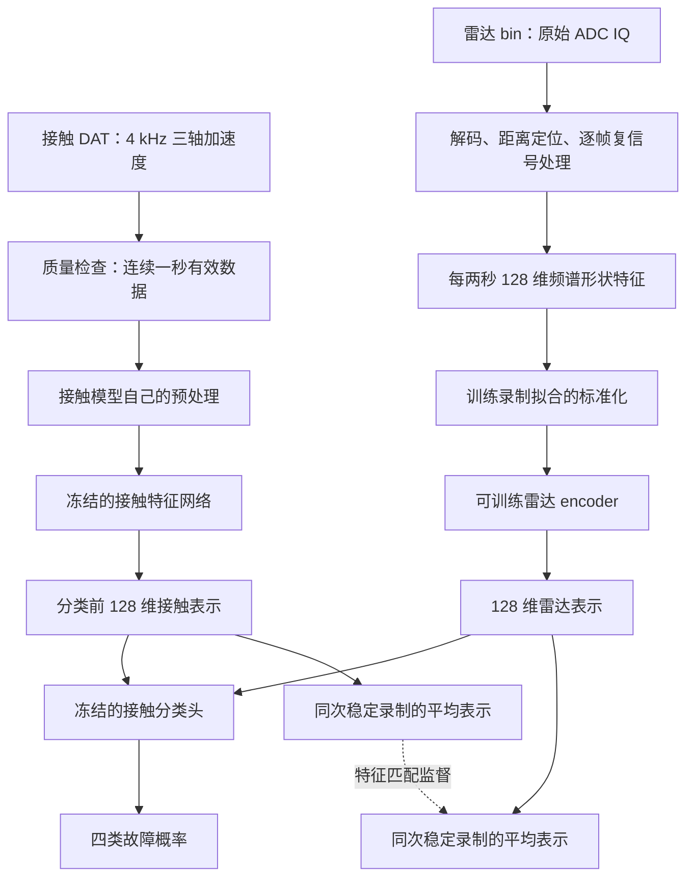
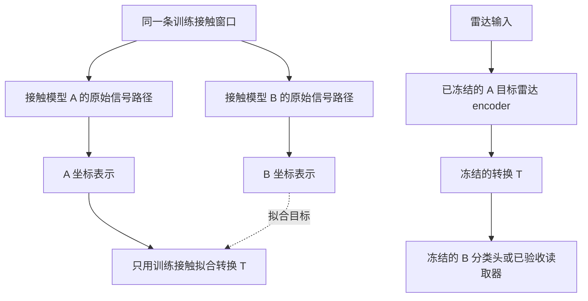

# 接触—雷达对齐链路、冻结模型复用与下一轮验证

2026-09-24。本文依据当前代码说明实际链路，区分已有实现、此次补测和拟补实验。完整采集步骤见同目录 `physical_collection.md`；算法比较与原始论文见 `baselines_and_novelty.md`。

**当前对齐位置是最终分类前的 128 维表示；监督的对应单位是同一次稳定录制，不是逐点波形或一秒对两秒的窗口。转换器是可选的跨接触模型复用模块，并非每个模型都必须附带。**

## 1. 当前主链路，从原始数据到分类

图中“冻结”指这一阶段不更新权重。接触分类头此前可能已经用接触训练数据适配过，不能把“雷达训练时冻结”误解为“从未训练过本地头”。

### 1.1 接触侧实际输入

接触设备设置为 4000 Hz。当前严格解析完整包与连续采样索引，提取连续 4000 点的一秒窗口。发送间隔、损坏记录和丢包不能拼成连续信号；接收时间戳也不能当精确采样时间戳。

当前 Bear v0 路径：每轴减均值→DCT→将系数补到 24000 长度→规定的能量归一化→与健康参考一起进入 FCN。补零只是满足输入接口，不增加 2 kHz 以上的观测信息。

这里有两个需要准确记录的实现事实：

- 对齐目标取在 FCN 卷积特征图经展平、`classifier.linear1` 和 ReLU 后的 **128 维隐藏向量**，位于最后分类线性层之前。不是最早的卷积特征图，也不是大语言模型 token。
- 现行归档 v0 用的是固定的公开训练集健康参考，并非本地同转速健康录制。各轴／参考结果按已归档规则汇聚。因此不能把当前主结果描述成“已经用了本地同工况健康参考”。下一轮可设置只取训练录制的本地健康参考对照。

Rot 则使用自己的 DCT/SFN 路径；UniFault 使用自己的时域片段、归一化与 Transformer。两种接触模型对同一原始窗口可以各自提取表示，不是将 Bear 的向量送入另一个模型的原始信号 encoder。

### 1.2 雷达侧实际输入

主分支不是把 IQ 或时频图直接送入神经网络，而是先从 IQ 计算一条 128 维频谱形状向量。

| 步骤 | 当前具体处理 | 用意与边界 |
|---|---|---|
| IQ 解码 | DCA1000 bin 按当前已审计布局解码，四个 RX、每 chirp 256 点 | 必须与实际固件、通道和文件格式一致，不能由文件后缀猜格式 |
| 距离处理 | 快时间去均值、Hann 窗、512 点距离 FFT | FFT 补零改善网格，不增加物理分辨率 |
| 目标选择 | 在实测距离附近约 ±16 cm 内选峰，保留相邻三格 | 防止远处强反射盖过四十多厘米处的电机；规则不读取故障类别 |
| 空间单元 | 4 RX × 3 距离格＝12 个相关单元 | 不是 12 个独立天线；原 TX=7 也不能自动当作可分离 TDM-MIMO |
| 单元归一化 | 每两秒窗口内，用有效 chirp 的幅值中位数缩放 | 减小增益／距离尺度影响，也可能丢失真实幅度信息，须做消融 |
| 静态分量处理 | 每帧只对有效 chirp 去复均值 | 减小静态回波；不等于消除了所有多径 |
| 慢时间谱 | 每个完整 192-chirp 帧单独加窗并计算功率谱，再平均 20 帧、取空间单元中位数 | 不假定跨帧相位连续，不跨缺口做相位差 |
| 频带汇聚 | 5–800 Hz 固定 128 个频带的平均功率→log→减该窗口频带均值 | 得到谱形，保留相对能量；不是标定后的位移功率谱 |
| 标准化 | 每维减训练均值、除训练标准差 | 不混合维度，也不把其他维度“变成128维”；进入此步骤前已是128维 |
| 神经网络 | MLP 128→128→64→128，中间 LayerNorm/GELU 等 | 输出落入对应接触教师的特征坐标与数值范围 |

本地证据：[当前预处理](/home/huangyating/anomaly_detection/four_class_preprocessing_20260921/preprocess.py)、[频带提取](/home/huangyating/anomaly_detection/four_class_chain_20260922/radar/extract_features.py)、[实际学生结构与损失](/home/huangyating/anomaly_detection/encoder_validation_20260923/controls/run_controls.py)。v2 复用算法、修复了外圈距离选择；旧脚本顶部保留的历史 ROI 警告不代表 v2 仍在错误距离上训练。

### 1.3 从哪里“对齐”

假设某次稳定内圈录制得到 10 个有效接触窗口和 40 个雷达窗口：

1. 接触网络为每个接触窗口输出 128 个数，取这次录制的平均。
2. 雷达 encoder 为每个雷达窗口输出 128 个数，训练时每袋抽取 16 个窗口估计平均。
3. 要求两者在训练接触统计量标准化后的坐标中接近。

**这并没有要求“第一个接触窗口必须对应第一个雷达窗口”。** 它要求二者来自同一次、同一故障与稳定工况的录制集合。若一边主要采到加速、一边主要采到稳定段，两种平均就不再代表同一状态，必须粗分段或进行更细对应。

1 秒和 2 秒只是两种特征提取窗口，不是同步精度。当前雷达 2 秒用于汇聚 20 帧以降低方差，也不是已经证明最优的窗口长度。

### 1.4 当前训练约束

已有完整方法为：

`总损失 = 类别CE + 录制平均特征MSE + 0.1×对比项 + 0.5×软概率蒸馏`

- **类别 CE**：每个雷达窗口通过冻结接触头后，应该给出训练故障标签。
- **平均特征 MSE**：让同录制的两种平均向量接近。
- **对比项**：使相同类别的平均表示相近，温度 0.2；当前每折每类仅一个训练袋，因此不能据此声称学习了类内关系。
- **软概率蒸馏**：雷达录制平均概率接近接触老师平均概率，温度 2。

这些权重来自既有实现，不是已经证明必须采用的最优组合。真实均值 MSE 本身已很强，应继续作为主要对照。完整法用到了真实训练标签，不能写成完全无标签学习。

部署时只需雷达预处理→雷达 encoder→分类头；接触传感器不必在线参与。当前验证的是特征／分类路径，尚未等同于验证完整 LLM 的自由文本故障报告。

## 2. 分类头、读取器、转换器分别是什么

| 模块 | 输入和输出 | 是否每个模型都有 |
|---|---|---|
| 原生分类头／本地新分类头 | embedding→故障概率 | 做分类需要；类别定义不合适时可另训本地头 |
| 新任务读取器 | embedding→某项振动指标或新任务 | **不是所有原模型自带**；当前物理指标读取器是额外训练的线性回归 |
| 接触 A→B 转换器 | A 的 embedding→B 的近似 embedding | **可选**；只在复用另一个接触模型坐标时需要 |

“读取器”是功能名称，分类头也可以理解为读取类别的模块。为了避免混淆，后续报告把四分类模块称分类头，把物理指标模块称新任务读取器。

## 3. 接触转换的理解正确：训练时不需要雷达

拟合时对同一个接触窗口分别运行 A/B，然后按训练录制均衡拟合两侧 StandardScaler 和 Ridge 回归。推理时合并成一个矩阵乘法和偏置：

`B近似表示 = T(A表示) = W×A表示+b`

若 B 的目标层非负，则可使用事先固定的非负截断；若是 UniFault 的有符号特征，则不加 ReLU。框架形式上可以处理不同输入／输出维数，但当前三个教师都取128维，异维接入尚未实测。每个目标模型仍需要自己的转换参数，并核验目标层、范围、归一化与头的匹配。

这个转换训练不使用雷达，也不读取测试接触窗口。它不需要故障标签作为回归目标；但 B 的本地四分类头使用过接触训练标签，因此整套系统不能称完全不使用标签。

部署时不再运行 B 的原始信号 encoder。得到的是“雷达→B 表示接口→B 后续模块”的兼容路径，不是把 IQ 塞进 B 的加速度输入口。

### 为什么转换可能有效，为什么又不能保证任意模型通用

学生已经在学 A 的坐标；若 T 对 A 的表示有效，它也可能对接近这些表示的雷达向量有效。失败来源有两个：雷达没有学好 A，以及 A→B 的转换本身不准确。线性 T 下，对应样本的误差满足普通三角不等式：

`雷达转B误差 ≤ ||W|| × 雷达相对A的误差 + A转B本身的误差`

该式只说明误差来源，不是新的理论或分类正确率保证；现有数据没有逐窗同步，也不能把它当作已经实测的瞬时误差界。若 A 已丢掉 B 所需的信息，转换器无法凭空补出。有限四类上能转换，也不代表新任务或新工况上能转换。

## 4. 本次已补做：冻结 Bear 雷达 encoder→UniFault

按用户提出的问题，本次实际运行了：

- 每折仅用接触训练窗口拟合 Bear→Uni 的转换，固定 Ridge alpha=1，不搜索测试最优参数。
- 保留有符号输出；UniFault 主干和已有四分类头均冻结。
- 加载并复算 36 个已有雷达 checkpoint：六种训练方法×两方向×三种子，**没有重训雷达**。
- 核对旧模型／输入哈希，保存转换、逐窗预测、逐录制预测与审计。

| 冻结的 Bear 雷达原训练方式 | 转 Uni 后窗口准确率 | 转 Uni 后录制准确率 |
|---|---:|---:|
| 仅类别 CE | 93.93% | 91.67% |
| 真实接触均值 | 99.84% | 100% |
| 完整方法 | 99.92% | 100% |
| 人为类别向量 | 95.06% | 100% |
| 人为类别向量＋CE | 96.28% | 100% |
| 固定错类接触均值 | 0.24% | 0% |

接触对照：Uni 自己的特征为 58/58 窗口正确；Bear 接触特征转换为 Uni 后为 55/58＝94.83%；两条路径录制均为 8/8。

这是 **8 个已有开发录制、412 个不同雷达窗口**。1236 是三个种子的重复判定，录制百分比也是种子平均，不是 24 个独立录制。未增加新的物理样本。

结论是：这次对第三模型的冻结复用也可行，真实特征学生的窗口结果优于类别／人为向量学生；但人为向量在录制层面同样满分，不能声称唯有真实接触知识才能完成该四分类复用。仍需新任务和新工况验证。

产物：[新补测目录](/home/huangyating/anomaly_detection/frozen_bear_to_unifault_20260924)、[结果 CSV](/home/huangyating/anomaly_detection/frozen_bear_to_unifault_20260924/results/summary.csv)、[可复现实验脚本](/home/huangyating/anomaly_detection/frozen_bear_to_unifault_20260924/run_frozen_transfer.py)。

## 5. 可复用框架能不能成为 insight

可以成为待验证的系统设计价值，但“线性转换连接两个模型”本身已有 model stitching 研究，不能当作首次提出的算法。[Lenc 与 Vedaldi，CVPR 2015](https://www.cv-foundation.org/openaccess/content_cvpr_2015/html/Lenc_Understanding_Image_Representations_2015_CVPR_paper.html)、[Bansal 等，NeurIPS 2021](https://papers.nips.cc/paper/2021/hash/01ded4259d101feb739b06c399e9cd9c-Abstract.html)

依据用户后续澄清，论文主目标应为：**建立接触—雷达跨模态知识适配框架，让后续雷达数据能够使用接触训练的诊断模型。** 仅接触转换属于辅助兼容性检查；减少重采或模型升级成本是潜在附带收益，不能替代主目标。详见 [目标澄清与cfg小试](/home/huangyating/research_proposals/alignment_and_collection_20260924/目标澄清_读取器与冻结验证_CFG小试.md)。

要把它做成可信贡献，需同时报告：

1. 新接触教师：重训雷达与仅接触转换，在相同新测试录制上的准确率、特征读出、耗时及新增雷达数据量。
2. 新接触任务：新增读取器时，雷达冻结，不使用该任务雷达标签；表现优于类别代表基线。
3. 跨转速／距离／环境：复用是否稳定，哪里需要少量再适配。
4. 粗配对边界：稳定状态下能容忍多少起止偏移，状态变化时何时需要分段，不能笼统说任何场景都无需时序对应。

高分类准确率和转换成功不是全部信息相同的证明；已有工作展示按类别聚集的随机表示也可能拼接成功。[Smith 等，ICML 2025](https://proceedings.mlr.press/v267/smith25a.html)

## 6. 毫米波预处理必须针对哪些实际问题

处理工具大多是通用信号处理，但参数、先后顺序和保留的信息需要针对微弱机械振动设计。不能直接套用点云／人体运动检测的默认链路。

### 6.1 距离峰与多径

电机实际四十多厘米时，不能直接选全场最大峰；此前外圈选到约 0.88 m 就说明了这一风险。以实测距离限制 ROI、保留邻近距离格和多个 RX、对单元作稳健汇聚，是当前落实的防护，但没有证明消除所有环境影响。

建议在新环境实验比较：仅最大单元、当前中位数汇聚、依据训练期固定质量规则加权的多单元汇聚。测试 ROI 规则不得读取故障类别或根据分类得分选择。

### 6.2 弱振动、静态回波与绝对幅度

电机表面几乎静止但存在微振动。逐帧去复均值可以压低静态分量；过强的高通或直接删掉低速分量也可能删掉有用信号。相位、复 IQ 变化和纯幅度在多径下表现不同，需要在 off／转动小试中检查。

当前幅度归一化有助于减小距离／增益差异，同时可能删掉故障幅值信息。应同时保留原始单元功率以便审计，并比较谱形、相位变化和额外幅度支路；不能为了让表示看起来不受环境影响，先把所有有用差异也归一掉。

TI 的 ADC 文档说明了原始采集布局；微弱表面振动感知也有雷达原始研究，但这些资料不替代本装置的质量验证。[TI 原始 ADC 采集说明](https://www.ti.com/lit/an/swra581b/swra581b.pdf)、[RadioMic 原论文](https://arxiv.org/abs/2108.03164)

### 6.3 帧间缺口和真正的频率分辨率

原 cfg 帧内慢时间间隔 500 μs，即 2000 Hz；192 chirp 占约 96 ms，每 100 ms 一帧。计划内空闲约 4 ms。192 个点的首末观测时间差为 95.5 ms，不能把帧内 2000 Hz、平均 chirp 数 1920/s 和帧率 10 Hz 混为一谈。

主谱是每个约 96 ms 帧的谱再平均，基本频率间隔量级约 `2000/192=10.42 Hz`，加窗主瓣还更宽。补到 4000 点后得到 0.5 Hz 网格，**不是 0.5 Hz 的物理分辨率，也不是连续两秒的相干谱**。

因此，是否能读取低速下精细边带，需要先做可观测性小试。若需长连续观测，应另行验收更长 chirp 块、跨帧相干性或有缺失掩码的估计方法；不能跨帧直接接相位并宣称恢复了真实连续振动。

提高到 5 kHz 也不自动提高分辨率：若仍为 192 点，连续时间反而缩短。高带宽与长观测时间是两个不同的设计需求。候选 cfg 只能先实机验收，再固定用于整批采集；改 cfg 后解析和特征规范也要对应更新。

### 6.4 不强行把雷达波形等同于加速度

接触测局部加速度，雷达观测多个散射点、多个传播路径的复回波。同一点、理想线性条件下的位移—加速度关系，不能直接套在不同测点与多径回波上。因此当前在学习到的表示空间对齐，不要求原波形一致。

这也不意味着任意特征都可恢复。雷达观测不到或当前前端已平均掉的信息，不能靠转换器补出。后续首先增加可观测性检查，再决定是否需要帧内时序／包络支路。

### 6.5 off 数据怎样用

off 可用于了解静态背景、噪声和非机械干扰，但不是“正常运转”类别。不同次启动、距离或相位基准下，不能直接把两个复 IQ 序列逐点相减。

正式结果区分：不使用测试环境标定；允许每环境固定时长 off 作为部署校准。后一种有实际价值，但不能称无校准泛化，也不能用带故障标签的测试数据挑最佳预处理。

## 7. 人为类别向量不能替代传统 ML／CNN baseline

两者回答的问题不同：人为向量检验“只学四个分类头认可的代表是否足够”，传统分类器检验“雷达本身是否可以直接完成任务”。而且当前人为向量使用过冻结接触头与全局训练特征尺度，并不等同于不接触任何教师信息的独立雷达分类。

推荐主分类比较：kNN、RBF-SVM、相同雷达 MLP＋自由四类头、MiniROCKET＋线性分类器、单个 Inception CNN。RF 可选。所有方法先使用相同 128 维输入；MiniROCKET／CNN 作用于频率轴时必须称频谱适配版。

额外单列三类迁移比较：教师硬伪标签／软概率蒸馏、真实均值 MSE、关系蒸馏 RKD。机制控制则保留人为向量、类原型、错类、同类同速错录制。

新接触教师优先考虑 TS2Vec：需要在允许的接触训练数据上自监督训练，不冒充已有通用轴承 checkpoint；若希望继续使用公开预训练权重，可先验收 MOMENT Small 的接触路径及其 512 点输入限制。没有必要一次增加大量模型。

完整来源、预算与防泄漏细节见 [baseline 与创新边界](/home/huangyating/research_proposals/alignment_and_collection_20260924/baselines_and_novelty.md)。

## 8. 交给采集者的优先顺序

1. 先做数条小试，确认原始 IQ、真实时间结构、接触完整包及串口吞吐。
2. 固定一个验收通过的 cfg、距离和安装，完成四类×三转速×四会话的 48 条主矩阵。
3. 再做两次独立会话的距离／环境扩展，每次保留 room、40 cm 的参考条件，以区分会话变化和环境变化。
4. keep 新故障、组合环境和转速切换为后续选做，不能替代主矩阵。
5. 所有原始文件、cfg、采集日志与失败记录一起保留。质量筛选只看通信、饱和、有效长度等，不根据预测类别是否正确决定保留。

详见 [可执行物理实验方案](/home/huangyating/research_proposals/alignment_and_collection_20260924/physical_collection.md) 及同目录采集 CSV。当前普通文本串口可能使采样与发送存在较长间隙，因此正式录制时长需按小试的有效包速率确定，不能假定录一分钟就有60个有效一秒接触窗口。
