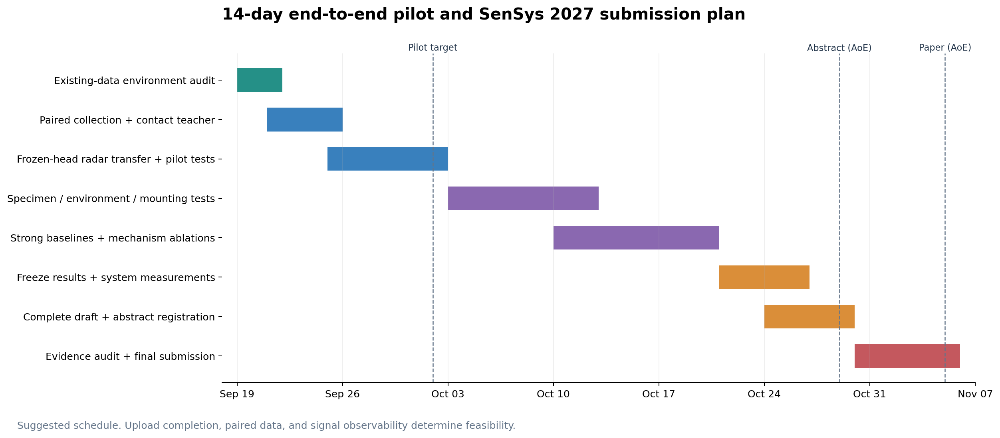

# SenSys 2027 投稿方案与 14 天全链条验证

**2026-09-22 执行更新：** 新四类数据已跑通接触教师适配→雷达 encoder→固定分类头→真实 BearLLM/Qwen 生成。原接触头四类准确率 25%，适配头及雷达学生文件留出 macro-F1 达 1.00，但频谱线性基线也满分；另一正常电机四分类全部方法均 0/2 正常接受。外圈和 keep 已保存的约 0.884 m 距离门与用户确认的四十多厘米不符，尚缺原 bin 修复。请以[四类全链条实测报告](../../anomaly_detection/four_class_chain_20260922/全链条实测报告.md)和[下一轮补采方案](../../anomaly_detection/four_class_chain_20260922/下一轮算法与补采实验方案.md)为当前执行依据；下文旧状态保留为历史设计。

更新：2026-09-19。本文按已确认的 AWR1843 + DCA1000、可调整雷达配置、5 kHz/4096 点三轴加速度包，以及现有轴承台架制定。它是上一版 [完整研究方案](研究方案.md) 的优先实施版本；时间、规模、超参数与验收线为建议，不是实验结果。

**同日实际验证更新：** 已使用 conda `m2vllm` 处理 room/narrow 的 42 个 bin，得到 652 个窗口。多单元 IQ 谱形状的三转速跨环境 macro-F1 为 100.0%/93.3%，但同一频谱上的主频对照为 100%/100%，未见距离测试又出现 50.0%/55.6% 的失败单元。off 校准未显示稳定额外收益，room 40 cm 存在近满量程数值和静止参考几何异常。A 层的本轮环境验证已完成，尚未验证故障迁移；B 层应优先采“相同转速、不同故障”的同步数据。完整实测方法、失败案例及补采计划见 [环境实验结论](../../anomaly_detection/environment_validation_20260919/实验结论.md)。下文计划条目若描述上传前状态，以该实测报告为准。

## 1. 投稿目标与研究范围

**接触式数据更新（同日）：** 新提供的实际采样配置为 4 kHz/4096 点 XYZ。已完成导出审计、严格 1 秒 DCN 和三轴教师接口实现；三份记录均无完整包，且存在接收边界字符异常，暂未生成有效本地教师窗口。另在固定 426 条 MBHM 测试查询上，重训 FCN 的 macro-F1 从原带宽 94.9% 降至低于 2 kHz 后的 49.8%。因此 B 层之前增加“完整包保存检查”和“接触式教师低带宽适配”门槛；完整包在 4 kHz 下取中间 4000 点，不能把 4096 点当一秒或把 XYZ 当 query/reference 通道。先按 [接触式验证报告](../../anomaly_detection/contact_validation_20260919/接触式预处理与embedding验证报告.md) 的 P0/P1/P2 补采与验收，再进入同步蒸馏。该带宽消融不是本地传感器诊断结果。

目标是 **SenSys 2027 第二轮，全文截止 2026-11-05 23:59 AoE；摘要注册截止 2026-10-29 23:59 AoE**。北京时间分别为 **11 月 6 日 19:59、10 月 30 日 19:59**，团队内部仍按 11 月 5 日、10 月 29 日完成。9 月 19 日到 11 月 5 日相隔 47 天。

官方规定常规全文至多 12 页，参考文献及可选附录可另加页；6 页短文仅适用于 visions、experiences、tools、datasets、benchmarks 等指定类别，不是普通技术论文压缩评估后的通用入口。本方案以常规系统论文为主。[SenSys 官方 CFP](https://sensys.acm.org/2027/cfp.html)

**论文主问题：如何利用已有接触式诊断模型，在不增加同步设备的条件下，让雷达在新环境中诊断由远处轴承传播到电机壳体的弱故障信息？**

建议主线只保留三个紧密相连的部分：

1. **可观测性审计与稳定雷达前端：** 实测哪些配置、距离与空间单元能保留故障信息，处理帧缺口、相位不稳定、静态多径和饱和。
2. **与任务精度匹配的跨模态对应：** 先建立可靠窗口对应；只有错位实验表明需要，才加入复杂后验匹配。
3. **固定接口的知识迁移：** 将雷达输出映射到接触式教师的诊断隐藏空间，固定分类头与语言接口，证明迁移收益、适用边界和部署成本。

短期不把“任意电机结构泛化”作为主结论。现有主电机不能替换，外部好/坏各一台只能作案例。可用独立轴承实体、环境、雷达位置、接触安装与传播测点的干预建立可信证据。PHI-S、SFN、RAG 放到独立消融或后续工作，不能挤占采集、强基线与重复实验时间。

暂定标题：**Reusing Contact Vibration Models for Radar Diagnosis across Sensing Environments**。只有实验支持时，再在标题加入 uncertainty/observability 等方法关键词。

## 2. 将工作分成三个可以独立验收的层级

| 层级 | 时间目标 | 输入 | 交付与可支持的结论 |
|---|---|---|---|
| A：现有数据环境验证 | 上传结束后约 1–2 天工程工作 | room/narrow，1000/2000/3000 rpm，20/40/80 cm，normal/off | 解析质量、环境干扰、运动/转速信息保留；不能声称故障诊断成功 |
| B：最小全链条验证 | 10–14 个日历日 | 新采同步雷达+加速度，正常/内圈/外圈/滚动体 | 预处理→对应→教师→学生→固定诊断头→仅雷达推理；初步跨环境诊断 |
| C：SenSys 证据补强 | 剩余约 4 周 | 独立轴承实体、配置/距离/安装干预、外部案例 | 严格泛化、强基线、机制分析、覆盖率和端到端系统成本 |

A 不是 B 的替代，B 跑通也不是 C 已经完成。最早发现不可观测或教师失效，可以及时调整任务范围与配置。

## 3. 雷达配置可以改：按单因素顺序优化

### 3.1 当前配置的约束

当前同配置 chirp 间隔 500 μs，帧内 2 kHz；192 chirp/100 ms，约 4 ms 额外空闲。每帧最后到下一帧最先 chirp 的起点间隔是 4.5 ms。平均 1920 chirp/s 不等于均匀 1920 Hz 采样。

当前三 TX 同时使能不能解析成 12 个独立虚拟通道。先增加单 TX、4RX 对照；AWR1843 三 TX 同时工作的供电条件及本机支持仍需按官方说明核实。[TI AWR1843 数据手册](https://www.ti.com/lit/ds/symlink/awr1843.pdf)

`profileCfg` 最后的 RX gain 目前是 48 dB，应检查原始 ADC 饱和比例。先比较 48/42/36 dB；优先避免削顶并保持故障频带信噪比，不预先认定某个增益最好。

20/40/80 cm 在当前斜率下，距离 beat 频率约为 **66.7/133.4/266.8 kHz**；IF 高通 code 0 并非关闭，两个拐点为 175/350 kHz。因此近距离强反射、泄漏/杂波、前端衰减可能同时存在；“IQ 很大”不等于微振动信噪比高。软件不能保证补回已衰减或削顶的信息。[TI SDK 参数表](https://e2e.ti.com/cfs-file/__key/communityserver-discussions-components-files/1023/5415.mmwave_5F00_sdk_5F00_user_5F00_guide.pdf)

### 3.2 三个优先候选

以下文件是**待实机验收的候选配置**，没有自动下发雷达；保留用户原始配置作对照。优先沿用原快时间参数，以免同时改变距离分辨率、带宽和慢时间率。

| 配置 | TX、慢时间与帧结构 | 纯 ADC 平均数据率 | 目的 |
|---|---|---|---|
| R0，原配置 | TX=7；500 μs；192 chirp/100 ms | 7.864 MB/s | 历史数据参照 |
| R1，单 TX 对照 | TX=1；其余时序同 R0 | 7.864 MB/s | 明确空间通道和相位前端；增益独立扫描 |
| R2，5 kHz 候选 | TX=1；idle 120 + ramp 80 μs；192 chirp/40 ms | 19.661 MB/s | 与加速度共同有效带宽可扩到约 2 kHz 的工程目标；名义缺口 1.6 ms，仍占 4% |
| R3，较小缺口候选 | 同 R2；帧周期 39 ms | 20.165 MB/s | 名义缺口 0.6 ms，约 1.54%；是否允许取决于固件处理/校准余量 |

R2/R3 的文件见 [configs](configs/README.md)。R2 的实际时间轴是 `m×0.040+n×0.0002`，不是把旧文件改成 5 kHz。R3 则是 `m×0.039+n×0.0002`。仍需保留 mask。更高慢时间率不能代替模拟抗混叠验证，也不保证雷达看到加速度的所有故障载波。

若原快时间 ADC 时序余量不被固件接受，可另测：ADC rate 5000 ksps、ADC start 6 μs、ramp 64 μs、idle 136 μs。256 点采样持续 51.2 μs，结束于 57.2 μs，距 ramp 结束约 6.8 μs；慢时间仍为 5 kHz，但有效距离带宽约 2.56 GHz，理想分辨率约 5.86 cm。这是另一个快时间配置实验，不与 R2 混称同一处理。

若 R3 报错、丢包、相位异常或处理不及，退回 R2；不要为了“无缺口”强行设置小于硬件处理所需的 frame period。持续波模式没有同样的距离分辨能力，不作为本轮替代方案。TI 明确要求 ADC 采样时长与 ramp 匹配，具体参数范围按本机 SDK/DFP 验证。[TI 时序解释](https://e2e.ti.com/support/sensors-group/sensors/f/sensors-forum/1131796/awr1843boost-can-t-set-the-parameter)

### 3.3 半天内完成的配置筛选

先选正常旋转与一种明显故障，固定同一测点/转速。用 R1/R2，各测 0.4/0.8/1.2 m、每条件 2 次、30 秒；共 24 次、12 分钟净采集。0.2 m 保留为已有数据的挑战条件。若需增益扫描，只在出现削顶或质量异常的代表几何上做，避免一开始全因子爆炸。

选择依据按顺序为：配置成功回执和无明显丢包 → 削顶/零填充比例 → 目标距离单元可辨认 → 静止相位噪声与运行动态证据 → 同工况故障区分度 → 数据量与耗时。预先保存选择准则，只在开发数据选工作配置；测试环境不能反复用于选最有利配置。

同一故障的特征若随 frame rate 从 10 Hz 移到 25 Hz/25.64 Hz，而不随转速改变，应优先怀疑采样窗伪调制。这个配置干预可以形成很有说服力的机制实验。

## 4. 现有 room/narrow 数据的处理和验证

### 4.1 数据含义与边界

文件名解析：`room/narrow` 为环境；`1000r/2000r/3000r` 为标称 rpm，转频候选约 16.67/33.33/50 Hz；`20/40/80cm` 为几何距离；`normal` 为正常轴承；`off` 为停止运行。文件名转速是评估标签，**不得输入转速分类器或用于选择最符合答案的谱峰**。距离可作为实际部署已知几何用于 ROI，需对所有方法一致。

`normal1/2/3` 是否为独立采集，要由采集记录确认。同一次采集拆分文件必须合并为同一个 run。没有这一信息时先按文件报告，不能宣称独立运行泛化。

上传期只做目录/文件大小监测和固定前缀的格式检查。正式处理要求上传完成、文件大小及 mtime 稳定；运行前后比对 manifest。文件变化则丢弃该次派生结果并重跑。保留所有原始文件，不覆盖或截断 bin。

### 4.2 解析与质量控制

1. 依据 DCA1000 两 lane 复数格式解码为 `[chirp,4RX,256ADC]`，以 2I/2Q 布局为官方格式候选，并检查共轭方向、距离峰与 RX 连续性。不能只因某种排列让分类更高就选择该排列。[TI 原始格式说明](https://www.ti.com/lit/an/swra581b/swra581b.pdf)
2. 用已知几何检查 20→40→80 cm 的峰位变化；统一量程偏置可以报告，不能逐类/逐环境随意校正到想要的位置。格式验证不等于已验证 UDP 缺包与帧起点。
3. 记录字节数、完整帧、尾部余量、全零 chirp、ADC 削顶比例、距离 ROI、跨帧相位变化、每种工况完整记录数。没有 DCA 丢包日志时明确不能严格恢复网络丢样时刻。
4. 同一个距离的 off 文件若距离峰、配置或采集对象不一致，不能当该距离的噪声标定。异常原文件保留，单独列出处理规则。

### 4.3 算法：先建立可解释、无需故障标签的前端

**共同距离处理：** 去 ADC 偏置、Hann 窗、512 点 range FFT（256 点补零只细化显示）。在已知距离 ±16 cm 的 ROI 内按平均反射功率选择中心，保留相邻三个 bin×4RX。后续模型不读取环境名、距离、文件编号或标称转速。

设复数距离观测为 `z[k,t]`，`k` 为 RX/bin 单元。保留静态载波，使用两条处理对照：

- 相位基线：最强单元的相邻 chirp 共轭相位差除以真实时间差；不跨帧缺口差分。
- 多单元 IQ：`u[k,t]=z[k,t]/(median_t |z[k,t]|+ε)`，在每个完整帧内去复均值；对各单元功率做稳健汇聚。减均值用于线性 IQ 残差，不再把其相角解释成真实位移。

**频谱分两种实现，结论分别报告：**

1. 完整帧内加窗估谱、跨帧平均功率。它不依赖帧间绝对相位，但每段约 96 ms，实际分辨能力有限；补零不能变成 2 秒相干分辨率。
2. 在 2 秒真实时间网格上，以有效 mask 拟合 `c+a cos(2πft)+b sin(2πft)`，取 `(a²+b²)/2`。FFT 只加速充分统计量计算，缺失位置不作为零测量参与回归。该法需要跨帧相干性验证，也不自动消除任意多分量谱泄漏。把它作为有条件的高分辨率版本。

**P0，无目标校准：** 对汇聚功率取 log，然后减去频带 log 均值，形成谱形状；另保留绝对功率版本作消融。归一化会删除总体幅度信息，是否损失状态可分性必须实测。

**P1，目标 off 校准：** 在同环境/几何的独立停机记录上估计噪声谱 `N(f)`，使用 `log(1+P(f)/(N(f)+ε))` 或有上限的噪声归一化谱。噪声地板由 off 数据估计，不能用目标正常旋转样本替代。若相应 off 校准缺失/异常，声明该条件无 P1 结果或按预先定义的 P0 回退，不能悄悄借用不匹配参考。

空间汇聚、滤波/谱形状归一化与 off 校准应拆开消融，不能仅报告一个组合方案。

### 4.4 验证协议

| 实验 | 训练 | 测试 | 说明 |
|---|---|---|---|
| P0 四状态识别 | room 的 off/1000/2000/3000 | narrow 全部完整记录 | 无目标校准，区分运动状态/转速，不是故障 |
| P0 反向迁移 | narrow | room | 使用相同预定流程，不能根据第一方向结果改方法后仍称两个盲测 |
| P0 三转速识别 | 源环境正常旋转记录 | 目标环境正常旋转记录 | 排除容易的 off 类掩盖转速迁移失败 |
| P1 三转速识别 | 源环境旋转 + 源 off 噪声参考 | 目标旋转；允许目标 off 校准 | off 校准记录不进入测试标签集合 |
| 距离留出 | 源环境两个距离 | 源/目标的未见距离 | 明确几何信息输入与覆盖；小样本作探索性报告 |
| 同状态跨环境谱一致性 | 同转速同距离的不同记录 | 汇总环境差异 | 同时检查异状态分离，避免全部抹平后“域差异变小” |

分类器首版统一采用正则化 logistic regression，`C∈{0.1,1,10}` 仅在源环境按距离分组验证选择。每个文件总训练权重相同；先聚合各窗口预测概率再评价文件/run，不能把成千上万窗口当独立测试实体。保持归一化统计只由训练拟合。

必要对照：原始 ROI 幅度、单单元相位谱、多单元 IQ 绝对谱、多单元谱形状、帧内功率汇聚、mask 回归、off 噪声归一化。报告 macro-F1、balanced accuracy、混淆矩阵、逐距离结果、处理耗时和质量异常。少量 run 的 bootstrap 区间只能作为描述，不把两个房间推广成任意环境。

**本数据的成功解释：** 若处理后跨环境转速/运行状态稳定、同状态谱差异减小且异状态仍可区分，可以说明前端保留了相关运动信息。只有新采故障实验才能说明它保留了故障信息。

## 5. 14 天最小全链条：数据与算法详细设计

### 5.1 最小采集矩阵

先做正常、内圈、外圈、滚动体四类；复合故障留给第二阶段。每类×3 转速×2 环境×3 次独立启停/重录，共 **72 runs**。每 run 60 秒，其中约 45 秒稳定诊断、前后合计约 15 秒用于启停/可选同步特征与稳定等待；约 72 分钟净采集，装配和搬运另计。

首轮固定一个经过筛选的雷达距离/角度。不要在同一轮同时追求距离、负载、视角全覆盖。三次重复中尽量包含跨天和重新安装，类别顺序随机化。若每类只有一颗轴承，明确为跨运行/环境验证，不能称未知轴承实体泛化。

**固定划分：** E1 每类每速度的 2 次 run 用于训练、1 次用于验证，即 24/12 runs；E2 的 36 runs 在处理规则确定后测试。教师适配和学生配对训练只用 E1 训练部分。测试时可以为研究记录加速度，但不输入雷达诊断系统，也不能据此选择模型。

全部故障类型的配对样本都出现在训练域。这是“利用接触式模型迁移诊断”的可行性验证，不是未见故障零样本泛化。全雷达监督基线使用相同数量 run 的状态标签，标注成本必须说清楚。

### 5.2 加速度输入与教师准备

优先检查是否只是传输有间隙。若设备实际采样连续，用采样计数重组 1 秒；若可将硬件采样设为 4 kHz，4096 点覆盖 1.024 秒，可取真实 1 秒以保留原 BearLLM 的时长语义。

若只能取得 5 kHz、4096 点的不连续包，则固定 0.8192 秒诊断窗，按真实频率和相同短窗处理所有配对数据。保留 24000 维 DCN 接口但明确存在原权重输入失配；在 E1 接触式训练 run 上适配教师。不能把补零称为恢复了 1 秒原始信号。不要把已发布 DCN 数据再做一次 DCN。

最小教师先固定一轴；有时间再做三轴共享编码器融合。先比较：包络/频带特征+线性模型、原权重、适配教师。适配从诊断头/后部层开始，只有验证集显示需要才解冻更多编码层。健康参考只从训练 run 的独立正常片段构建，按允许的工况匹配；缺参考版本明确训练和验证。

建议主接口为 BearLLM 分类第一层 ReLU 后的 **128 维隐藏量**。冻结其后分类层、语义投影和 LLM，学生输出同一 128 维坐标。原十类按故障部位汇总严重程度概率得到四类；若改成新四类头，必须说明教师已适配。额外报告原 `128×47` 特征图接口替换，作为更严格但非 MVP 阻塞项。

教师先验证，再冻结；冻结包括 BatchNorm 运行统计。不要一边更新教师与下游头，一边宣称成功复用了固定模型。

### 5.3 第一版对应算法：仿射时间 + 窗口后验

1. 每包保留实际时间、包序号和接收时间；接收时间只作软约束。雷达保留 chirp/grid mask。
2. 在两侧可观察频带提取转频候选、带能量变化与冲击强度。雷达旧配置用帧内短窗或有 mask 的支持区间，不能普通 STFT 跨缺口。
3. 用可靠变化事件估计 `t_a=β+(1+ε)t_r`。首尾可采用不同形状的短变速，但所有类别使用相同分布，且诊断网络不输入校准段。
4. 在拟合时间附近，对候选诊断窗口计算共享描述子代价，取至多 3 个候选；令 `Q_ij ∝ exp(-C_ij/τ_a)`，按质量和对应熵降权。温度和门槛只在源验证 run 的已知人为错位上选择。
5. 无可靠锚点或后验多峰时，回退为同一稳态 run 的袋级语义监督；记录回退比例，不把它当精确同步。

该简化版不需要一开始实现全局 pair-HMM。首轮用 `0/25/50/100/200/500 ms` 人为错位曲线判断精细对齐的收益。如果 200 ms 内诊断没有明显变化，同步应作为基础处理；如果明显敏感，再实现上一版的单调匹配/跳过后验。机械群延迟与绝对时钟偏移一般不能仅凭两条未知传递后的信号唯一分开。

### 5.4 第一版雷达学生

采用小模型，明确输出接口：

```text
多 RX / range-bin 复数片段 + 时间与有效 mask
  ├─ IQ/相位增量分支：共享 TCN，通道 32→64→128，kernel 7，dilation 1/2/4
  └─ 谱分支：频带支持明确的 log 谱/包络谱，2 层 MLP，256→128
       ↓ 按信号质量汇聚空间单元，拼接后 256→128
  radar hidden h_r[128]
       ↓ 冻结的原诊断后半段
  四类概率 / 低置信度拒识
       ↓ 可选冻结语言接口
  诊断文字
```

mask 必须参与统计池化；卷积支路只在有效段运行或显式带 mask，不能让跨缺口的人工连接成为故障特征。MVP 先不用完整循环谱大图、Transformer、可学习域对抗和多教师。谱形状分支与保留绝对幅值的分支分别比较，防止删除故障严重程度信息。

训练输入不包含文件名标签或标称转速。若加入阶次谱，部署时用雷达估计转频，并评估估计错误；不能用测试文件名转速偷偷提供答案。已知设备工况作为额外输入的版本单列。

### 5.5 首版损失与训练顺序

教师隐藏量为 `h_a`，学生为 `h_r`，固定诊断头为 `C`，窗口后验为 `Q`，质量权重为 `w`。使用：

\[
L_{feat}=\sum_i\bar w_i\sum_j Q_{ij}\,\mathrm{Huber}(h_i^r/s,h_j^a/s),
\]
\[
p_i^a=\sum_j Q_{ij}\,\mathrm{softmax}(C(h_j^a)/T),\quad
L_{KD}=T^2\sum_i\bar w_i\,KL[p_i^a\|\mathrm{softmax}(C(h_i^r)/T)].
\]

`s` 是仅由教师训练特征估计的全局尺度；第一版不用 PHI-S。加 `0.1 L_contrast`，采用窗口后验作软正样本权重；相邻同状态窗口不全部当负样本，同速度不同故障是必要负样本。教师及其对比投影固定。没有标签的轨道不能用人工类别筛选负样本。

总损失先用 `L_feat + L_KD`；跑通后加对比项。轻量增强为 RX/bin dropout、有限复增益变化和训练域噪声，不把删除全部诊断频带仍当保持标签的增强。

推荐起点：AdamW，LR 3e-4，batch 32，温度 T=2，最多 60 epoch、验证指标 10 epoch 不改善停止；随机种子首轮 3 个。超参数只做小网格，所有基线同预算。低质量权重先由外部信号指标固定，不允许模型靠把所有困难样本降权来优化损失。

### 5.6 证明全链条的最低实验集合

| 编号 | 方法/干预 | 必须回答的问题 |
|---|---|---|
| M0 | 电机处接触式简单模型、原教师、适配教师 | 标签信息是否已传播到测点，教师是否可信 |
| M1 | 雷达谱特征+线性分类；同学生直接监督 | 雷达本身是否可观测，复杂迁移有无必要 |
| M2 | 雷达学生仅 logit KD | 最基础迁移能做到什么 |
| M3 | feature+KD，固定头 | 隐藏知识迁移是否有额外收益 |
| M4 | M3+对比；M3+质量/对应权重 | 两个增量各自是否有效，避免一起加无法归因 |
| M5 | 原前端 vs 环境处理前端 | 在 room→narrow 上是否保留故障信息 |
| M6 | 正确配对、同 run 打乱、跨故障 run 打乱 | 时间对应是否有用，是否只学到转速/类别 |
| M7 | 固定原头 vs 新雷达头 | 是否真的复用了原接口 |
| M8 | 雷达单独部署，接触式文件不可访问 | 完成系统闭环，而不是测试时仍依赖教师 |

主表按 run 汇总四类 macro-F1、balanced accuracy、正常误报和故障漏报；同时报告全覆盖结果和拒识覆盖率。绘制源域验证与目标环境结果、3 个速度组、混淆矩阵、错位曲线、配对 run 数学习曲线。展示 3–5 个固定测试样本的输入证据、教师预测、学生预测和失败原因，不只给最佳示例。

**阶段验收以证据为准：** 教师在源验证 run 上有效；雷达监督基线优于多数类/元数据控制；至少一种 KD 能接上固定诊断头；目标环境收益来自故障信息而非采集身份。可以预设 macro-F1 0.75 作为工程继续投入线，但它不是统计上的普适门槛，更不是录用标准。

## 6. 14 天逐日安排

| 日程 | 工作 | 当天可检查的产物 |
|---|---|---|
| D1–D2 | 上传完整性、IQ 解析、现有环境前端；配置小扫描 | 数据 manifest、质量图、环境结果、选定主配置 |
| D3–D4 | 72 runs 同步采集，确定包时间契约 | 原始文件、实体/run/环境划分、参考许可；未完成则先四类一速度闭环 |
| D5 | 接触式可分性、短窗/带宽适配 | 原权重与适配教师的独立验证，冻结 checkpoint |
| D6 | 仿射对应和已知错位测试 | 对应表、熵/质量/拒绝率；无锚点回退规则 |
| D7–D8 | 小雷达学生，M1/M2/M3 | 第一张固定头诊断主表、仅雷达推理脚本 |
| D9–D10 | 对比/前端/配对消融，3 个种子 | 机制增量表，确认是否值得做复杂对齐 |
| D11–D12 | E2 冻结测试、失败定位；必要配置补采 | 跨环境结果、按速度/距离问题定位 |
| D13–D14 | 重复关键实验、延迟测试、演示与短报告 | 全链条可复现命令、结果与下一阶段取舍 |

如果 D5 教师失败，优先调整测点/任务；若教师成功而雷达监督失败，优先处理硬件与可观测性；若雷达监督成功而 KD 失败，聚焦接口/带宽/配对。不要在每种失败下都继续堆叠损失。

## 7. 47 天 SenSys 倒排



图：建议排期，不代表采集或实验已经完成；实际门槛由信号可观测性和独立验证决定。

| 日期 | 必须完成 | 不再无限扩张的范围 |
|---|---|---|
| 09-19—10-02 | 14 天全链条；已有环境验证；主配置冻结 | 不同时改 LLM、SFN、RAG |
| 10-03—10-12 | 独立轴承实体与环境留出；重装/距离/配置干预 | 主方法只保留已证明有效的模块 |
| 10-13—10-20 | 最强基线等预算调参；核心消融；外部好坏案例 | 复杂循环/后验模块无稳定收益就删减 |
| 10-21—10-26 | 主结果冻结；失败边界、延迟/资源、论文图表 | 主测试不再用于模型选择 |
| 10-27—10-29 | 完整初稿、摘要注册；复现包与匿名材料 | 摘要范围必须对应已得到的证据 |
| 10-30—11-03 | 论证与图表复核；核对原始日志、补关键缺项 | 避免重开整套模型设计 |
| 11-04—11-05 | 最终格式、提交检查与提交 | 留出网络/上传余量 |

最低补强优先级：**独立故障轴承实体 > 新环境/重装重复 > 配置与可观测机制 > 新网络模块**。每类至少 3 个实体才有最基本的 train/val/test 实体划分，4 个更利于保留 2 个训练实体；来不及取得时收窄结论，不用增加窗口数代替实体数。

建议主文 12 页分配：问题与贡献 1 页，观测与实测挑战 1.5 页，系统/方法 3 页，实现 1 页，评估 4 页，相关工作与局限约 1.5 页。核心结果必须在正文；附录放详细参数、推导和额外案例。

主文最好有六组图：真实台架与部署流程；配置/距离/采样缺口证据；固定头迁移主结果；跨环境与独立实体结果；关键消融/错位/覆盖曲线；延迟与失败边界。不要用多张 t-SNE 代替跨环境诊断证据。

官方 CFP 对研究过程中 AI 工具的使用要求在方法部分说明。保留此次辅助代码/数据分析的版本和人工复核记录，最终按实际使用范围撰写方法说明。[SenSys 官方说明](https://sensys.acm.org/2027/cfp.html)

## 8. 交付与执行边界

本补充方案已给出可实施的算法、实验和候选 cfg；候选配置尚未实机执行。现有上传数据的分析结果另存于 `anomaly_detection/environment_validation_20260919`，只在文件完整且解析条件确认后生成正式报告。

现有数据没有同步加速度与故障类，所以此次环境验证不能冒充完整跨模态故障训练。14 天方案明确列出需要新采什么、如何训练、如何测试和何时停止扩张；后续应据实填入结果，而不是预设改进一定成立。
