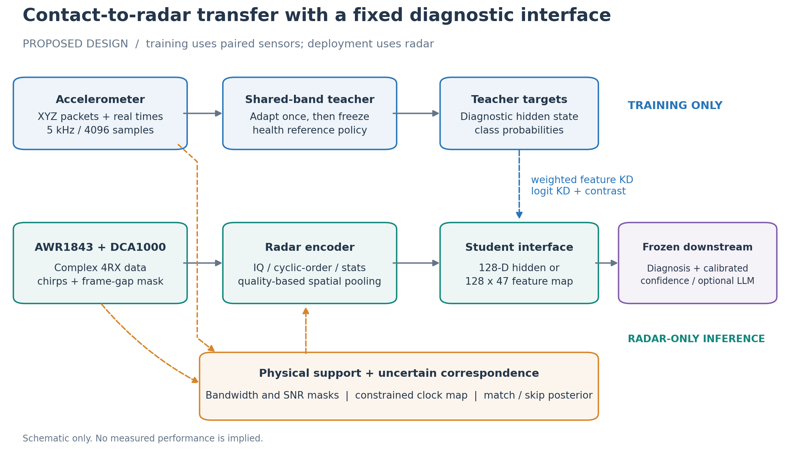
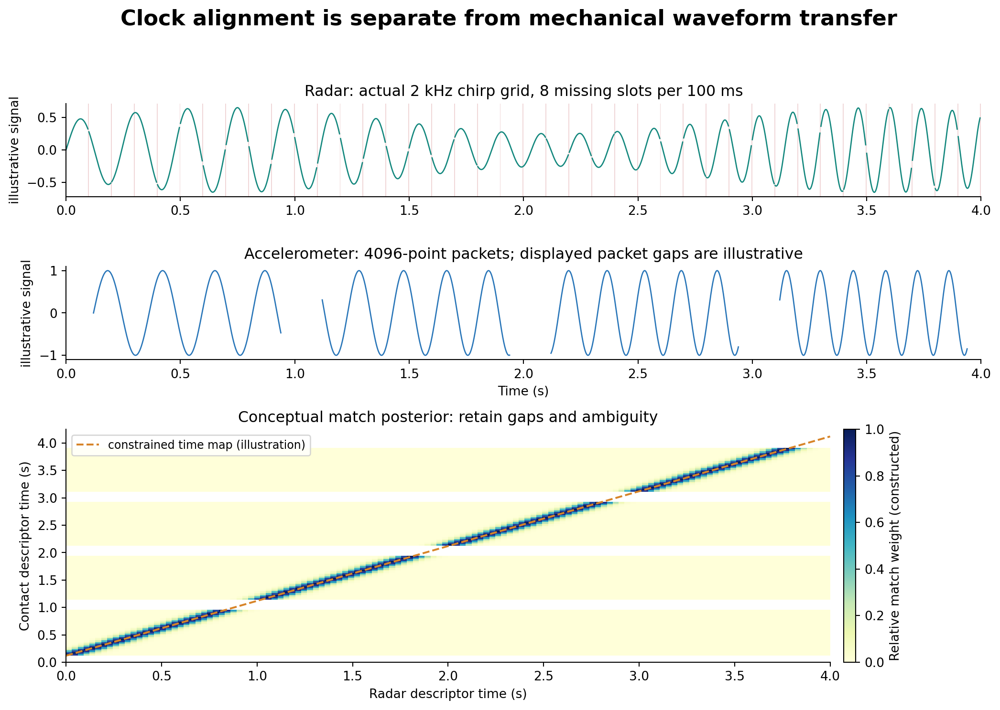
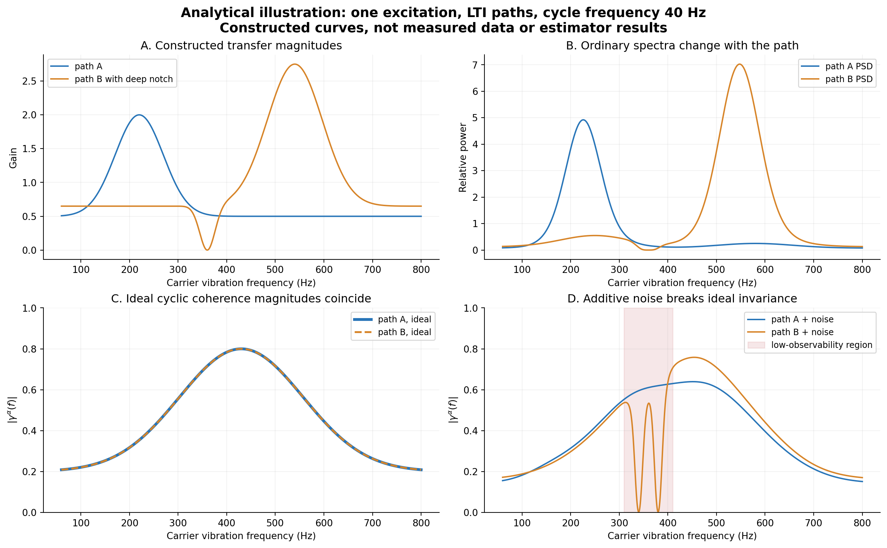
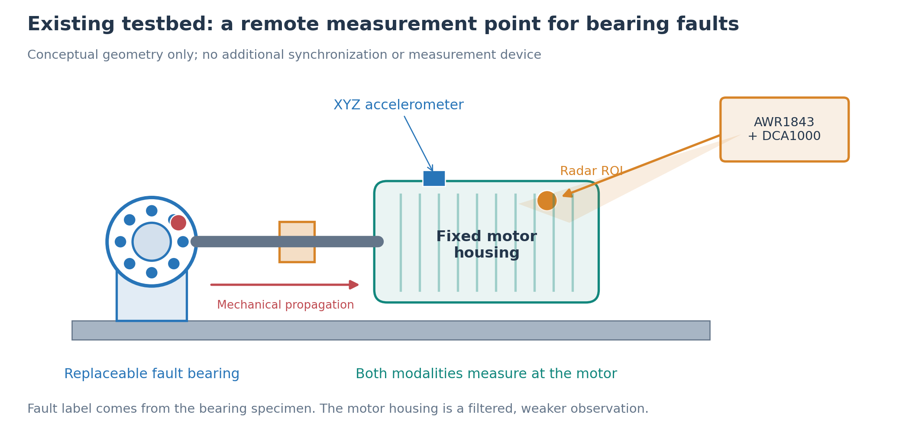
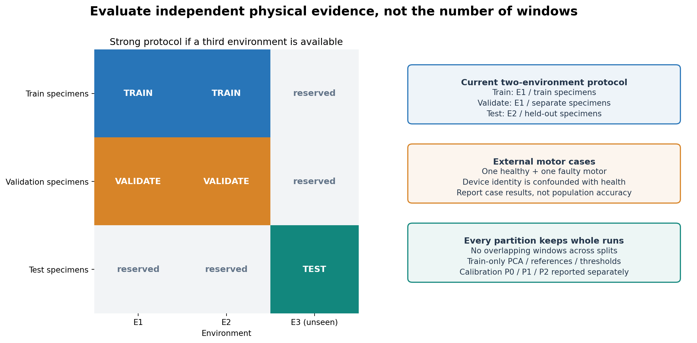
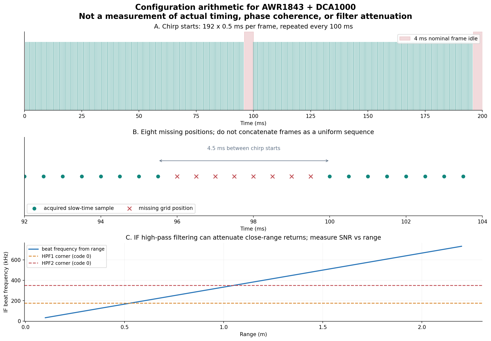

# 从接触式诊断模型到毫米波诊断：物理可观测性约束下的跨模态迁移研究方案

调研日期：2026-09-19。本文是可实施的研究设计，不是已完成实验的论文；所有超参数、规模、通过门槛均为建议值，所有示意图均不是实测性能。

**最新实施优先级：** 用户已确定以 2026-11-05 的 SenSys 2027 第二轮为目标，并允许修改雷达配置。请优先阅读 [SenSys 投稿与 14 天全链条验证](SenSys投稿与14天全链条验证.md)；本文保留完整论证，原 12 周安排由该补充版的 47 天倒排替代。

**建议的论文主线：在设备异步、采样有缺口、测点不一致和结构变化的条件下，识别毫米波与加速度计共享且可观测的故障信息，将其迁移到既有接触式诊断模型的固定接口。** 论文的核心不应是把 BearLLM、PHI-S、对比学习、SFN 和 RAG 串在一起，而应是回答“哪些知识能迁移、对应关系有多可靠、何时必须拒绝迁移”。

暂定英文题目：**From Contact to Contactless: Observability-Aware Transfer of Vibration Diagnostic Models under Asynchrony and Structural Shift**。内部简称 **C2R**（Contact-to-Radar），仅用于讨论，不代表已查明不存在同名方法。

目前方案优先定位 MobiCom/MobiSys 或 UbiComp/IMWUT 类型的感知系统研究；若希望冲击 NeurIPS/ICML/ICLR，需要进一步抽象成可推广的异步、部分可观测跨模态学习问题，并在独立于电机雷达的第二类任务上验证。不存在能提前保证录用的设计；下面给出的是可以形成有说服力证据链的路线。

**已纳入你的补充条件：** 雷达确认为 **AWR1843 + DCA1000**，有原始 IQ bin，配置见第 4.1 节；加速度约为 4096 点/包，只有接收时间戳；主体为一个可更换故障轴承的试验台及其连接电机，两种传感器都测电机；电机本身不能更换，另有一套系统的一个好电机和一个坏电机。因而主任务应先定义为“远离故障轴承测点的外壳振动诊断迁移”，跨结构只作受限外部验证，除非后续补充独立设备。

## 1. 先明确四个判断

1. **你已有的两种环境、距离、转速、静止/转动数据，适合做信号可用性与环境鲁棒性研究。** 已有可更换的内圈、外圈、滚动体与复合故障轴承，为故障任务提供了条件；仍需核实已采数据覆盖及每类独立轴承数量。一个主电机与另一系统的好/坏各一台，不足以支持广泛跨结构泛化。
2. **时间对齐、机械传递关系、诊断语义对齐是三个问题。** 外壳使波形和相位变化，不等于两台设备的时钟不同。强行用任意 DTW 把两条原始波形拉成相同，可能消除的正是故障差异。
3. **PHI-S 适合作为教师蒸馏的可选归一化组件，不是结构去耦算法。** 它不自动删除结构信息，也不保证教师与雷达属于同一坐标系。
4. **先证明雷达能观察到目标故障，再谈借助 LLM 诊断。** 5 kHz 加速度的理论奈奎斯特频率是 2.5 kHz，实际可用带宽还受模拟前端限制；雷达的振动带宽由相干慢时间采样决定，不能用 ADC 的 MHz 采样率代替。



图 1：训练时存在接触式教师、配对关系估计和雷达学生；部署时输入仅为雷达及协议允许的元数据/校准信息。原教师的诊断头和语言接口必须通过单独的冻结实验检验是否能复用。

## 2. 调研核查：哪些可以借鉴，哪些已经不是新贡献

| 工作 | 本次核查到的内容 | 对本项目的意义 |
|---|---|---|
| BearLLM，AAAI 2025 | 固定时长振动片段、DCT/DCN、健康参考与残差；先训练分类编码器，再接语言模型 | 基准教师与固定下游接口；其原任务是轴承健康状态，不是任意电机故障。[论文](https://arxiv.org/html/2408.11281v2)、[官方代码](https://github.com/SIA-IDE/BearLLM) |
| RotLLM，EAAI 2025 | SFN（Spectral Folding Network）、更广旋转机械数据、语义投影与 LoRA；论文还讨论 RAG | SFN、RAG 已是已有方法，不能将简单加入它们作为主要创新。[论文](https://doi.org/10.1016/j.engappai.2025.112544)、[官方代码](https://github.com/SIA-IDE/RotLLM) |
| R2E-Net，IMWUT 2025 | 正式名称为 Radar-to-Event Net；借助 ECG 监督的事件空间，学习雷达到该空间的单向映射，并使用时空雷达编码器 | 是最需要正面比较的任务范式近邻。不能只把 ECG 换成振动后宣称新范式。[出版社](https://doi.org/10.1145/3770693) |
| 接触式心电到无线诊断的知识迁移，Nature Communications 2025 | 已提出用 ECG 教师指导雷达诊断，并关注共享知识 | “接触式教师指导非接触式学生”本身已有先例。[原文](https://pmc.ncbi.nlm.nih.gov/articles/PMC12092671/) |
| mmVib，MobiCom 2020 | 多反射信号整合用于微米振动测量 | 是雷达信号处理强基线；不应只和简单相位解缠比较。[作者论文](https://tns.thss.tsinghua.edu.cn/sun/publications/mmVib_MobiCom2020.pdf) |
| Romeo，TMC 2025 | 利用毫米波精细角速度特征做旋转机械故障检测 | 需要说明目标是外壳内部故障迁移，还是可见转子的转速异常；两种观测几何不能混为一谈。[作者机构页面](https://research.polyu.edu.hk/en/publications/romeo-fault-detection-of-rotating-machinery-via-fine-grained-mmwa/) |
| PHI-S，2024；RADIOv2.5，CVPR 2025 | 平衡不同教师特征的统计尺度 | 适合做多教师消融，不能作为环境不变性的证据。[PHI-S 原文](https://arxiv.org/html/2410.01680v1)、[RADIOv2.5](https://openaccess.thecvf.com/content/CVPR2025/papers/Heinrich_RADIOv2.5_Improved_Baselines_for_Agglomerative_Vision_Foundation_Models_CVPR_2025_paper.pdf) |
| Soft-DTW；Gromov DTW | 前者提供可微时间规整，后者处理不同表征空间中的关系匹配 | 都应作为对齐基线。普通 DTW 不自动解决物理不可辨识。[Soft-DTW](https://proceedings.mlr.press/v70/cuturi17a.html)、[GDTW](https://proceedings.mlr.press/v130/cohen21a.html) |

**R2E-Net 的证据范围：** 本次取得出版社向 Crossref 提交的标题、作者、摘要与 DOI 元数据，已保存到 `references/r2enet_crossref.json`；ACM 全文访问被拒绝，未取得完整正文/实现。因此，本文只借鉴已核实的任务与架构方向，不把后文的环境处理、对齐公式或损失函数归于 R2E-Net。后续若取得全文，应补齐精确复现；目前只能称“受其范式启发的适配基线”。[出版社提交的元数据](https://api.crossref.org/works/10.1145/3770693)

**本地代码核查：** 工作区已有 BearLLM 复现与协议审计，但记录不等于本次重新训练完成。本文仅做只读检查；不修改其训练任务。本地代码显示 BearLLM 接受的是 query/ref 两个输入通道，内部计算 residual，并非将 xyz 三轴直接作为这三个通道。其特征图为 `128×47`，后接 `6016→128→10` 分类路径；47 个位置来自 DCT 输入的卷积下采样，**不能当成 47 个时间片**。相关文件：[FCN.py](https://github.com/SIA-IDE/BearLLM/blob/4bdd29bf013971909e81cd79732c4b3813101ca9/models/FCN.py)、[fine_tuning.py](https://github.com/SIA-IDE/BearLLM/blob/4bdd29bf013971909e81cd79732c4b3813101ca9/src/fine_tuning.py)。

RotLLM 已独立下载到本目录的 `references/RotLLM`，核查提交 `2fda9859da3537acf9909b62010995d7366b17ae`。其公开 SFN 默认将 24,000 维谱分成 3 段作为通道，默认分类输出 15 类；这既不是抗混叠意义上的采样“折叠”，也不是自动适配任意采样率。未假定完整 RAG 工程已随核心代码发布。[SFN 源码](references/RotLLM/code/models/SFN.py)

## 3. 科学问题、假设和论文贡献边界

### 3.1 用一个统一观测模型描述问题

设故障相关激励为 \(s_y(t;\omega,\ell)\)，其中 \(y\) 为故障类型，\(\omega\) 为转速，\(\ell\) 为负载。对结构 \(m\)、加速度测点 \(p\)、雷达空间单元 \(k\)：

\[
a_p(t)=\frac{d^2}{dt^2}[h^a_{m,p}*s_y](t)+\epsilon_a(t).
\]

雷达复回波更合适的起点是：

\[
z_k(t)=b_k+\sum_{q=1}^{Q_k}\rho_{kq}
\exp\{j[\phi_{kq}+\kappa_{kq}u_q(t)]\}+\eta_k(t),
\quad u_q=h^r_{m,q}*s_y.
\]

直接单站路径沿视线位移的 \(\kappa=4\pi/\lambda\)；多径的路径长度敏感方向可能不同。雷达是**空间分辨单元内多个散射体的相干叠加**，不是外壳位移的简单面积平均。

在小位移、散射系数近似稳定、复回波不接近零的局部条件下，可将合适的 IQ/相位观测近似线性化为有效传递函数作用下的振动。大位移、散射点切换、深衰落和强动态多径会破坏这个近似。这是后面不变性推导的前提，不是所有雷达信号的既定性质。

设备观测时间另写为：

\[
t_a=g(t_r)=\beta+(1+\epsilon)t_r+u(t_r),\qquad g'(t_r)>0,
\]

并以 \(M_a,M_r\) 标记未采到、丢包和无效样本。\(\beta\) 是时钟偏移，\(\epsilon\) 是时钟比例误差，\(u\) 是小幅非线性漂移。**机械相位响应保留在 \(h\)，不随意吸收到 \(g\)。**

### 3.2 三个主假设

| 假设 | 支持证据必须是什么 | 会推翻/缩小它的结果 |
|---|---|---|
| H1：显式表示缺口和对应不确定性，有助于迁移 | 已知合成偏移/漂移的恢复、真实数据事件留出验证，以及固定学生下的诊断改善 | 与时间戳/粗对齐无显著差别，或只在加入人工变速时有效 |
| H2：循环统计与多空间观测有助于跨结构共享 | 传递函数仿真、结构留出、散射点/视角干预，且保留故障区分度 | 只降低设备可分性却丢失故障信息，或收益来自健康参考泄漏 |
| H3：按雷达可观测性选择教师知识，比全量蒸馏更可靠 | 固定教师与固定下游头、相同配对数据预算下，未见环境×结构的性能/校准改善 | 必须大量微调测试结构或教师才能有效；学生只学到转速 |

建议贡献写成：**问题与公开基准 + 受约束的不确定对应估计 + 有物理依据的可观测知识迁移**。循环谱、Soft-DTW、蒸馏、PHI-S、SFN 均应承认已有基础，不将组合后的每个模块分别包装为新贡献。

## 4. 硬件与数据契约：第一周必须核实

雷达已确认为 **AWR1843，通过 DCA1000 采集 IQ bin**；尚未提供实际 bin、SDK/DFP/采集软件版本及配置成功回执。加速度计的 4096 按时域样本理解，时间戳按不精确的主机接收时间处理。

### 4.1 你的雷达配置的实际含义

```text
flushCfg
sensorStop
dfeDataOutputMode 1
channelCfg 15 7 0
adcCfg 2 1
adcbufCfg -1 0 1 1 1
profileCfg 0 77 420 5 80 0 0 49.99 1 256 3430 0 0 48
chirpCfg 0 0 0 0 0 0 0 7
frameCfg 0 0 192 0 100 1 0
lowPower 0 0
lvdsStreamCfg -1 0 1 0
calibMonCfg 1 1
monCalibReportCfg 0 0 0
sensorStart
```

按标准 mmWave SDK CLI 语义，且配置确实成功应用时，可得下表；具体固件若有自定义，须以回执和实际数据验证。[TI CLI 参数说明](https://e2e.ti.com/support/sensors-group/sensors/f/sensors-forum/942710/awr1843boost-cli-file-that-configure-the-awr1843)

| 项目 | 由配置得到的数值 | 对研究设计的影响 |
|---|---|---|
| 起始载频 | 77 GHz，波长约 3.89 mm | 可测微位移，绝不代表可测所有振动频率 |
| chirp 周期 | idle 420 μs + ramp 80 μs = 500 μs | 同一配置 chirp 的包内慢时间率 2000 Hz |
| chirp 数 | 每帧 192 个，只有 chirp index 0 | 帧内覆盖约 96 ms；单帧慢时间 FFT 间隔约 10.42 Hz |
| 帧周期 | 100 ms，即 10 帧/秒 | 名义每帧额外空闲约 4 ms；相邻帧最后/最先 chirp 时刻相差 4.5 ms |
| 实际时间轴 | \(t_{m,n}=0.1m+0.0005n+t_0\)，\(n=0,\ldots,191\) | 2 kHz 网格每 200 个位置缺 8 个，不是连续 1920 Hz，也不是无缺口的 2000 Hz |
| ADC | 256 点/chirp，3430 ksps，16-bit complex 配置 | ADC 率用于距离测量，不是外壳振动采样率 |
| ADC 采样时长 | \(256/3.43\,\mathrm{MHz}\approx74.64\) μs | 从 ramp 内 5 μs 开始，名义结束约 79.64 μs；还需核对芯片/固件时序余量 |
| 有效扫频带宽 | \(49.99\,\mathrm{MHz/\mu s}\times74.64\,\mu s\approx3.731\) GHz | 理想距离分辨率约 4.02 cm；加窗会展宽，补零不会提高物理分辨率 |
| 接收通道 | RX mask=15，4 RX | 可保留 RX×邻近 range-bin 集合 |
| 发射配置 | TX mask=7，单 chirp 中置三个 TX bit | 请求同时发射，需核实板卡供电模式/固件支持；不能当作已分离的 3TX×4RX=12 虚拟通道 |

AWR1843 确有 3TX/4RX，但“三个 TX 可选”不等于在任意供电模式下三者均可同时开启。TI 数据手册对三发同时工作给出了 1 V LDO bypass/PA LDO disable 条件，需核实实际板卡和固件；仅凭这份 cfg 不能证明它已正确工作。**建议新增一组单 TX、4 RX 的对照采集，先建立明确的相位前端。** 这不增加设备，也不必改现有历史数据；选择单 TX 会改变照明方向图/SNR，必须实测比较。无需为主任务强行追求 12 虚拟通道。[AWR1843 官方规格](https://www.ti.com/product/AWR1843)、[数据手册](https://www.ti.com/lit/ds/symlink/awr1843.pdf)

按 4 RX、256 个复采样、I/Q 各 int16、192 chirp、无额外头部/打包变化计算，纯 ADC 每帧应为 **786,432 byte**，平均约 **7.864 MB/s**；60 秒约 **471.9 MB**。该数字可帮助检查帧解析，但不是判定 UDP 缺包/帧对齐的充分条件。bin 的 I/Q 顺序、lane packing、sampleSwap 和通道顺序取决于采集工具链；用 DCA1000 日志、序号和已知静态距离峰联合验证，不固定套用 `I,Q,I,Q` 解析模板。TI 的 RAW Capture 应用笔记可作解析起点，最终以本机版本的设置验证。[TI 原始数据格式说明](https://www.ti.com/lit/an/swra581b/swra581b.pdf)

**近距离还有一个容易漏掉的影响：** `hpfCornerFreq1=0, hpfCornerFreq2=0` 对应 IF 高通拐点 175/350 kHz，并非关闭滤波。当前 slope 下 \(f_b=2SR/c\)，0.5/1.0/1.5 m 的 beat 频率约 167/333/500 kHz，近处目标可能受 IF 高通显著衰减；这不是“350 kHz 以下机械振动都测不到”，它作用在距离 beat 信号上。约 1.05 m 对应 350 kHz，但不是硬性的最小测距边界。先实测距离—IQ幅度—相位噪声曲线，再选工作距离，不默认越近越好。[TI SDK 参数表](https://e2e.ti.com/cfs-file/__key/communityserver-discussions-components-files/1023/5415.mmwave_5F00_sdk_5F00_user_5F00_guide.pdf)

**当前配置的可用首版：** 保留所有 192 chirp 的相干 IQ，主要研究约 10–800 Hz 内的可测振动/调制，具体下限由趋势滤波和记录长度决定、上限由噪声和混叠验证决定；不要仅每帧抽一个 chirp。800 Hz 是低于 1 kHz 理论奈奎斯特频率的起始工程余量，并非设备已验证有效带宽。帧间相位是否稳定要用静态单元实测；不能从 cfg 推断绝对相干性。

4 ms 周期缺口会产生 **10 Hz 及其倍频的采样窗伪调制**，尤其会污染本方案的循环谱。因此掩码处理是本机的必需模块，第 7.2 节补充其估计方法。低于 1 kHz 的规则 chirp 采样也可能混叠更高机械频率；用两种 chirp 周期的对照及接触式频谱辨别，不能仅对已采样数据低通就消除混叠。

若需要扩展带宽，可在不加设备条件下试验缩短 idle time、减小帧间空闲/调整 chirp 数。示例算术：idle 120 μs + ramp 80 μs 对应包内 5 kHz；这只是候选设计，不是已验证可运行配置。需确认 LVDS 吞吐、帧处理时间和温度/相位稳定性后再改。首版先利用现有配置，不以换硬件为前提。若以后采用三个 TX 轮流发射，在相同 chirp 周期下每个 TX 的慢时间率约降为三分之一，必须重新计算振动带宽，不能直接沿用 2 kHz。

### 4.2 加速度与数据记录契约

| 必须核实的项 | 情形与处理 |
|---|---|
| “4096”是什么 | 若是每轴 4096 个时域点，按下文包内处理；若是 4096 个 FFT 频点，需知道 FFT 长度、单双边、幅度/复数、窗函数和覆盖时间；幅度谱不能恢复相位或精细波形时间对齐 |
| 发送间隙还是采样间隙 | 若设备缓冲且采样计数连续，传输停顿不代表信号缺失；若采样停止，必须保留真实空洞 |
| 时间戳 | 优先样本计数器/设备时间戳、包序号；主机接收时刻只给到达时间约束，不能直接视为采样时刻 |
| 加速度通道 | xyz 单位、满量程、模拟带宽、抗混叠滤波、轴向与安装方向、是否饱和 |
| 雷达信息级别 | 原始 ADC/IQ 最好；距离 FFT 复数据通常也可；点云/幅度热图一般不足以恢复微振动相位；厂商位移输出需核实其滤波、抽取与延迟 |
| 雷达慢时间 | 每个同配置 TX 的相干 chirp 时刻、帧间空闲、TDM/BPM、运行中校准/相位重置，而不只是帧率或 ADC 率 |
| 标签与覆盖 | 电机结构型号/实例数、轴承几何、故障实体、严重程度、负载、实际转速来源、重装日期 |

如果每轴每包 \(N=4096\)、\(f_a=5000\) Hz，则：

\[
T_{\rm packet}=N/f_a=0.8192\ {
m s},\quad
\Delta f_{\rm FFT}=f_a/N\approx1.2207\ {
m Hz}.
\]

对 DCT-II，基函数频率间隔约为 \(1/(2T)\approx0.61035\) Hz；1 秒片段则是 0.5 Hz。不能混淆 FFT 频率间隔和 DCT 基函数间隔，也不能把 0.8192 秒补点后改称 1 秒。补零可以细化显示网格，不增加测量时长、独立信息或物理分辨率。

**与原 BearLLM 1 秒输入兼容的优先级：**

1. 若只是传输间隙且采样连续，依据计数器重组真实 1 秒序列。
2. 若硬件支持修改采样率，4 kHz 下 4096 点是 1.024 秒，可取连续 4000 点形成 1 秒；代价是理论带宽降至 2 kHz。只有设备实际按 4 kHz 采样才成立。
3. 若只能取得 5 kHz、4096 点的有缺口包，使用 0.8192 秒作为本项目基本诊断窗，并用原始接触式训练信号的同长裁剪重新适配教师。保持 24,000 维接口，不声称还是未经适配的官方原模型。
4. 将短包直接送官方 DCN 可作为明确标注的“输入失配基线”；频谱插值可以做工程对照，但不能恢复缺失波形或严格等价于原 1 秒 DCT。

雷达应保证所需振动频带内足够密集且相干的慢时间采样。保守初始带宽取 \(f_{\max}\le0.4f_{\rm slow}\)，并同时受实际抗混叠、相位稳定性和噪声底限制；0.4 只是工程余量。若每帧只使用一个 chirp，振动采样率等于帧率；只有保留同 TX 的相干逐 chirp 数据并处理空闲间隔，才可利用更高的包内带宽。[TI 官方实验说明](https://www.ti.com/video/5428037798001)、[TI 开发指南](https://e2e.ti.com/cfs-file/__key/communityserver-discussions-components-files/81/DevelopersGuide.pdf)

## 5. 两种模态的预处理

### 5.1 接触式：保留三轴、真实时间和绝对量纲

**包内流程：** 单位转换 → 饱和/重复/异常值检测 → 每个连续区间去均值/低阶趋势 → 按目标频带滤波 → 加窗 → 多分辨率谱与包络特征。每个结果同时带有效掩码、频率轴、采样率、窗口时长、质量指标。

- 不跨真实缺口做 filtfilt、STFT、Hilbert 或差分；滤波边界按实际冲激响应裁去，不把边界假冲击作为故障。
- 工频及其谐波可能是真实电磁激励；不默认 50/60 Hz 一刀切陷波。提供有/无陷波消融并核查故障特征是否重叠。
- 留存原始 RMS、峰值和各轴尺度；归一化分支与幅值分支并行，防止逐窗标准化抹除严重程度。
- 三轴各自提取谱；\(P_x+P_y+P_z\) 可作为同一点、正交旋转下的总功率辅助量。\(\sqrt{a_x^2+a_y^2+a_z^2}\) 是非线性变换，会制造频率成分，不能直接替代某轴的原始波形。
- 原教师先用固定安装方向的一轴建立最简单基线；三轴增强可用共享教师分别编码后，在训练集上学习质量加权。轴权重若可学习，完成适配后再冻结。

推荐保存三种输入：①实际带宽内的时域多轴段；②物理频率坐标下的 DCN/PSD；③包络谱、阶次谱与循环统计。**DCN 是 DCT 系数表示，PSD 是功率统计，两者不可互换。** 原始加速度支路不得被预先限制到雷达带宽后再称“全带宽教师”。

### 5.2 雷达：静态背景、多径和机械耦合要分开

对 ADC 数据：去 ADC 偏置/通道校准 → 快时间窗与距离 FFT → 保留复数距离单元 → 有阵列条件时做波束形成 → 候选电机 ROI。几何 ROI 从电机大致距离/角度确定；不能通过测试故障标签选择最有利距离单元。

建议保留 \(K=4\sim16\) 个空间单元，而不是仅取能量最大的一个。空间单元可以来自已有接收天线、距离邻域或波束，无需增加设备；若原雷达没有阵列/复数多单元输出，则退化为单/少通道版本，并删去相应主张。

**静止数据的用途是估计噪声、散射与漂移，不是构造“正常旋转”的健康参考。** 正常静止、正常转动和故障转动是三个不同状态。静止时的反射均值包含电机外壳强静态反射；把整个均值相减后直接算相位，可能去掉微振动解调所需的载波中心。

建议比较两条前端：

| 前端 | 做法 | 边界 |
|---|---|---|
| 标准相位前端 | 对复 IQ 做可靠的偏置/椭圆校正，再在连续段内解缠；\(d=\lambda\phi/(4\pi)\) 仅解释为单主路径的视线位移 | 微小弧段圆心估计病态；深衰落或多径下位移解释失效 |
| 稳健复数前端 | 保留归一化 IQ、\(\arg[z(t)z^*(t-1)]\)、幅度和质量掩码；模型融合多个单元 | 共轭相位差仍受复偏置影响，不等于天然去除多径；归一化低幅度信号也会放大噪声 |

对于相位增量分支，可计算：

\[
v_k[n]\approx\frac{\lambda}{4\pi\Delta t_n}
\arg\!\left(\tilde z_k[n]\tilde z_k^*[n-1]\right).
\]

仅对相邻有效、相干样本使用；\(|\Delta\phi|<\pi\) 是基本无歧义条件。不要把采样缺口两侧作为相邻点。若进一步求加速度，使用带限微分/局部多项式估计，并单独报告高频噪声放大，不直接两次有限差分作为主输入。

**环境抑制按可测证据逐步加入：**

1. 用停机段估计每个单元噪声谱、相位稳定性、异常率，形成有效频带/质量分数。
2. 若存在非电机背景单元，用其估计背景协方差；在目标 ROI 内做有对角加载的抑制/波束融合。无充分样本或 steering 信息时用简单质量加权更稳妥。
3. 低秩/SVD 去背景只作为对照：目标周期振动也可能低秩，不能默认删除第一主成分就是去环境。
4. 自适应滤波必须缓慢更新并避免追踪到故障冲击；线上因果版本与离线零相位版本分别报告。
5. 使用空间一致性、噪声底、复幅度、丢包和瞬态异常共同门控。相干性高也可能来自共同干扰，不能单独判定它属于电机。

mmVib 的多反射整合可作为前端强基线；使用者需按当前雷达输出和几何实现可比版本，而不是给简单平均换名。[mmVib 原文](https://tns.thss.tsinghua.edu.cn/sun/publications/mmVib_MobiCom2020.pdf)

### 5.3 用现有两环境数据先完成什么

建立 `环境×距离×转速×静止/转动×独立run` 索引。先画：距离谱/复 IQ 轨迹、噪声谱、主频随转速变化、空间单元稳定性、各有效频带覆盖率、包间时间间隔分布。

做 E1→E2、E2→E1 的转速/运动状态迁移，报告静止误报、转动检测、质量分数与信号重复性；这证明的是前端适用性。**不能把正常静止/正常转动二分类准确率当成故障诊断准确率。** 如果两种环境的转速/距离分布不重叠，应先补齐交叉条件，否则环境与工况的作用无法分离。

## 6. 无新增设备的同步：估计对应关系，并保留不确定性

### 6.1 你的首尾变速想法应如何定位

它是有用的**受控校准协议**，可以产生两个以上锚点以估计偏移和时钟比例误差，但不是任意部署场景下都成立的被动同步算法。建议保留，同时增加“无变速校准”的主实验。

校准序列可采用 5–10 秒短小非等间距转速变化，首尾不同形状，幅度从额定工况允许的 5%–10% 起试；具体范围服从电机现有控制能力。不要每次用完全相同的升速模式，避免周期歧义。其作用是对齐，不让诊断网络使用校准片段；所有故障/健康状态采用相同分布的序列。

如果现有控制器不能调速，则只用自然启停/负载变化和已有时间戳；这些也不存在时，应承认恒定周期信号的绝对相位偏移可能不可唯一确定。

### 6.2 三层对齐，而不是一个任意 DTW

**第一层：时钟与包索引。** 将设备时间戳或采样计数映射到各自连续时间轴。对同一采集 run 使用同一个缓慢变化的 \(g\)，包缺口留空。主机接收时刻为软约束；若每包开始时间都未知，显式引入非负间隙变量，不能假设固定间隙。

**第二层：跨模态共享描述子。** 加速度包内可先用 0.2–0.4 秒窗、25–50 ms 步长；当前雷达每帧连续段约 96 ms，帧内变化定位先用 32–64 ms 短窗。若要在雷达上使用 0.2–0.4 秒支持区间，必须按真实时间轴作掩码感知统计，且先验证跨帧相干性；不能把多个帧直接拼成普通 STFT 输入。对两侧使用相近的有效支持范围，并记录特征的时间支持与置信度，提取：

- 低阶谐波梳状匹配得到的转频候选及置信度，而非只选最高峰；
- 转频变化率、多个频带的对数能量时间变化；
- 多频带冲击包络的事件强度；
- 有足够周期时的自相关/循环统计轮廓。

同一稳定传递路径下，某频率的 \(\Delta_t\log P(f,t)\) 可减弱静态增益影响，因此比直接对齐振幅更合适；群延迟、时变路径和低信噪比仍会影响它。短窗用来定位变化，长窗/多包统计用来辨别工况，二者不能假称拥有相同的时间和频率分辨率。

用稳健相关或候选网格搜索初始化 \(\beta,\epsilon\)，再利用多个可靠事件拟合。设校准时长为 \(T_c\)，时钟比例误差造成的偏移增长约为 \(\epsilon T_c\)；首尾跨度越大，越容易估计漂移。

**第三层：窄带、可跳过的软对应。** 在初始时间变换附近，对描述子序列建立单调匹配，允许跳过缺失区间/低质量事件，而不是强迫每一点匹配。候选代价：

\[
C_{ij}=\sum_b w_{ijb}\rho(d^r_{ib}-d^a_{jb})
+\lambda_t\frac{[t_j^a-g(t_i^r)]^2}{\sigma_t^2}
+\lambda_\omega\rho(\hat f^r_i-\hat f^a_j).
\]

其中 \(w_{ijb}\) 来源于频带质量与可观测性，\(\rho\) 为 Huber 损失。缺失样本不建立有效匹配。首先用**带宽约束的 pair-HMM/动态规划**实现匹配、跳过雷达、跳过接触式三种状态，设置固定的 gap-open / gap-extend 代价，并用前向后向算法计算匹配后验 \(Q_{ij}\)。这是本方案推荐的可实现首版；Soft-DTW 和 GDTW 作为比较方法，而不是把所有对齐算法叠起来。

时钟映射先只用仿射；确有剩余漂移才加入低自由度单调样条。可用拟合先验：

\[
\mathcal R(g)=\lambda_1\int[g'(t)-(1+\epsilon)]^2dt
+\lambda_2\int[g''(t)]^2dt.
\]

初始漂移搜索可取 ±1000 ppm，并用设备计时日志缩窄；该数值不是已知硬件指标。剩余局部时间带从 ±50–100 ms 开始验证。事件分辨率与带宽决定有效精度，不能因输出插值到 0.2 ms 就宣称达到采样级同步。

### 6.3 必须防止的三个退化解

1. **时钟偏移与机械延迟混淆。** 对单频 \(\sin(2\pi ft)\)，偏移相差整数周期仍可能同样好；任意传递函数相位也可吸收固定延迟。因此仅凭这两个信号，一般不能唯一分离绝对时钟误差与未知机械群延迟。论文应称“在规定约束下的有效对应”，没有独立真值时不声称绝对同步误差。
2. **无限规整掩盖频率差。** 约束时间映射的变化率；禁止让每个频带或每个包自由选择不同的伸缩函数。物理传递差异使用统计特征/观测模型处理。
3. **拒绝所有样本或只选容易样本。** 跳过代价不能任由诊断损失降低；记录匹配覆盖率、拒绝率和不同故障类的覆盖率；质量低的拒绝必须计入系统性能。

### 6.4 后验如何用于训练

描述子级对应必须转换成**真实诊断窗口**的重叠后验 \(Q^{\rm win}\)，再与逐窗口教师特征配对。不要把 BearLLM 的谱特征位置当时间位置做 DTW。

对有效行定义 \(\bar Q_{ij}=Q_{ij}/\sum_jQ_{ij}\)，保留未匹配概率和归一化熵。可先用：

\[
q_i^{\rm align}=(1-p_{i,\rm unmatched})
\left[1-\frac{H(\bar Q_i)}{\log |\mathcal J_i|}\right]
\]

作为启发式权重；仅一个候选时单独处理。熵受候选数/温度影响，不是已校准概率，必须用已知扰动验证校准。低置信度段可退化成同一稳定 run 的 bag-level 语义监督，但不能继续报告为精确配对。

**实用优先级：** 若整段故障类别稳定，窗口级语义蒸馏可能只需几十毫秒到几百毫秒的有效对应；只有冲击相位重建或故障切换定位才可能需要更精细时间。必须通过“性能—人为错位”曲线证明精细同步的必要性；若 200 ms 内性能几乎不变，就降低同步模块在论文中的篇幅。



图 2：缺口保留在真实时间轴中；对应后验围绕缓慢变化的时间映射展开，并在不可匹配处留空。示意图不表示本算法已达到某个同步精度。

## 7. 跨结构表示：用条件不变量，而不是声称存在万能特征

### 7.1 哪些特征更值得优先使用

| 特征 | 预期收益 | 必须说明的限制 |
|---|---|---|
| 阶次谱 \(q=f/f_r\) | 减弱转速造成的频率平移/伸缩 | 不抵消结构频响；转速误差会污染所有阶次 |
| 包络谱、冲击重复频率 | 常比载波共振峰更接近故障重复机制 | 包络依赖所选载波频带；雷达未观测到载波时，不能“恢复”其包络 |
| 循环谱相干模值 | 在规定 LTI 条件下可抵消传递函数 | 多源、噪声、时变结构、零点与短记录会破坏不变性 |
| 对数谱减平滑趋势、倒谱 liftering | 减弱缓慢变化的谱包络 | 尖锐结构共振不一定平滑；过度去趋势会删除故障特征 |
| 近邻边带比、相对峰间距 | 对统一增益较稳健 | 不对任意频率选择性滤波不变 |
| 峭度、峰值因子、谱熵 | 低成本、可解释的补充 | 不能宣称与结构无关；滤波与噪声都能改变它们 |
| 健康参考下的对数谱比 | 同一传递路径稳定时，可能削弱结构幅频响应 | 需要正常旋转参考；参考负载、视角、距离变化后可能失效 |

“转速归一化”也不等于“轴承几何归一化”。例如理想无滑移、外圈固定条件下：

\[
q_{\rm BPFO}=\frac{n_b}{2}\left(1-\frac dD\cos\theta\right),\quad
q_{\rm BPFI}=\frac{n_b}{2}\left(1+\frac dD\cos\theta\right).
\]

不同轴承的 \(n_b,d/D,\theta\) 不同，故障阶次也不同。几何已知时可增加相对候选故障阶次的局部坐标；几何未知时使用谐波/边带关系与范围候选，不伪造具体 BPFI/BPFO 真值。将“相同轴承、不同外壳”和“不同轴承几何、不同电机”分成两个难度层级。[SKF 技术说明](https://evolution.skf.com/us/vibrations-help-find-faulty-components-3/)

### 7.2 可用于论证的物理基础：循环相干在理想滤波下的模值不变性

循环统计是已有成熟工具，本项目应借用它的性质，而不是声称发明循环谱。[Fast Spectral Correlation 原文](https://www.sciencedirect.com/science/article/pii/S0888327017300134)

以下是为本方案展开的理想条件推导。对 \(x=h*s\)，设：

\[
S_x^\alpha(f)=\mathbb E[X(f+\alpha/2)X^*(f-\alpha/2)],
\]
\[
\gamma_x^\alpha(f)=\frac{S_x^\alpha(f)}
{\sqrt{S_x^0(f+\alpha/2)S_x^0(f-\alpha/2)}}.
\]

在 LTI、无附加噪声、相关频点非零且统计估计理想的条件下：

\[
S_x^\alpha(f)=H(f+\alpha/2)H^*(f-\alpha/2)S_s^\alpha(f),
\]
\[
\gamma_x^\alpha(f)=
e^{j[\angle H(f+\alpha/2)-\angle H(f-\alpha/2)]}\gamma_s^\alpha(f),
\quad |\gamma_x^\alpha(f)|=|\gamma_s^\alpha(f)|.
\]

加速度相对于位移的 \(-(2\pi f)^2\) 因子，在非零有效频率下也可包含在 \(H\) 内；因此无需通过不稳定的两次积分重建位移后才能讨论这个模值不变量。

但这个结论**不推出任意两台电机的特征相同**：两台电机的激励统计、轴承几何、负载、滑移、安装和故障严重程度也会变。若雷达单元混合多个独立激励，\(x=\sum_q h_q*s_q\)，一般不能再提出同一个 \(H\)。有限窗谱泄漏、频率平滑及正则化分母也使上述等式变成近似。

**可观测性比形式上的归一化更重要。** 定义可靠区域 \(\Omega_k\)：两个移位频点 \(f\pm\alpha/2\) 均落在有效带宽，局部功率超过噪声底，且相位连续性/样本数量足够。仅在 \(\Omega_k\) 内计算或使用归一化循环相干。深衰落处小分母会把噪声变成很大的“特征”；加 \(\varepsilon\) 只是数值保护，不能让不可观测频率重新变得可观测。

实现从 \((f,\alpha)\) 图出发，转为 \((f,q=\alpha/f_r)\) 图；对可靠载波频带和空间单元加权汇总，输出阶次上的调制特征及覆盖率。稳态使用固定转频；变速时在短准稳态窗内估计，或先角域重采样。角域变换使原本时域 LTI 假设不再严格成立，快速变速数据应单独评估。

**短包限制：** 单包 0.8192 秒若只包含很少转数，低阶循环统计估计方差很大。可在相同稳态工况下对多个完整包的功率/模值统计作非相干汇总以降方差，但不能声称跨缺口拼成了更长的连续信号或获得同等相干分辨率。只有时间与转角相位足够可靠时，才考虑跨包复统计的相位校正。建议以每窗至少约 10–20 个相关周期作为起始质量准则，随后用方差与任务性能验证，不作为理论阈值。

**针对你当前雷达 10 Hz 周期缺口的补充：** 不对零填充的慢时间信号直接算循环谱。首先比较“仅完整帧内估计并汇总”和“真实时间轴上的掩码感知估计”。前者简单，但 96 ms 连续段的频率分辨率不足以覆盖所有低阶特征；后者可在相位相干验证通过后使用。

一个可实现的后者是有限循环频率的加权最小二乘估计。对网格延迟 \(\ell\)，只使用两端均有效的样本对，构造
\(y_{n,\ell}=x(t_n)x^*(t_{n+\ell})\)、中心时刻 \(c_{n,\ell}\)，拟合
\[
y_{n,\ell}\approx\sum_{\alpha\in\mathcal A}
R_x^\alpha(\ell)e^{j2\pi\alpha c_{n,\ell}},\qquad
\hat{\boldsymbol R}_\ell=(\Phi_\ell^*W_\ell\Phi_\ell+\lambda I)^{-1}
\Phi_\ell^*W_\ell\boldsymbol y_\ell.
\]
必须包含 \(\alpha=0\) 截距，检查设计矩阵条件数，并对 \(\ell\) 维作相应频率变换得到循环谱估计；符号约定按实现统一。已知采样窗导致的基函数非正交通过 Gram 矩阵处理；简单按有效点数除一下，并不能保证去掉 10 Hz 假循环分量。这个估计建立在有限循环频率模型上，不是对所有缺口的无偏万能恢复；采用正则化时应报告偏差/方差。

验证方法必须包括：平稳噪声/平稳滤波噪声加同样 mask 后不应出现稳定故障证据；把帧周期适当改为另一个允许值后，采样伪峰随帧率移动、真实机械阶次随转速移动。候选 \(\alpha\) 范围、正则化与检测阈值只在训练/验证数据选取。加速度不规则包缺口也保存其 mask，不能只修雷达这一侧。



图 3：解析示意展示传递函数改变普通谱，而理想单源条件下的循环相干模值保留；加入噪声与传递零点后不变性会失效。图中曲线为构造示例，不是实际电机测量。

### 7.3 健康参考：有用，但必须分协议

若健康与待测状态共享近似相同的结构/观测路径，可计算：

\[
R(f)=\log[P_{\rm query}(f)+\varepsilon]-
\log[P_{\rm healthy}(f)+\varepsilon].
\]

它在无噪声且路径相同的乘法模型中有抵消作用，但健康激励不同、频点无能量或路径改变时不成立。参考应来自独立的正常旋转记录，不能拿测试查询本身或全体测试数据平均当健康参考。功率比比任意相位的 DCT 系数相减更适合讨论传递幅值，但不自动兼容原 BearLLM，因此先作为雷达特征或接触式改进变体。

本项目至少区分：

- **P0，严格无目标校准：** 不使用新电机的停机/健康记录，不更新统计量或权重。依靠训练域建立的处理与模型。BearLLM 若无可用健康参考，必须说明缺参考回退策略，不能假称满足其原条件。
- **P1，目标场景停机校准：** 可用 10 秒左右停机雷达数据估计背景噪声，不使用健康旋转标签，不更新故障模型权重。它是有场景校准的部署协议，不称完全无校准。
- **P2，正常旋转校准：** 新电机每个声明工况可用独立 30 秒健康参考。这里已经使用了“正常”状态信息；可以无故障标注，但不能称完全无标签。若原模型要求目标接触式健康参考，也要额外披露其采集成本。

主文优先报告 P0/P1，P2 单列工程收益；三者不能混成一个最好结果。

### 7.4 PHI-S 到底放在哪里

对某教师的特征列向量 \(z\in\mathbb R^d\)，仅使用训练集估计均值 \(\mu\) 与协方差 \(U\Lambda U^\top\)。令 \(H\) 是归一化 Hadamard 矩阵：

\[
\tilde z=W(z-\mu),\qquad
W=\frac{HU^\top}{\sigma},\quad
\sigma^2=\frac{\mathrm{tr}\Lambda}{d}.
\]

这使变换后各坐标的方差相同，但协方差一般仍非对角。它不是逐主成分除以 \(\sqrt{\lambda_i}\) 的完全白化，也不要求先丢弃低方差主成分。[PHI-S 原文](https://arxiv.org/html/2410.01680v1)

对于本项目，其数学含义值得特别强调：由于 \(HU^\top\) 正交，若对预测与目标使用同一满秩变换，

\[
\|W(z_1-\mu)-W(z_2-\mu)\|_2^2
=\|z_1-z_2\|_2^2/\sigma^2.
\]

因此，在这个设定下只是全局缩放 MSE，不会凭空产生去结构能力。直接预测归一化坐标可能改变优化、正则化与多教师平衡，但需要实验比较；这不是物理不变性。

推荐在 `教师 hidden feature → 蒸馏目标` 处使用；每个教师独立估计，学生也用独立输出头匹配各自坐标。若部署要接回冻结的原诊断头，使用
\(\hat z=\mu+\sigma UH^\top\hat{\tilde z}\)
恢复原坐标。不要对教师和学生各自随意 PCA 后直接比较；也不要在留出环境重新拟合 \(U,\mu\) 后继续称严格泛化。对于 128 维隐藏向量，Hadamard 实现简单；不必对 6016 维大特征硬凑矩阵。

必要消融为：无归一化、全局方差缩放、LayerNorm、PCA 白化、PHI-S。PCA 降维单独评估，检查低方差故障信息是否丢失；不能只以保留 95% 总方差决定保留哪些诊断信息。

## 8. 雷达编码器与接触式模型接口

### 8.1 首版用三支路，先控制模型规模

**输入按基本诊断窗组织，长期信息作为相邻完整包的上下文，而非拼接原始波形。**

| 支路 | 输入 | 首版结构与作用 |
|---|---|---|
| 时间/复数支路 | 每个单元的 IQ/相位增量、幅度、mask；实际时间间隔 | 共享 1D ResNet/TCN，提取冲击与短时动态；这是保留可能被手工特征遗漏信息的路径 |
| 循环/阶次支路 | 带 mask 的循环相干图、包络阶次谱、实际 Hz 频带 | 小型 2D CNN + pooling，提取重复冲击、边带与调制模式 |
| 统计/参考支路 | 24–48 个 RMS/峭度/频带比等统计量、可选健康谱比及 reference-present 标志 | 两层 MLP，提供幅值与数据质量信息 |

各空间单元共享参数，经基于质量的 gated pooling 或 Set Transformer 汇聚；空间单元 dropout 防止过度依赖一个反射点。传感器确有多单元时才能实现此模块。初始 hidden dimension 128/256，总参数控制约 1–5 M；该范围是工程目标，实际需实现后计数。比较同参数量的单支路 CNN，避免把参数增大误当算法收益。

时间/结构相关细节放辅助分支，诊断潜变量记 \(z^{\rm diag}\)。速度、距离、结构 ID 不应直接作为分类捷径：速度可用于阶次变换或质量估计，几何可用于物理特征；设备 ID 仅作为训练分组。若使用条件建模，必须报告相同条件信息下的全部基线。

### 8.2 复用 BearLLM 的三个层级

| 模式 | 学生输出 | 冻结的部分 | 能支撑的主张 |
|---|---|---|---|
| I：完整编码接口替换 | \(\hat F_r\in\mathbb R^{128\times47}\) | 原分类两层、语义投影、LLM | 真正测试“替换原 encoder 输出后直接复用”；容易被结构细节蒸馏拖累，是重要强约束实验 |
| II：诊断隐藏接口替换，建议主线 | \(\hat h_r\in\mathbb R^{128}\)，对齐分类第一层 ReLU 后隐藏量 | 原 `linear2`、softmax、语义投影及 LLM | 复用诊断后半段与语言接口；需明确不是完整原 encoder 接口替换 |
| III：新雷达分类器 + 原语言输出 | 雷达独立类别概率 | 可选语义投影/LLM | 是监督/蒸馏强基线，不能单独证明复用了原接触式诊断表征 |

**重点实现模式 II，同时报告模式 I。** 即使 mode II 分类很好，也不能用它替代 mode I 的证据。两个接口需要不同的学生输出头；不能训练任意 256 维 embedding 后直接声称可插入原 6016 维接口。

如果教师已因短包、5 kHz 或新标签微调，则报告“部署带宽适配后的教师冻结迁移”；另列“官方原权重全冻结”成绩，避免把改进教师与改进跨模态算法混为一谈。

### 8.3 教师的可迁移知识与不可观测知识

建立两个接触式版本：

- \(T_{\rm full}\)：使用加速度传感器实际全可用带宽的教师；它是性能参考，**不是雷达理论上必然达到的上限**。
- \(T_{\rm shared}\)：基于雷达与加速度共同可靠信息训练/适配的教师，例如共同带宽、可观测阶次/包络支路。其诊断头在学生训练前冻结。

V1 从共同原始频带开始，避免强迫雷达复现根本未观测的高频特征。V2 可研究“载波不同、调制阶次相同”的迁移：只有雷达自身也观测到相应调制时，才允许接触式较高载波频带提供监督。不能因为调制频率很低就认定低速雷达能看到未被采样的高频载波包络。

可训练一个**教师目标选择器** \(V(a,o_r)\)，根据接触式信号和雷达可观测 mask 生成共享目标。它只用训练域，先离线适配并冻结，不能随着学生误差任意降低质量权重；否则会出现“学不会的都判为不可观测”。首版优先使用可解释的频带屏蔽和固定门控；学习选择器留作扩展。

## 9. 对比学习与蒸馏：公式、训练阶段和负样本

### 9.1 记号与目标

冻结教师输出 \(h_j=T_{\rm shared}(a_j,r_j^a)\)，雷达学生输出 \(\hat h_i=E_r(r_i)\)。教师健康参考策略由 P0/P1/P2 明确规定；无参考版本必须训练 reference dropout 或使用已声明的训练域参考库，并分别验证。

蒸馏使用诊断窗口后验 \(\bar Q\)，以及外部估计的可靠性：

\[
w_i=q_i^{\rm signal}\,q_i^{\rm align}\,q_i^{\rm teacher},
\quad \bar w_i=\frac{w_i}{\sum_kw_k+\varepsilon}.
\]

教师可靠性来自在独立验证集校准后的概率、跨轴/参考一致性等；softmax 高置信度本身不等于正确。主结果同时报告全样本指标和接受覆盖率，防止通过拒绝大量困难样本获得虚高准确率。

### 9.2 三个主损失

**(1) 带对应后验的特征蒸馏：**

\[
\mathcal L_{\rm feat}=\sum_i\bar w_i
\sum_j\bar Q_{ij}\frac1d
\operatorname{Huber}(W\hat h_i-W\,\operatorname{sg}(h_j)).
\]

其中中心化在两侧一致，\(W\) 可取全局缩放或 PHI-S。对多峰对应采用逐候选期望，避免先平均成一段并不存在的原始波形。Huber 对错误配对更稳健，但仍需拒绝明显不匹配样本。

**(2) 固定诊断头的概率蒸馏：**

\[
p_i^T=\sum_j\bar Q_{ij}\,\operatorname{softmax}(C_T(h_j)/T_d),
\]
\[
\mathcal L_{\rm KD}=T_d^2\sum_i\bar w_i
\operatorname{KL}\left[\operatorname{sg}(p_i^T)\,\|\,
\operatorname{softmax}(C_T(\hat h_i)/T_d)\right].
\]

注意平均的是候选教师的类别概率，不是把不同候选 logits 平均后假称相同分布。若因故障切换使候选含多个状态，应该降低对应置信度或使用事件级监督。

**(3) 受约束的软正样本对比损失：**

\[
s_{ij}=\operatorname{cos}(P_r(\hat h_i),\operatorname{sg}[P_T(h_j)]),
\]
\[
\mathcal L_{\rm con}=-\sum_i\bar w_i\sum_j\bar Q_{ij}
\log\frac{\exp(s_{ij}/\tau)}{\sum_{k\in\mathcal D_i}\exp(s_{ik}/\tau)}.
\]

\(\mathcal D_i\) 包含有效正候选和可靠负样本。教师对比投影 \(P_T\) 在教师准备阶段固定，学生投影可学习；若教师 projection 随学生共同更新，须作为另一个设定报告。这个损失是已有对比蒸馏思想在不确定对应上的设计，不声称 InfoNCE 本身新颖。[CRD 原文](https://arxiv.org/abs/1910.10699)

### 9.3 最关键的负样本规则

- 与查询重叠的窗口、同一稳态短 run 内相邻窗口，不能全部当负样本；它们可能拥有同一个故障语义。
- 要有“相同速度/负载、不同故障”的难负样本；否则模型只需识别转速就能完成配对。
- 使用接触式人工标签组织负样本时，必须标为“配对接触式标签辅助”，不称完全无标签迁移。
- 无标签配对轨道中，可根据校准教师分布排除高度疑似同类负样本，且把这种过滤与不过滤比较；不要依赖错误伪标签无限扩大正样本。
- 跨环境/距离的同故障样本可以作为语义正样本，但不是同一个瞬时事件的物理配对；局部对应与类别正样本分开建损失。
- 通过“只用速度/距离/环境元数据分类”“同速度内检索”“打乱时间配对”三个控制，检查捷径。

### 9.4 物理与环境约束作为一个辅助项

\[
\mathcal L_{\rm inv}=\mathbb E_{\mathcal A_1,\mathcal A_2}
\|z^{\rm diag}(\mathcal A_1r)-z^{\rm diag}(\mathcal A_2r)\|_2^2.
\]

\(\mathcal A\) 使用训练域验证过的可保持故障语义的变化：频响平滑扰动、空间单元 dropout、复增益/相位旋转、噪声、有限丢样。滤波器限制增益/零点深度，不能把某一故障唯一证据全部滤掉后仍强求预测相同；丢失证据后应改变 mask/不确定性目标。

强多径合成在复 IQ 或线性化观测模型内做，不简单对最终频谱加随机噪声就声称模拟多径。结构滤波增强应抽样稳定的低阶共振滤波器，范围从训练设备经验频响估计；不使用测试结构的传递函数调参。

若存在标签可加 \(\mathcal L_{\rm sup}\)；若加入域对抗，采用类/工况条件化并放消融，避免删除与故障相关的信息。无需一开始叠加 CORAL、MMD、DANN、GroupDRO 和多任务解耦。

首版总目标：

\[
\mathcal L=\mathcal L_{\rm feat}+\mathcal L_{\rm KD}
+0.1\mathcal L_{\rm con}+0.1\mathcal L_{\rm inv}
+\lambda_y\mathcal L_{\rm sup}.
\]

初始 \(T_d=2\)、\(\tau=0.1\)，候选 \(T_d\in\{1,2,4\}\)、\(\tau\in\{0.05,0.1,0.2\}\)。权重只是起点，损失按有效维度和有效样本归一化；仅使用验证域选择，所有基线有相同调参预算。无标签配对轨道 \(\lambda_y=0\)。

### 9.5 训练顺序

| 阶段 | 操作 | 冻结与验收 |
|---|---|---|
| S0 | 审计采样/缺口/带宽；建立划分与参考库 | 分组 manifest 固定，测试集不可用于归一化/PCA/阈值选择 |
| S1 | 原 BearLLM 复现，再做 5 kHz/窗长/类目适配 | 教师必须先在独立接触式验证集上表现可信；保存官方版和适配版 |
| S2 | 非学习/小模型对齐，计算后验、可观测 mask | 首版独立于诊断训练；验证错位恢复和拒绝行为 |
| S3 | 学生先用 feature+KD 训练 10–20 epoch | 教师、BatchNorm 运行统计、下游头全冻结；检查随机配对是否明显变差 |
| S4 | 加对比与物理增强训练至最多约 100 epoch | AdamW，LR 从 1e-4/3e-4 试，batch 32/64，按验证域提前停止 |
| S5 | 冻结学生与原下游接口，做主测试 | 不给测试结构加速度、不用测试标签选模型 |
| S6，可选 | SFN/LoRA/RAG 等独立升级 | 更新后重复同一冻结迁移协议，不能取代 S5 |

对齐后验和教师特征可离线缓存，降低 GPU 负担。若希望后续端到端优化，先用 S2 初始化，再做交替更新，并 stop-gradient 诊断误差到时间映射；否则网络可能通过错误配对让损失更容易。端到端版本应证明优于独立对齐，才值得保留。

### 9.6 不同监督预算必须分别命名

U0：公开接触式模型 + 未标注同步双模态数据；雷达无人工标签，但教师来自有标签源数据。

U1：在 U0 基础上使用配对采集中的接触式故障标签；这等价于把已知状态传递给雷达，属于跨传感器监督。

U2：直接使用相同数量真实雷达标签训练；是监督强基线。

K-shot：只给新结构每类 K 个独立 run 的标签，K 取 1/3/5，单列适配轨道。

**仅采健康配对数据不能证明能够迁移所有故障类。** 建议主实验配对训练覆盖已定义故障，另加“留一故障未参与配对”的挑战实验；后者失败也不能被包装为已经实现零样本通用诊断。

## 10. 接触式教师怎么复现和改进

### 10.1 原样复现、协议修正、硬件适配分开

本地已有 [协议审计](references/BearLLM_protocol_audit_snapshot.md)，指出当前发布代码的健康参考选择、样本覆盖与论文协议需要区分。应建立三条独立实验线，不覆盖原结果：

| 版本 | 目的 | 关键要求 |
|---|---|---|
| T0：官方权重/发布代码 | 可比基准 | 固定提交、数据版本、输入归一化、reference 规则和分类接口；报告覆盖范围 |
| T1：严格评估协议 | 排除泄漏与不可靠选择 | 按原始 run/实体划分；健康参考限于允许集合；只按验证性能选 checkpoint |
| T2：本设备适配 | 解决采样与测点迁移 | 真实 5 kHz/短包/电机外壳信号；训练域适配后冻结；单列原权重直接用的退化 |

不重复对发布数据中已做 DCN 的数组做 DCN。若要模拟包缺口、改变窗长或进行精确时域低通，需要原始时域信号；从截断/归一化后的 DCN 不能保证恢复原始幅值、原始高频与原记录边界。先选可获取原始数据的公共轴承数据建立可复现子集，再扩大。

### 10.2 对你数据最重要的升级顺序

**优先级 A：带宽、窗长和弱响应适配。** 使用原始接触式训练数据模拟 5 kHz 和雷达约 800 Hz 的有效频带；重采样前抗混叠，模拟传递路径、噪声和包级裁剪。对当前电机外壳采样单独检查教师是否比简单包络谱+SVM 更好。若接触式在这里都不能区分故障，教师蒸馏无法保证救回雷达。

**优先级 B：参考稳健性。** 将单个随机健康参考改为训练域内多个健康参考的稳健聚合/原型，按速度和允许的工况匹配；设置 reference dropout，评估缺参考与参考失配。测试时不能按真实故障类别选择“最佳”参考。原 BearLLM、reference bank 版和无参考版分别报告。

**优先级 C：三轴与幅值保留。** 同一教师共享参数编码三轴，训练集学习融合；另一支路保留未标准化 RMS 等幅值。先验证相对固定单轴的贡献，不立即改全模型。外壳点的三轴输入只是同一点的运动，不等于故障轴承本身的激励。

**优先级 D：与 SFN 的公平对照。** 先原样复现 SFN，在同一训练数据/标签/预算上比较。当前 5 kHz、1 秒 DCT 只有约前 5000 个系数有测量支持，补到 24000 后再平均分成 3 个 8000 长的频段，会有大量空通道。可研究有效频带内的分段、Hz/阶次双坐标与支持 mask；标为本项目变体，保持参数量可比。不能把它称为原始 SFN，也不能让不同数据的相同下标代表不同频率。

**优先级 E：LoRA 与语言输出。** 编码器/诊断头先通过独立测试，才比较 `全冻结 / 投影层微调 / 投影+LoRA`；LoRA rank 可试 4/8/16，学习率从 1e-5–1e-4 小网格开始。小数据下先避免全量 LLM 微调。把可迁移诊断表示和语言表达收益分开度量。

### 10.3 你的故障标签如何与 BearLLM 对应

建议先做四类：**正常、内圈、外圈、滚动体**。原十类教师的单故障严重程度概率可以按故障部位求和；该聚合仍需在当前试验台验证和校准。缺少可比较的损伤尺度时，不把人工缺口尺寸、不同数据集标注直接映射为统一的轻/中/重。

**复合故障设计两条明确轨道：**

1. 开集轨道：训练/配对只用四类；复合故障作为未知状态，评估拒识，不要求原十类头准确给出复合类别。
2. 多标签扩展：使用已知构成的复合故障标签，将接触式教师改成内圈/外圈/滚动体三个 sigmoid 输出，健康为三者皆无；在接触式训练域完成适配后冻结，再迁移给雷达。复合类型未见组合的测试单列。这是新教师接口，不能称原 BearLLM 原封不动支持复合故障。

若复合故障构成未知，只能给“复合/异常”标签，不能捏造组成。模型自然语言必须与分类输出和可观测证据一致；不要让 LLM 根据常识自行补出具体损伤部位。

### 10.4 RAG 应承担什么

RAG 用于把已确认的诊断状态、可观测证据和设备说明书转换为维护解释；它不修复缺失频带、错误同步或未知类别。知识库使用训练阶段许可的文档与案例，留出设备记录和测试报告不可混入检索库。

建议比较：无 RAG、只检索技术文档、技术文档+训练案例；固定同一分类预测，评估证据引用准确率、无依据断言率、建议适用性和诊断一致性。另给“只输入类别+置信度+证据摘要”的模板/小模型基线，检查 LLM 是否真的带来额外价值。若所谓语言效果仅仅重述分类标签，就把语言模块降为系统展示，不作为核心研究贡献。

## 11. 按现有设备能执行的物理实验

### 11.1 主任务的准确表述

故障源位于试验轴承，两种传感器都观测相邻电机外壳。任务不是“电机自身轴承故障识别”，而是**由轴承故障通过试验台机械路径传播形成的外壳振动诊断**。接触式在电机上不是完全不受结构影响的真值；它也是传递后的观测。标签真值来自已知故障轴承及装配记录。

在台架上标记：轴承座、连接/传动路径、电机测点、雷达 ROI、视线方向和距离。雷达尽量看电机壳体不动表面，避免看到可见转轴后仅靠转子散射完成任务。若必须包含转子，增加屏蔽该 ROI 的算法对照，说明依赖来源；无需增加测量设备。



图 5：对应用户现有台架的概念示意。轴承故障经机械连接传播到电机外壳，两传感器测点不同；不是台架照片，也未假定额外转速计或振动仪。

### 11.2 第一个预实验：验证弱振动到底能不能观测到

固定一组距离/角度/转速，对健康和三种单故障分别采集同步 IQ+xyz。每状态至少 3 次独立启停/重录，初始每次 60–120 秒。计算：

- 电机处接触式四类分类、正常/故障可分性及特征频带；
- 雷达在相同物理频带/循环阶次的证据及重复性；
- 对齐后同频段的谱相干、事件对应质量和互检索；
- 简单谱特征+线性模型，以及强监督小 CNN，作为可观测性经验参照。

“雷达监督模型成绩高”不能单独证明捕获了故障，仍可能是速度/安装捷径；必须在匹配转速、重新安装/跨天划分后成立。若正常与故障的雷达有效频带不能区分，首先调整既有雷达的距离、角度、ROI 和 chirp 配置，而不是增加对比损失。

**无需新增传感器的传播分析：** 在重复稳态工况中，把现有加速度计依次放在轴承座、近侧电机壳体、远侧电机壳体；雷达固定。仅电机测点数据参与主配对训练，其余用于机制分析。因不是同一时刻的双点接触式测量，只能估计重复工况下的统计衰减/可分性变化，不能冒充严格同步传递函数测量。

### 11.3 主采集矩阵与工时

以下按 **5 个状态（健康+内圈+外圈+滚动体+复合）** 设计；第一阶段可暂去复合，先完成四类任务。

| 因素 | 现有条件下的设计 | 为什么需要 |
|---|---|---|
| 主结构 | 1 套轴承台架+固定电机 | 明确不把同一电机不同视角叫不同结构 |
| 独立轴承 | 每状态至少 3 个实体；更理想 4 个 | 分离损伤类别与某个轴承个体；只有一个实体/类时必须降级主张 |
| 环境 | 现有 E1/E2；可行时补 E3 | 第三环境可减少反复在同一目标域调参的问题 |
| 转速 | 3 个稳定档，覆盖装置许可工作区 | 每类均覆盖全部档；实际值实测/已有控制日志核对 |
| 距离 | 先扫 0.5–2 m，再选 3 个有代表性距离 | 结合 IF 高通与传播衰减决定；更近或更远均非必然更好 |
| 视角/ROI | 至少正视与一个斜视；近/远壳体 ROI | 控制可见散射和结构传播影响 |
| 独立重复 | 3 次重新启动、重新定位/跨天记录 | 与同一 run 切出大量窗严格区分 |
| 负载 | 若原装置可调，至少 2 档；否则记录固定状态 | 无法调负载时明确外推范围，不人为虚构负载实验 |
| 安装 | 主流程固定接触式位置与方向；重装作为挑战子集 | 防止每种故障使用唯一安装方式 |

**可控规模的基础方案：** `5状态×3实体/状态×2环境×3转速×3独立重复 = 270 runs`。每 run 约 120 秒，净采集 **9 小时**；不含更换、稳定、校准和搬运，实际跨多天。距离/角度采用平衡轮换，而非再全因子相乘：预先用约束随机化使每类、每环境、每转速下的距离/角度分布匹配，并检查二者不完全绑定。每个局部组合若覆盖不足，不能单独估计其交互效应。

增加 E3 后为 405 runs、13.5 小时净采集；每状态 4 个实体、2 环境为 360 runs、12 小时。按当前纯 ADC 算术数据率，9 小时约 **255 GB**，还需预留原始包、元数据和处理产物空间。若你实际每类仅一个故障轴承，就先执行小规模可行性实验，不能通过重复 270 次得到 270 个独立故障实体。

每个 run 建议记录：10 秒停机 → 可选 5 秒同步激励 → 约 90 秒稳定/规定变化工况 → 可选 5 秒不同同步激励 → 10 秒停机。剔除激励和过渡段后再统计可用诊断时间；不允许诊断网络通过“每类不同启动过程”猜类别。另采一组全程稳态、无首尾变速的记录，作为被动对齐主对照。

### 11.4 环境、测点、结构的物理消融

| 干预 | 固定项 | 改变项 | 说明什么 |
|---|---|---|---|
| 环境迁移 | 轴承、安装、转速 | 房间/已有周围反射物布局 | 环境鲁棒性；改变采集日也要平衡 |
| 距离与角度 | 轴承、速度、环境 | 雷达位置 | SNR、视线分量、多径和空间单元融合 |
| 动态干扰 | 同一稳态故障 | 人在 ROI 外/附近移动，现有其他设备开关 | 异常空间单元剔除是否有效 |
| 测点偏移 | 故障与速度 | 接触式壳体位置，雷达 ROI | 点测量与分布散射不一致的代价 |
| 接触安装重做 | 轴承状态 | 同一标记点拆装/方向重置 | 安装鲁棒性与教师可信度 |
| 传播距离 | 同一故障、重复工况 | 现有加速度计顺次移到轴承座/近壳/远壳 | 远测点的弱故障信息是否仍存在 |
| 采样配置干预 | 同一故障、速度和几何 | 合法的 frame period / chirp period | 区分采样伪循环与真实机械阶次 |
| 结构机制扩展 | 同一台电机 | 仅在装置允许且明确不改变健康标签时调整现有支撑条件 | 只能称边界条件/传递路径鲁棒性，不等于不同电机泛化 |

不得把松动本来会造成新故障的紧固件当作“保持标签的结构增强”。无需为此新增转速计、同步器、激光测振仪；如现有控制系统本来输出转速日志，可记录但不将指令转速当无误差真值。

### 11.5 另一套好/坏电机怎么用

在冻结模型下采它们的雷达信号；为研究诊断分析可同步记录现有加速度计，但该数据不能进入训练/归一化/选模型。若这两台电机故障类型没有确证，只报告**正常/异常外部案例**，不输出已经验证的内圈/外圈准确率。

**一个好电机+一个坏电机存在设备身份与健康状态完全混杂。** 100 个窗口仍然只有两台电机，不能据此估计跨结构总体准确率或得到看似很窄的置信区间。最有价值的补强是同一外部设备维修前后/可逆更换已知轴承前后对比，或增加每种状态的独立实例；这些是未来条件，不默认现在可做。

在当前资源下建议主标题不强调“任意电机零样本泛化”。可选更贴合实际的标题：**Contact-to-Radar Transfer for Remote Bearing Diagnosis under Asynchronous and Intermittent Sensing**。跨结构表示属于有依据的设计动机和受限机制验证，不先写成已经达到的结果。

## 12. 软件实验、划分和统计

### 12.1 先划分物理实体，再切窗口

每条记录至少包含：

```text
machine_system_id, motor_id, bearing_specimen_id, fault_state,
compound_components, severity_metadata, environment_id,
run_id, day_id, speed_command, speed_estimate, load_setting,
radar_pose_id, radar_cfg_hash, adc_format_version,
acc_mount_id, acc_packet_id, acc_sample_count,
acc_host_rx_time, radar_frame_index, raw_file_hash,
split, calibration_protocol, reference_source_ids
```

同一 run 的所有包、重叠窗口、增广样本和对应双模态必须进入同一 split。实体留出时，该轴承在所有速度/环境的记录均不得进入训练。对重复使用参考、同一次采集拆出的文件、跨 split 相邻窗口分别审计。PCA、PHI-S、噪声增强范围、教师校准、拒识阈值、超参数均仅由训练/验证产生。

### 12.2 适合当前资源的主任务表

| 任务 | 训练/验证/测试 | 主结论范围 |
|---|---|---|
| D0，run 留出 | 同一批实体的不同独立记录 | 工程基线，不是跨实体泛化 |
| D1，轴承实体留出 | 每类不同轴承分别用于 train/val/test；优先 2/1/1 实体 | 同电机结构的未知故障实体诊断 |
| D2，环境留出 | E1 训练，E1 内不同实体/独立 run 验证，E2 测试；反向单列固定流程 | 两环境迁移；单方向只有一个训练环境，不能伪称多源域泛化 |
| D3，实体×环境共同留出，建议主表 | 训练实体只在训练环境训练，验证实体不进入测试；新实体在未见环境测试 | 当前设备条件下最有价值的联合泛化测试 |
| D4，未见速度/距离/视角 | 整档或整几何留出；与 D1 组合 | 插值和外推分开报告 |
| D5，采集方式挑战 | 无校准变速、间隙增加、帧配置变化 | 对齐和观测约束的适用边界 |
| D6，复合故障 | 未知拒识或单独的多标签训练/组合留出 | 不与四类原教师结果混合 |
| D7，外部好/坏电机 | 冻结模型，在两台外部设备展示 | 案例研究，不能当大规模跨结构基准 |

若只拥有两环境，模型选择用训练环境的留出实体/记录，预先固定 E2 为测试后不反复调参。补 E3 后可专门留出环境验证。域泛化评估中，模型选择策略本身需要公开；否则测试域调参会改变任务。[DomainBed 原文](https://arxiv.org/abs/2007.01434)



图 4：划分按物理实体、环境与完整记录执行。主实验不把外部两台设备当成足够大的独立测试群体。

### 12.3 必要 baseline：优先十项，按资源逐步增加

| 编号 | 方法 | 所需监督/作用 |
|---|---|---|
| B0 | 元数据模型：仅速度/距离/环境/采集次序 | 捷径控制；若很高说明设计混杂 |
| B1 | 雷达 PSD/包络/阶次/循环特征 + SVM 或梯度提升 | 检查复杂网络是否必要；同样做验证调参 |
| B2 | 相同雷达 encoder，使用 U2 雷达标签直接监督 | 强监督参照，标签预算明确；不预先称数学上限 |
| B3 | 相同 encoder，只做 logit KD | 最基础教师迁移 |
| B4 | MSE/Huber feature KD + KD，无对比与物理模块 | 检查新损失收益 |
| B5 | 同步窗口硬配对 + InfoNCE/CRD + KD | 常见跨模态方案，最关键比较 |
| B6 | R2E 范式适配：雷达时空 encoder 到冻结接触式潜变量 | 全文/代码未得前标为 inspired baseline，不称忠实复现 |
| B7 | 原始/带限雷达位移→正则化二阶微分→接触式教师；或监督重建加速度后诊断 | 对比“重建波形再诊断”的价值与噪声代价 |
| B8 | 相同 encoder + 强 ERM 增广 / CORAL / GroupDRO | 选 1–2 个真实正确实现；固定监督与调参预算 |
| B9 | 完整 C2R，固定教师/固定下游接口 | 核心模型 |

额外单列：\(T_{\rm full}\)、\(T_{\rm shared}\) 接触式参考；mmVib 前端 + 相同下游分类器；Romeo 仅在可见旋转几何和诊断目标适用时比较，否则用相关工作分析说明差异，不能给它不支持的输入后宣称失败。

B2 若使用更多标签，单独画监督预算曲线，不混进同预算排名。所有学生使用同一 split、参考许可、有效带宽、编码器容量、增强范围和种子。至少对最强基线做相等预算调参；不能只调自己的模型。

### 12.4 对齐基线与同步“真值”

比较：主机时间戳、仅固定偏移相关、仿射时间映射、首尾变速锚点、包络 DTW、Soft-DTW、GDTW，以及本方案的带跳过状态后验匹配。保持后续 encoder/损失相同，避免用更强分类器替弱同步算法兜底。

**没有新增同步设备时，精确真实跨设备时钟真值一般不可得。** 使用三类证据：

1. 同一原始信号生成两路观测，施加已知滤波、导数、偏移、漂移和缺口：可以测绝对算法恢复误差，但属于合成模型。
2. 在现有真实配对数据一侧注入已知额外时间偏移/漂移：测注入扰动的恢复误差，不冒充原始时钟误差真值。
3. 用部分启停/变速事件拟合、其余事件留出验证；报告事件时间误差/对应稳定性，并承认机械响应延迟。可用真实参数估计的仿真补充，但不是独立硬件真值。

始终报告对齐拒绝率、对应熵、有效覆盖和算法运行时间；恒速纯周期、强干扰、缺口覆盖所有变速事件是必须纳入的失败场景。

### 12.5 算法消融与物理消融相互对应

| 消融 | 对应物理场景 | 预期检验 |
|---|---|---|
| 真实时间 mask → 直接拼接 | 原雷达 4 ms 缺口、人工扩大缺口 | 是否产生 10 Hz/倍频伪特征及虚假提升 |
| 后验软匹配 → 最大后验硬匹配 | 时间戳抖动、多峰周期匹配 | 不确定性传播是否有价值 |
| 有限时钟模型 → 任意 DTW | 不同转速/不同结构相位 | 过度规整是否消除故障或伪造对应 |
| 物理/循环支路去除 | ROI、安装、环境改变 | 对故障语义和条件稳定性的贡献 |
| 多单元 → 最强单元/普通平均 | 视角变化、单元深衰落 | 是否减少反射点依赖 |
| 全量教师 → 可观测教师 | 逐步降低雷达带宽/噪声增加 | 避免负迁移是否真实发生 |
| full-band/raw → 仅手工特征 → 混合输入 | 弱故障/复合故障 | 手工表示是否损失关键内容 |
| 无对比/无 KD/无 feature/无增强 | 固定配对预算 | 每一损失是否提供独立作用 |
| PHI-S → 全局缩放/LayerNorm/白化 | 单教师与 BearLLM+SFN 双教师 | 效果来自尺度、坐标还是多教师平衡 |
| 教师解冻 vs 冻结 | 同一训练数据 | 收益是否其实来自重新训练整个模型 |
| 有健康参考 vs 无参考/错工况参考 | P0/P1/P2 | 参考依赖与部署成本 |
| 正确配对 vs run 内打乱 vs 跨 run 打乱 | 稳态与过渡工况分别测试 | 精确同步是否真有必要，标签/转速是否足够 |
| LLM vs 直接固定分类头 | 所有主测试 | 诊断提升是否与语言模型有关 |

消融不必遍历所有组合。先在一个实体×环境留出配置上筛查，再把有证据支持的 3–4 个核心组件放到主矩阵；若某模块贡献不稳定，就删掉，不以堆模块增加论文长度。

### 12.6 指标、统计单位和成功门槛

**主诊断指标：** run 级与轴承实体级 macro-F1、balanced accuracy、每类召回、正常误报率、故障漏报率；多标签另用 macro/micro-F1 与 exact match。报告接受覆盖率、全覆盖性能和风险—覆盖曲线；拒绝样本不得从所有主指标分母静默删除。

**迁移与鲁棒性：** 最差环境/速度组表现，跨环境下降，固定诊断头下的 teacher-student 差距，配对 run 数学习曲线。接触式模型并非严格性能上界，差距允许为负。

**可靠性：** ECE/Brier、未知检测 AUROC/AUPRC（只有足够独立未知实例时才有可信含义）、数据质量拒绝能力；置信度阈值只在验证集确定。

**机制与效率：** 有效频带覆盖、归一化谱/循环统计误差、已知扰动同步误差、检索 recall；端到端延迟、预处理耗时、参数/FLOPs/显存。LLM 生成延迟单列，不能只计雷达网络前向就称系统实时。

建议主方法与最强 2–3 个基线跑 5 个随机种子，其余初筛 3 个。置信区间按轴承实体/完整 run 分层 bootstrap，模型种子不当成新的物理样本；实体数少时明确不稳定，不用数万重叠窗口计算极窄误差条。外部两台电机只报告逐设备结果和运行分布，不推断总体跨电机性能。

可预注册的研究门槛示例：相同资源下，D3 的 macro-F1 对最强基础迁移法提高约 5 个百分点，或在相近性能下节省约一半配对 run；同时最差组/误报不恶化，且在无同步激励组仍有收益。这些是决定投入的**目标**，不是预测结果或保证。若达不到，按失败定位表调整主张。

## 13. 合成实验：逐个检验设计假设

生成包含转频/谐波、周期或带抖动冲击、调幅共振的激励；通过不同稳定滤波器生成多轴加速度与多个雷达散射单元，再按复回波模型合成 IQ。每个合成参数均保存真值，训练/测试分别抽取未见参数范围。

| 变量 | 初始扫描范围 | 必须观察的现象 |
|---|---|---|
| 时间偏移 | ±0.1/0.5/2 秒 | 各算法捕获范围与多峰歧义 |
| 时钟漂移 | 0/50/200/1000 ppm；60/300 秒记录 | 是否随记录时长累积；1000 ppm 是压力测试 |
| 接触式包缺口 | 0/20/100/300 ms，固定与随机两种 | 不能用插值掩盖不可观测区间 |
| 雷达采样窗 | 精确使用 192/200 网格；额外 0/1/5/10% 随机缺失 | 10 Hz 伪循环与缺包恢复差异 |
| 加性噪声 | SNR 20/10/0/−5 dB | 最低可用范围与质量门控，不只报告均值 |
| 结构滤波 | 不同共振中心/阻尼、平滑增益、深零点 | 理想不变性成立与失效的边界 |
| 雷达多径 | 1/2/4 路，幅度比和相位遍历 | 相干相消，是否出现虚假大相位 |
| 多个激励源 | 故障源+独立结构/环境源 | 单源不变性不能直接推广 |
| 带宽 | 200/400/800 Hz；加速度保留至实际上限 | 可观测教师是否比盲目全量蒸馏稳健 |
| 转速 | 稳态、小漂移、变速、纯单频极限 | 无信息场景是否输出低置信度 |

仿真覆盖是必要机制证据，不代替真实结构验证。尤其避免只生成满足本方法假设的数据，然后证明它最好；必须包括不满足 LTI/单源、未知采样缺口、路径随时间改变的测试。

建议额外做一个**信息缺失反例**：两个故障状态在 800 Hz 以下观测完全相同，仅在接触式高频带不同。任何仅看该雷达观测的分类器都不应被期望区分它们；合理系统应不确定/合并类别。这个反例能清楚解释为何“教师更强”不等于“所有教师知识都可迁移”。

## 14. 实施顺序：先做能决定方向的四件事

### 14.1 首两周的最小可行实验

1. **核查 AWR1843+DCA1000 原始采集。** 保存 SDK/DFP/固件版本与每条 CLI 回执，验证 TX 工作模式；建立静态场景的正确距离峰、4RX 布局、相位连续性、DCA 缺包日志、帧边界，测量 0.5–2 m 距离扫描。
2. **确认加速度计真实采样间隙。** 尽量从现有接口记录包序号/样本计数。若只能接收时间戳，用同机单调时钟记录包起止接收与字节数，保留不确定区间；不能用调节标称采样率掩盖抖动。
3. **做故障可观测性预实验。** 健康、内圈、外圈、滚动体，固定工况至少三次重录；电机上的加速度先过线性模型/原教师，再看雷达。初版只用静态 ROI 与简单相位/复数前端。
4. **冻结教师，跑最小迁移链。** 对齐暂用仿射+保守窗口匹配；比较独立雷达监督、logit KD、feature+KD、加入对比。确认正确配对确实比跨 run 打乱有益，然后才投入复杂后验算法。

如果第 3 项无有效诊断信号，先优化现有雷达布置/参数，或将任务缩小为可观测故障/较严重损伤；不要直接进入 SFN、PHI-S 和 RAG 调参。

### 14.2 后续阶段与交付物

| 时间，建议 | 工作 | 阶段交付 |
|---|---|---|
| 第 1–2 周 | 上述四项、原教师审计 | 数据字典、硬件解析报告、可行性曲线 |
| 第 3–4 周 | 同步后验、间隙处理、基本采集 | 对齐基准、固定 split manifest、第一批独立实体数据 |
| 第 5–6 周 | 循环/阶次编码与可观测蒸馏 | B1–B9 核心比较，失败案例 |
| 第 7–9 周 | 实体×环境留出、物理干预、复合故障 | 主表、消融、置信区间与部署覆盖 |
| 第 10–12 周 | 外部案例、必要补采、论文与可复现包 | 数据/代码说明、冻结接口演示、完整局限 |

工期依赖可获得的故障实体、台架排期和原始数据，以上不是交付承诺。预留拆装与跨天复测时间，GPU 训练一般不是唯一瓶颈。

### 14.3 后续代码建议目录

```text
c2r/
  configs/              # 原始 cfg、固件版本、训练/评估设置
  manifests/            # 按实体/run 的固定划分与参考许可
  io/                   # DCA 解析、加速度 packet、时间轴与缺失 mask
  preprocessing/        # IQ 校准、range ROI、谱、阶次、循环估计
  alignment/            # 仿射基线、pair-HMM、后验校准
  teachers/             # 官方/严格协议/硬件适配三个版本
  models/               # 雷达支路、空间汇聚、固定接口 adapter
  training/             # KD、后验对比、质量加权、增强
  evaluation/           # run 级诊断、覆盖/校准、实体 bootstrap
  simulations/          # 时钟/缺口/结构/多径真值仿真
  reports/              # 从冻结日志自动生成表格和图
```

本次交付的是研究文档、配置计算、绘图与采集计划模板；**尚未实现上述整套训练系统，也没有训练或评估用户实际 IQ 数据**。

## 15. 从审稿人的角度检查论文是否成立

| 审稿质疑 | 需要拿出的证据/采取的行动 |
|---|---|
| “只是把 ECG→雷达替换成振动→雷达” | 真实采样间隙/周期伪调制、远测点弱传播、可观测知识筛选带来的独立贡献及强基线；不把换领域当唯一创新 |
| “循环相干早就有了” | 明确承认；展示其在缺口和多径下失效，及掩码/不确定性如何帮助固定诊断接口迁移 |
| “同步算法没有必要” | 人为错位敏感曲线；若不敏感，删减同步主张，把它作为数据处理而非核心贡献 |
| “网络只是认转速/安装方式” | 类别×转速平衡、元数据基线、同速难负样本、重装/实体留出 |
| “PHI-S 就是旋转缩放” | 承认并给出等价 MSE 推导；只在实际多教师收益存在时保留 |
| “学生看到的频带不足，结果靠标签猜测” | 信息缺失反例、带宽扫描、可观测 mask、原始证据可视化和拒识 |
| “两台外部电机不够” | 不作总体泛化结论；报告身份混杂，补独立设备或同设备状态干预 |
| “LLM 只是把标签写成句子” | 固定分类结果比较文本质量；没有额外价值就放展示/附录 |
| “高分来自切窗泄漏” | 可公开的实体/run/reference manifest、不可重叠检查、外部测试冻结记录 |
| “没有新理论” | 不假造普适定理；给出明确适用条件、反例和完整物理系统证据；算法会议版本再补更普遍验证 |

就现有设备而言，最值得冲击的论文形态是**围绕一个困难感知问题的系统性方法与严谨评估**。MobiSys 的官方征稿范围包含无线感知并强调可运行实现和实际评估；IMWUT 则是期刊审稿并与 UbiComp 的主技术报告相关联，投稿时应采用正确的目标与流程。[MobiSys 官方征稿说明](https://www.sigmobile.org/mobisys/2026/call_for_papers/)、[UbiComp/IMWUT 官方说明](https://ubicomp.hosting.acm.org/ubicompiswc2026_wp/imwut-papers/)

这里引用这些页面说明学术定位，不提供已经过期的 2026 截稿日作为未来计划。正式选定轮次时需再次核实下一轮官方时间与要求。

## 16. 建议保留和暂缓的内容

**首篇论文保留：** 实际 IQ/加速度缺口建模；可靠窗口对应；与结构传递有关的统计表示；可观测性限制下的固定教师迁移；轴承实体×环境留出；测点/距离/采样配置干预。

**作为必要工程组件或消融：** 三轴融合、健康参考、PHI-S、SFN、小型空间注意力。

**第一版暂缓：** 大规模 LLM 改造、复杂 RAG、同时训练多个大型教师、无证据的因果解耦、任意原始波形重建、将两台外部设备包装为通用跨结构验证。

最值得先回答的具体问题是：**在当前 AWR1843 配置和电机壳体测点上，哪些轴承故障的哪些频带/阶次可以被稳定观察，以及这种观察在更换独立轴承和环境后是否保留？** 这一步决定后续算法是否具有可信的研究基础。

## 17. 参考资料与本次附件

文中各事实附近均给出直接链接。核心阅读顺序建议为：

1. [BearLLM 论文](https://arxiv.org/html/2408.11281v2)与[官方实现](https://github.com/SIA-IDE/BearLLM)：理解固定输入与诊断接口。
2. [RotLLM 论文](https://doi.org/10.1016/j.engappai.2025.112544)与[官方实现](https://github.com/SIA-IDE/RotLLM)：核实 SFN、类目与实际发布范围。
3. [R2E-Net 出版记录](https://doi.org/10.1145/3770693)：当前仅核实作者提交摘要，后续全文待补。
4. [雷达心律诊断知识迁移原文](https://www.nature.com/articles/s41467-025-59482-y)：作为共享知识迁移近邻；使用具体实验前应检查页面所列后续更正。
5. [mmVib](https://tns.thss.tsinghua.edu.cn/sun/publications/mmVib_MobiCom2020.pdf)、[Romeo](https://research.polyu.edu.hk/en/publications/romeo-fault-detection-of-rotating-machinery-via-fine-grained-mmwa/)：建立雷达系统基线与任务差异。
6. [Fast Spectral Correlation](https://www.sciencedirect.com/science/article/pii/S0888327017300134)：循环统计实现基础。
7. [Soft-DTW](https://proceedings.mlr.press/v70/cuturi17a.html)、[GDTW](https://proceedings.mlr.press/v130/cohen21a.html)、[CRD](https://arxiv.org/abs/1910.10699)：对齐/蒸馏基线。
8. [PHI-S](https://arxiv.org/html/2410.01680v1)、[DomainBed](https://arxiv.org/abs/2007.01434)：统计归一化与严格模型选择。
9. [AWR1843 数据手册](https://www.ti.com/lit/ds/symlink/awr1843.pdf)、[RAW Capture 应用笔记](https://www.ti.com/lit/an/swra581b/swra581b.pdf)、[TI SDK 参数表](https://e2e.ti.com/cfs-file/__key/communityserver-discussions-components-files/1023/5415.mmwave_5F00_sdk_5F00_user_5F00_guide.pdf)：具体配置的物理含义与采样格式。

配套附件：

- [启动清单.md](启动清单.md)：可以直接据此开始下一轮采集和实验。
- [采集计划模板.csv](采集计划模板.csv)：仅字段模板，不含已采数据或虚构实验结果。
- [脚本 make_figures.py](scripts/make_figures.py)：可复现彩图，输出 PNG/SVG/PDF。
- [脚本 check_design.py](scripts/check_design.py)：核算配置数值与两个数学性质；不验证真实雷达解码或实际算法性能。
- [核算结果.json](核算结果.json)：对应脚本实际执行的结果。
- [来源与核查范围.md](references/来源与核查范围.md)：调研范围、原始来源和未核实事项。



图 6：由提供的 cfg 计算的采样时序与距离拍频；不是读取 bin 后测得的硬件行为。先验证配置成功应用和数据格式，再使用这些数值建立处理链。
